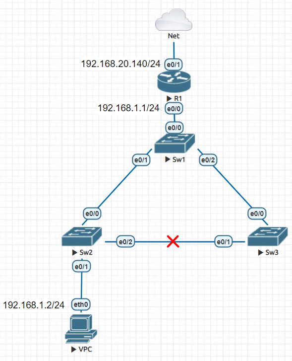
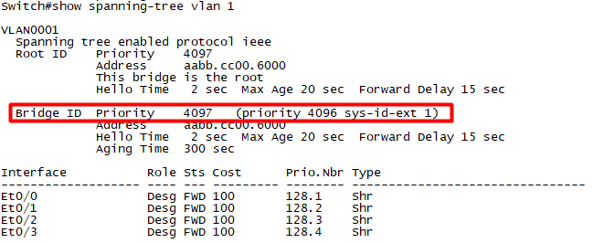
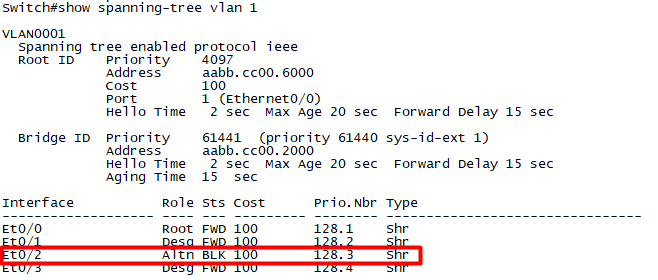
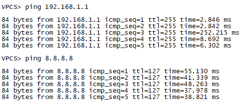
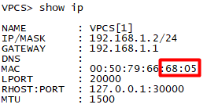
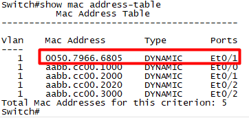

# Mô hình 



### I. Khái niệm STP 
`STP` (Spanning Tree Protocol) là một giao thức ngăn chặn sự lặp vòng cho phép các bride truyền thông với nhau để phát hiện vòng lặp vật lý trong mạng.

Hoạt động bầu chọn của một tiến trình STP:
- Thực hiện bầu chọn Root-Bridge
- Bầu chọn Root-Port
- Lựa chọn các Designated-port
- Blocking các port còn lại

#### 1. Chọn Root-Bridge của Giao thức Spanning Tree.
Một khi tiến trình STP được bật, các Sw sẻ gửi các gói tin `BPDU` (Bridge Protocol Data Unit) để trao đổi giữa các Switch với nhau, BPDU là một gói tin quan trọng trong tiến trình STP, BPDU chứa một thông tin quan trọng là Bridge-ID của các switch, giá trị này dùng để dịnh danh mỗi Switch khi náo tham gia tiến trình STP.

Bridge-ID dài 8byte:
- Số Priority(2byte): có giá trị từ 0 – 65535 mặc định là 32768
- MAC address(6byte)

Tiến trình bầu chọn `Root-Bridge` sẻ tiến hành như sau:

- Đầu tiên sẽ so sánh Sw nào có số Priority thấp nhất sẻ là Root-Bridge
- Các Sw được thiết lập số Priority bằng nhau thì tiến trình thứ 2 là so sánh MAC sẽ thực hiện, Sw nào có MAC nhỏ nhất sẻ làm Root-Bridge. MAC là địa chỉ duy nhất trên thế giới nên sẻ không xảy ra trùng lập được. VD như hình trên SW1 có MAC nhỏ nhất nên sẻ được bầu chọn làm Root-Bridge.
- Sau khi đã bầu chọn được Root-Bridge thì chỉ có SW làm root mới gửi BPDU ra khỏi cổng để duy trì tiến trình STP ( gửi 2s/lần). Các SW con chỉ nhận, bổ xung thông tin BPDU và forward thông tin BPDU này.


#### 2. Bầu chọn Root-port của Giao thức Spanning Tree.
Sau khi đã bầu chọn `Root-bridge` các SW sẽ bầu chọn `Root-port`, Root-port là port có đường về Root-bridge có tổng cost tích lũy nhỏ nhất.

Mỗi `interface` của Ethernet LAN đều gán một giá trị gọi là `cost`, để thực hiện tính toán của STP.


#### 3 Bầu chọn Designated Port.
Các qui tắc trong bầu chọn Designated port:
- Tất cả các port của Root-bridge đều là Designated Port
- Trên một link p2p thì đối diện Root-port là Designated port.
- Nếu trên một link có 2 cổng cung cấp đường về Root-bridge có cost tích lũy bằng nhau. Lúc đó sẻ dùng Sender ID để xác định, nếu Sender ID lại bằng nhau thì dùng đến port-ID để xét.


#### 4 Tiến trình Blocking các port còn lại của Giao thức Spanning Tree.

Bước cuối cùng trong tiến trình STP thì các port không có vai trò là Root hay Designated sẽ bị Block và được gọi là `Alternated port`. 

### II. Các trạng thái trong một tiến trình STP.
Các trạng thái trong một tiến trình STP đến khi hội tụ bao gồm:
- `Disable`: cổng này đang ở trạng thái không active.
- `Blocking`: port đang bị khóa Alternated port. Chỉ tiếp nhận BPDU mà không cho BPDU đi ra khỏi cổng. Không học địa chỉ MAC vào bảng MAC và không forward được dữ liệu.
- `Listening`: có đặc tính cổng chỉ nhận BPDU hoặc gửi BPDU. Không học địa chỉ MAC vào bảng MAC và không forward được dữ liệu
Learning: giống như trạng thái Listenning cổng chỉ nhận BPDU hoặc gửi BPDU. Có thể học được địa chỉ MAC vào bảng MAC và không forward được dữ liệu.
- `Forwarding`: cổng chỉ nhận BPDU hoặc gửi BPDU.  Tương tự Learning có thể học địa chỉ MAC vào bảng MAC và có thể forward được dữ liệu.

Tiến trình chạy STP
- Giao thức Spanning Tree chạy. Cổng bị đưa vào trạng thái Blocking sẻ bị khóa ngay lập tức. Còn các cổng như Root và Designated port thì phải trải qua các trạng thái Listening(15s) rồi tiếp tục chuyển sang trạng thái Learning(15s). Rồi mới chuyển sang trạng thái Forwarding để forward được dữ liệu.
- Đợi tiến trình STP chạy hết để chống loop qua các trạng thái Listening và Learning mất 30s khá lâu. Cho nên Cisco đã đưa ra một số các tính năng nhằm hạ thấp khoảng thời gian timer này lại như: Portfast, Uplinkfast, Backbonefast hay version Rapid SPAN IEEE 802.1W.

### III. Cấu hình trên Switch
Để thiết bị `Sw1` đóng vai trò là `Root-Bridge`, ta cần chọn giá trị Priority nhỏ nhất nhưng không nên bằng `0`.
```
Switch#conf t
Enter configuration commands, one per line.  End with CNTL/Z.
Switch(config)#spanning-tree vlan 1 priority 123
% Bridge Priority must be in increments of 4096.
% Allowed values are: 
  0     4096  8192  12288 16384 20480 24576 28672
  32768 36864 40960 45056 49152 53248 57344 61440
Switch(config)#spanning-tree vlan 1 priority 4096
Switch(config)#end
```

Kiểm tra giá trị Priority ta dùng lệnh `show spanning-tree vlan 1`.



Tiếp theo trên Sw2, ta tiến hành cấU hình để Sw2 có port `e0/2` bị khoá. Sw có port bị khoá thì thường có số Priority lớn nhất.
```
Switch#conf t
Enter configuration commands, one per line.  End with CNTL/Z.
Switch(config)#spanning-tree vlan 1 priority 2
% Bridge Priority must be in increments of 4096.
% Allowed values are: 
  0     4096  8192  12288 16384 20480 24576 28672
  32768 36864 40960 45056 49152 53248 57344 61440
Switch(config)#spanning-tree vlan 1 priority 61440
Switch(config)#end
```

Kiểm tra giá trị Priority.



Ta thấy giá trị Priority của Sw2 đã thành `61440` và port `e0/2` đã chuyển sang `block` (BLK) có trạng thái là `Altn` (port dự phòng).

Kiểm tra xem PC đã thông với Internet hay chưa.


Nếu dữ liệu đi từ PC đến Sw1 thì MAC của port `e0/1` sẽ trung với MAC của PC.






