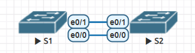
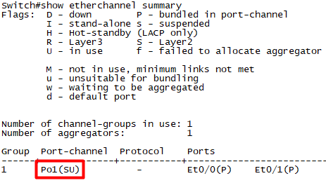

# Mô hình


### I. Giới thiệu công nghệ Ehternet Channel.
Ether Channel là một kỹ thuật nhóm 2 hay nhiều đường kết nối truyền tải dữ liệu vật lý (`Link Aggregation`) thành một đường ảo duy nhất có port ảo thậm chí cả MAC ảo để tăng tốc độ truyền dữ liệu và khả năng dự phòng (`Redundancy`) cho hệ thống.

Công nghệ Ethernet Channel có thể bó từ 2 đến 8 link FE (`Fast-Ethernet`), GE (`GigaEthernet`) thành 1 link logical. Khi đó, Switch đối xử các port thuộc Ether Channel như 1 port duy nhất.

Thiết bị ở 2 đầu cần cùng sử dụng công nghệ Ether Channel để đảm bảo hoạt động đúng và chống loop. Nếu chỉ có 1 đầu sử dụng thì có thể gây ra hiện tượng loop.

### II. Phân loại Ether Channel.
Có 2 loại giao thức Ether Channel:

- `LACP` (Link Aggregation Control Protocol): có thể dùng cho hầu hết các thiết bị thuộc các hãng khác nhau, LACP hỗ trợ ghép tối đa 16 link vật lý thành 1 link luận lý.
  
  - LACP có 3 chế độ: 
    
    - ON
    - Active
    - Passive  

  - PAgP (Port Aggregation Protocol): là giao thức cấu hình Ether Channel độc quyền của Cisco và chỉ hỗ trợ ghép tối đa 8 link vật lý thành 1 link luận lý.
  - PAgP cũng có 3 chế độ như LACP.

### III. Cấu hình Ether Channel.
Tại Switch 1, ta thực hiệu cấU hình như sau:
```
S1#conf t
Enter configuration commands, one per line.  End with CNTL/Z.
S1(config)#int range e0/0,e0/1
S1(config-if-range)#shut
*Aug 24 07:33:43.550: %LINK-5-CHANGED: Interface Ethernet0/0, changed state to administratively down
*Aug 24 07:33:43.560: %LINK-5-CHANGED: Interface Ethernet0/1, changed state to administratively down
*Aug 24 07:33:44.559: %LINEPROTO-5-UPDOWN: Line protocol on Interface Ethernet0/0, changed state to down
*Aug 24 07:33:44.565: %LINEPROTO-5-UPDOWN: Line protocol on Interface Ethernet0/1, changed state to down
S1(config-if-range)#switchport trunk encapsulation dot1q 
S1(config-if-range)#switchport mode trunk 
S1config-if-range)#channel-group 1 mode on
Creating a port-channel interface Port-channel 1
S1(config-if-range)#no shut
```

Để cấu hình tránh bị lỗi, ta nên tắt port trước khi cấu hình. Sau khi hoàn thành, ta bật lại port.

Kiểm tra xem đã cấu hình trunk và Ether Channel được hay chưa, ta làm như hình dưới.



```
S1#show int trunk 

Port        Mode             Encapsulation  Status        Native vlan
Po1         on               802.1q         trunking      1

Port        Vlans allowed on trunk
Po1         1-4094

Port        Vlans allowed and active in management domain
Po1         1

Port        Vlans in spanning tree forwarding state and not pruned
Po1         1
```

Làm tương tự với Switch 2. (Thay lệnh `channel-group 1 mode on` thành `channel-group 2 mode on`).
### IV. Cấu hình Ether Channel qua giao thức LACP
Ta thực hiện như dưới:
```
S1(config)#int range e0/0,e0/1
S1(config-if-range)#
S1(config-if-range)#shut
*Aug 24 09:16:16.557: %LINK-5-CHANGED: Interface Ethernet0/0, changed state to administratively down
*Aug 24 09:16:16.562: %LINK-5-CHANGED: Interface Ethernet0/1, changed state to administratively down
*Aug 24 09:16:17.557: %LINEPROTO-5-UPDOWN: Line protocol on Interface Ethernet0/0, changed state to down
*Aug 24 09:16:17.567: %LINEPROTO-5-UPDOWN: Line protocol on Interface Ethernet0/1, changed state to down
S1(config-if-range)#switchport trunk encapsulation dot1q 
S1(config-if-range)#switchport mode trunk 
S1(config-if-range)#channel-protocol ?
  lacp  Prepare interface for LACP protocol
  pagp  Prepare interface for PAgP protocol

S1(config-if-range)#channel-protocol lacp 
S1(config-if-range)#channel-group 1 mode ?
  active     Enable LACP unconditionally
  auto       Enable PAgP only if a PAgP device is detected
  desirable  Enable PAgP unconditionally
  on         Enable Etherchannel only
  passive    Enable LACP only if a LACP device is detected

S1(config-if-range)#channel-group 1 mode active 
Creating a port-channel interface Port-channel 1

S1(config-if-range)#no shut
S1(config-if-range)#
```

Sau khi xong, ta tiến hành kiểm tra như bên trên.

Khi cấu hình Ether Channel bằng `LACP`, ta sẽ có 2 mode là `active` và `passive`.
- `active`: định kỳ sẽ gửi ra những bảng tin để rủ thiết bị đầu ra thiết lập đường `trunk`.
- `passive`: bị động để thiết lập đường trunk khi có sự xuất hiện của bảng tin `lacp` mà nó nhận được.

Sau khi cấu hình xong bên `S1`, ta làm tương tự với `S2` nhưng chọn mode là `passive` thay vì mode `active` như bên `s1` (có thể chọn bên S2 cũng là `active`).


