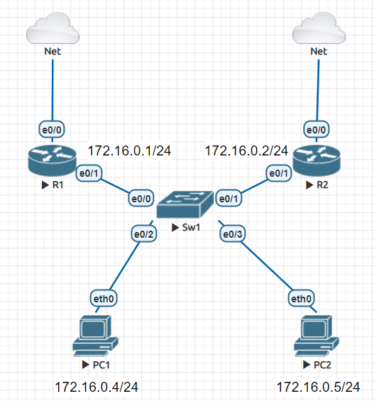

# Mô hình



# IP Planning


### I. Giới thiệu giao thức HSRP.
`HSRP` **(Hot Standby Router Protocol)** là một giao thức cho phép nhiều Router Cisco cùng tham gia cung cấp default - gateway cho các host nằm trên cùng mạng LAN. Các router này sẽ cùng nhau xây dựng một router ảo và các host trên LAN sẽ cấu hình trỏ default - gateway về router ảo này thay vì các router thực.

Các host đầu cuối trên LAN khi cần đi ra ngoài mạng LAN sẽ chuyển các gói cần đi ra ngoài LAN đến router ảo để có thể đi tiếp.

### II. Cấu hình 
Trên R1, tiến hành cấu hình HSRp trên port `e0/1`. Sử dụng lệnh `standby` để cấu hình.
```
R1(config)#int e0/1
R1(config-if)#standby 1 ip 172.16.0.3
```

Để thiết lập R1 thành Active Router, ta cần thiết lập giá trị `priority` lớn hơn R2. Sau đó ta thiết lập thêm cơ chế `preempt`.
```
R1(config-if)#standby 1 priority  20
R1(config-if)#standby 1 preempt 
R1(config-if)#no shut
R1(config-if)#
```

Cơ chế `preempt` là cơ chế mà khi `Active/Standby` đã được bầu chọn, các Router mới vào nhóm sẽ không được chiếm quyền dù có `priority`cao hơn.

Sau khi đã cấu hình trên R1 xong, ta chuyển sang cấu hình bên R2 tương tự như bên R1 nhưng số `priority` thấp hơn với R1.

Ta có thể kiểm tra xem HSRP đã cấu hình thành công hay chưa bằng lệnh `show standby br`.
```
R1#show standby br
                     P indicates configured to preempt.
                     |
Interface   Grp  Pri P State   Active          Standby         Virtual IP
Et0/1       1    20  P Active  local           unknown         172.16.0.3
R1#
```

Tiếp theo, ta sang PC và tiến hành ping đến gateway ảo.


Vậy là PC đã có thể ping tới gateway ảo và truy cập mạng thành công.

Kiểm tra địa chỉ MAC ảo trên Router và PC.


Ta thấy địa chỉ MAC ở cả 2 đều trùng nhau.  


