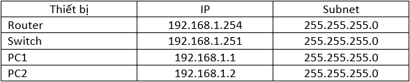
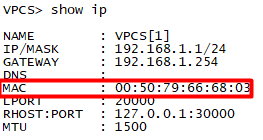

# Mô hình


# IP Planning


### I. Giới thiệu 
Port Security là tính năng security layer 2 trên Switch. Port Security thường được triển khai trên các Cisco layer 2 để ngăn chặn người lạ xâm nhập vào hệ thống mạng nội bộ.

Tính năng `Security` giới hạn đầu vào interface bằng cách hạn chế và xác định địa chỉ MAC của các máy trạm được phép truy cập vào.  

Một số nguyên tắc khi cấu hình Port Security.
- Không thể cấu hình trên các Port trunk.
- Không thể cấu hình port security trên Destination port SPAN.
- Không thể cấu hình tên interface port-channel.

Khi vi phạm xảy ra ta có thể cấu hình các hành động ứng với các vi phạm cụ thể đó là::
- Restrict: một vi phạm an ninh cổng nhằm hạn chế dữ liệu, làm cho bộ đếm Security Violation tăng và một thông báo SNMP được tạo ra.
- Shutdown: một vi phạm an ninh cổng làm cho cổng đóng ngay lập tức.
### II. Cấu hình port security.
- Vào port cần cấu hình.
```
Switch(config)#int e0/1
```

- Khởi động port security và chỉ định số lần địa chỉ MAC được thay đổi.
```
Switch(config-if)#switchport port-security       
Switch(config-if)#switchport port-security maximum 1
Switch(config-if)#shut
```

- Chỉ định địa chỉ MAC cần được bảo mật.
```   
Switch(config-if)#switchport port-security mac-address 0050.7966.6803
Switch(config-if)#switchport port-security violation shutdown 
Switch(config-if)#no shut
```

Sau khi cấu hình xong, host có địa chỉ MAC tương ứng sẽ hoạt động bình thường khi kết nối vào Switch trên Interface này.

Để kiểm tra xem port đã được cấu hình `port security` thành công hay chưa, ta dùng lệnh `show port-security int 'ten_port'`.




Ta thấy địa chỉ được cấu hình trên Switch đã trùng với địa chỉ MAC trên PC đƯợc nối qua port `e0/1`.

### Cấu hình Port Security với Router.
- Cấu hình port `e0/0` trên Swith.

```
Sw1(config)#int e0/0
Sw1(config-if)#switchport mode access 
Sw1(config-if)#switchport port-security 
Sw1(config-if)#switchport port-security maximum 1
Sw1(config-if)#switchport port-security mac-address sticky 
Sw1(config-if)#switchport port-security violation restrict 
Sw1(config-if)#no shut
Sw1(config-if)#end
```

Kiểm tra xem đã cấu hinhf port security thành công trên port `e0/0` hay chưa, ta dùng lệnh `show porrt-security address`.
- MAC bên Switch
- 


- MAC của Router.
- 


Địa chỉ MAC hiện ở Switch đã trùng với địa chỉ MAC của Router. 

Để kiểm tra xem chức năng port security đã hoạt động hay chưa, ta tiến hành thay đổi địa chỉ MAC của Router và tiến hành ping đến các PC.
- Thay đổi địa chỉ MAC của Router:
```
Router(config)#int e0/0
Router(config-if)#mac-address 0000.2414.1201
Router(config-if)#end
```


Ta đã thay thành công địa chỉ MAC của Router. Giờ ta tiến hành ping từ Router đến các PC và qua Switch để xem có cấu hình port security thành công hay không.


- Khi ping thì bên Switch sẽ có các cảnh báo được gửi đến.


