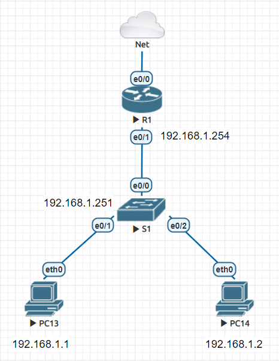
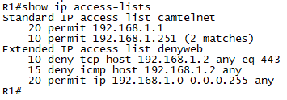

# Menu
[I. Giới thiệu ACL.](#gioi_thieu)

[II. Nguyên tắc hoạt động.](#nguyen_tac)

[III. Các loại ACL](#cac_loai_acl)
- [1. Standar ACL](#standard_acl)
- [2. Extended ACL](#extended_acl)
- [3. Dynamic ACL](#dynamic_acl)
- [4. ACL phản xạ](#acl_phan_xa)

[IV. Phương pháp cấu hình](#phuong_phap_cau_hinh)
- [1. Numbered ACL](#numbered_acl)
- [2. Name ACL](#name_acl)

[V. Wildcard Mask](#wildcard_mask)

[Thực hành cấu hình ACL](#cau_hinh_acl)

<a name="gioi_thieu"></a>
### I. Giới thiệu ACL.
ACL(Access Control List) là danh sách tuần tự các câu lệnh dùng để quản lý lưu lượng đến hoặc đi.

ACL giống như loại tường lửa, chỉ hạn chế, chặn hoặc cho phép các gói tin đang truyền từ nguồn đến đích.

ACL dùng để phân loại dữ liệu. Tạo 1 ACL để cho phép hoặc không cho phép dữ liệu của tham gia hoặc không tham tiến trình nào đó của Router.

<a name="nguyen_tac"></a>
### II. Nguyên tắc hoạt động.
Khi được đọc ACL sễ đọc và thi hành từng dòng 1 từ trên xuống dưới. Dòng nào chưa thông tin khớp với thông tin của gói tin đang được xem xét, dòng ấy sẽ được thi hành ngay và bỏ qua các dòng còn lại.

Nếu ACL được thực thi không khớp với bất cứ thôn tin nào trong gói tin thì gói tin sẽ bị bỏ.

Trên 1 cổng, mỗi chiều chỉ được áp 1 và chỉ 1 IP ACL.

Khi triển khai ACL trong mạng:
- Standar ACL nên đặt gần đích nhất (vì chỉ quan tâm đến source IP).
- Extended ACL nên đặt gần nguồn.

<a name="cac_loai_acl"></a>
### III. Các loại ACL (ACL tiêu chuẩn)

<a name="standard_acl"></a>
#### 1. Standard ACL
Chỉ quan tâm tới Source IP của gói tin, không quan tâm tới thông số nào khác.

<a name="extended_acl"></a>
#### 2. Extended ACL (ACL mở rộng)
Quan tâm tới nhiều tham số hơn: source IP, Des IP, source port, des port, protocol (TCP, UDP, ICMP, ...).

<a name="dynamic_acl"></a>
#### 3. Dynamic ACL (ACL động)
Loại ACL này thường được gọi là `Lock and key` và có thể được sử dụng cho các khung thời gian cụ thể.

Các danh sách này cho phép người dùng truy cập vào nguồn hoặc đích chỉ khi người dùng xác thực với thiết bị qua Telnet.

<a name="acl_phan_xa"></a>
#### 4. ACL phản xạ (Reflexive ACL)
ACL phản xạ còn được gọi là ACL phiên IP. Các loại ACL này Lọc lưu lượng dựa trên thông tin lớp phiên trên.

<a name="phuong_phap_cau_hinh"></a>
### IV. Phương pháp cấu hình.
Có 2 phương pháp cấu hình: `Numbered ACl` và `Named ACL`.

<a name="numbered_acl"></a>
#### 1. Numbered ACL
Có thể được định danh bởi số hiệU (1, 2, 3, ...).

Các `Standard ACL` sẽ lấy số hiệu từ `1-99` hoặc `1300-1999`, các `Extended ACL` sẽ lấy số hiệu từ `100-199` hoặc `2000-2699`

<a name="name_acl"></a>
#### 2. Name ACL
Có thể được định danh bởi 1 chuỗi ký tự.

**Khác nhau giữa Numbered ACL và Name ACL** là `Name ACL` cho phép chèn, sửa, xoá từng dòng còn `Numbered ACL` thì phải xoá toàn bộ nếu như bị sai ở dòng nào đó.

<a name="wildcard_mask"></a>
### V. Wildcard Mask
Trong Cisco IOS, Wildcard Mask dùng với các mục đích sau:
- Để biết kích thước của 1 mạng hoặc mạng con trong giao thức định tuyến như OSPF, EIGRP. 
- Kiểm tra những IP cần kiểm tra để áp dụng hành động `Alow` hoặc `Deny` trong Access Control List (ACL).

Dạng thức của Wildcard Mask là Subnet Mask ngược.

<a name="cau_hinh_acl"></a>
## Thực hành cấu hình ACL

### Mô hình


Để cấu hình ACL, ta cần tạo ACL và up ACL lên vị trí cụ thể.

- Cấu hình dịch vụ Telnet 
```
R1(config)#line vty 0 4
R1(config-line)#privilege level 15
R1(config-line)#no login
```

- Để PC và Switch có thể Telnet tới Router, ta thêm câu lệnh.
```
R1(config-line)#transport in
R1(config-line)#transport input te
R1(config-line)#transport input telnet 
R1(config-line)#
```

Kiểm tra kết nối Telnet trên Switch.
```
S1#telnet 192.168.1.254
Trying 192.168.1.254 ... Open
R1#
```

Tạo ACL có tên là `camtelnet`
```
R1(config)#ip access-list standard camtelnet
```

- Liệt kê các IP được phép telnet tới Router.
```
R1(config-std-nacl)#permit 192.168.1.251
R1(config-std-nacl)#permit 192.168.1.1
```

- Up ACL lên cổng `line vty 0 4`.
```
R1(config)#line vty 0 4
R1(config-line)#access-class camtelnet in
```

- Cấu hình tên access-list (named ACLs) thay cho các số hiệu.
```
R1(config)#ip access-list extended denyweb
R1(config-ext-nacl)#15 deny icmp host 192.168.1.2 any
R1(config-ext-nacl)#end
```

- Cấm PC2 không được quyền truy cập internet còn lại cho phép hết.
```
R1(config-ext-nacl)#deny tcp 192.168.1.2 0.0.0.0 any eq 443
R1(config-ext-nacl)#permit ip 192.168.1.0 0.0.0.255 any (cho phép các IP còn lại trong mạng truy cập internet)
R1(config-ext-nacl)#exit
```

Khi dữ liệU đi từ PC2 ra ngoài internet thì nó phải đi qua port `e0/1`, do đó ta sẽ up ACL cấm `denyweb` trên port `e0/1`.

- Truy cập port `e0/1` và cấU hình.
```
R1(config)#int e0/1
R1(config-if)#ip access-group denyweb in
R1(config-if)#end
```

- Lên PC2 và kiểm tra kết nối tớI internet.
```
VPCS> ping 8.8.8.8

*192.168.1.254 icmp_seq=1 ttl=255 time=1.895 ms (ICMP type:3, code:13, Communication administratively prohibited)
*192.168.1.254 icmp_seq=2 ttl=255 time=1.748 ms (ICMP type:3, code:13, Communication administratively prohibited)
*192.168.1.254 icmp_seq=3 ttl=255 time=1.701 ms (ICMP type:3, code:13, Communication administratively prohibited)
*192.168.1.254 icmp_seq=4 ttl=255 time=1.890 ms (ICMP type:3, code:13, Communication administratively prohibited)
*192.168.1.254 icmp_seq=5 ttl=255 time=1.933 ms (ICMP type:3, code:13, Communication administratively prohibited)

VPCS> 
```

`Communication administratively prohibited` là đã bị ngăn chặn bởi ACL.

- Hiển thị tất cả ACLs đang sử dụng




