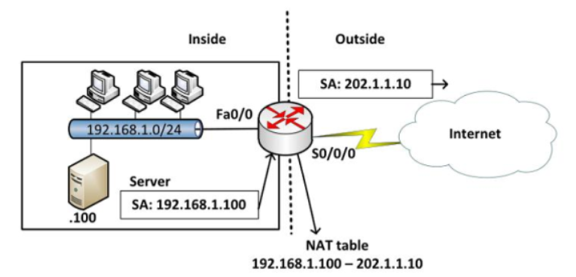
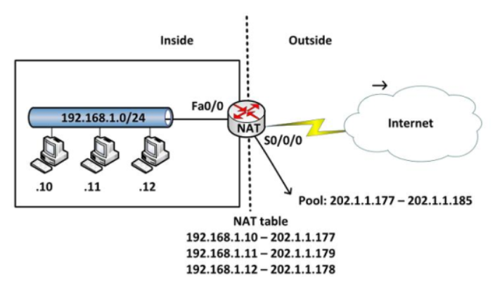
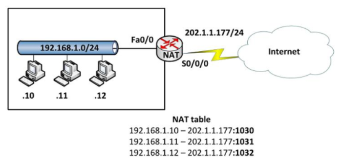

# Menu
[I. Giới thiệu](#gioi_thieu)

[II. Các khái niệm cơ bản](#cac_khai_niem_co_ban)

[III. Các kỹ thuật NAT](#cac_ky_thuat_nat)
- [1. NAT one-to-one](#one-to-one)
- [2. NAT many-to-one](#many-to-one)

[IV. Ưu điểm và nhược điểm của NAT Router](#uu_diem_va_nhuoc_diem)
- [1. Ưu điểm](#uu_diem)
- [2. Nhược điểm](#nhuoc_diem)

## I. Giới thiệu.
Network Address Translation (NAT) là quá trình dịch hay chuyển IP nội bộ sang địa chỉ IP bên ngoài bằng cách thay đổi tiêu đề của gói IP khi truyền qua Router.

NAT sẽ thực hiện thay đổi địa chỉ IP hợp lệ để giúp mạng nội bộ và mạng bên ngoài có thể giao tiếp được với nhau.

Ngoài ra, NAT Server còn đóng vai trò là tường lửa giúp bảo mật địa chỉ IP của máy tính. Cụ thể là khi gặp sự cố kết nối internet, địa chỉ IP của mạng công cộng sẽ thay thể cho địa chỉ IP của mạng cục bộ.

`NAT port` giúp các dữ liệu dễ dàng đi qua các thiết bị mạng (router, modem, ...) mà không bị tường lửa chặn. Điều này giúp giảm tốc độ truy cập dữ liệu (download và upload), đáp ứng nhu cầu cho các ứng dụng game Online, xem camera, utorrent, acestream... 

## II. Các khái niệm cơ bản.
- Địa chỉ `inside local`: là các IP thuộc mạng doanh nghiệp và đặt trên các host ở khu vực nội bộ bên trong.
- Địa chỉ `inside global`: kà địa chỉ được đăng ký với NIC (Network Information Center) dùng để thay thế 1 hay nhiều địa chỉ IP `inside local`.
- Địa chỉ `inside interface`: là cổng của router biên nối xuống phần mạng private.
- Địa chỉ `outside local`:là địa chỉ IP của 1 thiết bị bên ngoài khi nó xuất hiện bên trong mạng. Địa chỉ này không nhất thiết là địa chỉ được đăng ký, nó được lấy từ không gian địa chỉ bên trong.
- Địa chỉ `outside global`: là các địa chỉ public bên ngoài internet.

## III. Các kỹ thuật NAT

#### 1. NAT `one-to-one`.
Phương thức NAT này sẽ thực hiện NAT một địa chỉ bên trong thành một địa chỉ bên ngoài. Có bao nhiêu địa chỉ bên trong thì cần bấy nhiêu địa chỉ bên ngoài để đảm bảo tất cả các địa chỉ bên trong có thể đi ra ngoài internet một cách đồng thời.

NAT one-to-one có 2 loại: `Static NAT` và `Dynamic NAT`.
- Static NAT được dùng để chuyển đổi IP này sang địa chỉ IP khác một cách cố định.

Câu lệnh để cấu hình NAT tĩnh: `ip nat inside source static` *inside_local inside_global*.
- inside_local là địa chỉ private bên trong.
- inside_global là địa chỉ public bên ngoài.

Chỉ định các cổng inside hay outside: `ip nat` {inside | outside}

- Dynamic NAT được dùng để ánh xạ một địa chỉ IP này thành một địa chỉ IP khác một cách tự động, thông thường là ánh xạ từ một địa chỉ cục bộ sang một địa chỉ được đăng ký.
Bất kỳ một địa chỉ IP nào nằm trong dải địa chỉ IP công cộng đã được định trước đều có thể được gán một thiết bị bên trong mạng.

Các bước cấu hình Dynamic NAT:
- Viết một ACL chỉ ra danh sách các địa chỉ Private bên trong cần di internet.
- Viết một pool bao gồm các địa chỉ Public bên ngoài sẽ được NAT thành: ip nat pool  *tên_pool IP_đầu IP_cuối* {**netmask** subnet mask | **prefix-length** prefix_length}
- Cấu hình để router NAT lits bên trong thành pool bên ngoài: ip nat inside source list *số_hiệu_hoặc_tên_của_ACL* **pool** *tên_pool*
- Cấu hình chỉ định các cổng inside và outside.

#### 2. NAT `many-to-one`.
Còn được gọi là NAT overload hay `PAT` (Part Address Translation). NAT overload cho phép NAT cùng lúc nhiều địa chỉ private bên trong thành một địa chỉ public bên ngoài.

Chỉ số cổng được mã hoá 16 bit, do đó có tới  65536 địa chỉ nội bộ có thể được chuyển sang một địa chỉ công cộng.

Phương thức NAT `one-to-one` không nhắm đến việc tiét kiệm IP mà được sử dụng để public các server trong mạng doanh nghiệp lên môi trường internet.

Để tiết kiệm IP thực sự, phương thức NAT `many-to-one` được sử dụng: nhiều host bên trong có thể đi ra bên ngoài bằng một địa chỉ public duy nhất.

## IV. Ưu điểm và nhược điểm của NAT Router.

#### 1. Ưu điểm
- Tiết kiệm IPv4: NAT có khả năng che giấu địa chỉ IP trong mạng LAN.
- Cách thức hoạt động của NAT là chia sẻ kết nối internet với nhiều thiết bị truy cập (máy tính, điện thoại di động) trong cùng một mạng LAN với duy nhất một địa chỉ IP public. Nhờ thế, NAT cho phép quản trị viên có thể lọc tất cả các gói tin đến, đồng thời cấp quyền truy cập cho IP mạng công cộng đến một cổng bất kỳ. 
- Giúp bảo tồn không gian địa chỉ IP. Bạn có thể kết nối một số lượng lớn máy chủ lưu trữ bằng địa chỉ IP nhỏ với internet toàn cầu.
- Cung cấp các tính năng bảo mật tốt giúp tăng cường bảo mật cho các mạng riêng bằng cách tách mạng nội bộ ra khỏi mạng bên ngoài.

#### 2. Nhược điểm
- CPU tốn thời gian kiểm tra và đổi địa chỉ IP khi nó sử dụng kỹ thuật NAT. Do đó, quá trình trễ Switching sẽ bị tăng độ trễ và ảnh hưởng đến tốc độ truyền của mạng internet.
- Các kỹ thuật viên khó khăn trong việc kiểm tra nguồn gốc địa chỉ IP do NAT đã che giấu chúng.
- NAT tiêu thụ tài nguyên bộ nhớ, vì NAT cần dịch địa chỉ IPv4 cho tất cả các biểu đồ dữ liệu IPv4 từ hệ thống nội bộ ra ngoài và ngược lại đồng thời để giữ các chi tiết dịch trong bộ nhớ.
- Một số công nghệ và ứng dụng mạng sẽ không hoạt động như mong đợi trong hệ thống mạng được cấu hình NAT.

