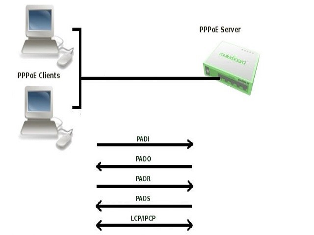
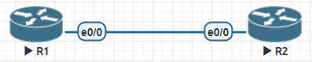
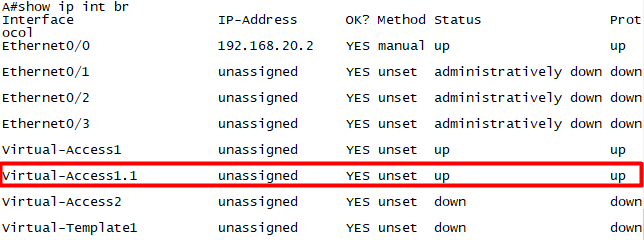

## I. Giới thiệu
Hầu hết các ISP (nhà cung cấp dịch vụ internet) từ khắp nơi trên thế giới đều cung cấp dịch vị đăng ký internet băng thông trộng. Một số nhà cung cấp làm điều đó thông qua công nghệ được gọi là PPPoE (Point to Point Protocol over Ethernet).

`PPPoE` là một giao thức mạng bắt nguồn từ một giao thức cũ hơn được gọi là PPP (Point to Point Protocol).

PPPoE được thiết kế để quản lý cách truyền dữ liệu qua mạng Ethernet (mạng cáp) và cho phép kết nối một máy chủ duy nhất được phân chia giữa nhiều máy khách sử dụng Ethernet.

Nhờ vậy, nhiều khách hàng có thể kết nối cùng một máy chủ từ nhà cung cấp dịch vụ và truy cập internet cùng một lúc.

PPPoE cũng có khả năng cung cấp các tính năng mạng cần thiết như xác thực, mã hoá và nén dữ liệu.

## II. Quy trình làm việc
Gồm 2 giai đoạn chính:
- Discovery (khám phá): PPoE client xác định địa chỉ MAC Ethernet cục bộ và thiết lập ID phiên. Và các host định vị nhiều PPPoE server, sau đó cho phép người dùng chọn một máy chủ.
- Session (phiên): khi giai đoạn trên thành công, cả host và server được chọn đều có thông tin về kết nối PPP qua Ethernet. Sau đó, PPPoE cho phép dữ liệu được truyền qua liên kết PPP trong các PPPoE header. Do đó, một phiên được thiết lập giữa một người dùng cá nhân và trang Web từ xa có thể được giám sát.


## III. Cách hoạt động
Trong thời kỳ `Session`, hệ thống khách hàng thiết lập một kênh giao tiếp với bộ tập trung truy cập (AC) - một máy chủ PPPoE có tính năng thương lượng và xác thực kết nối với các máy khách PPPoE.

Khi một máy khách khởi đầu một phiên với AC, máy khách và AC tham gia vào một quy trình tìm hiểu bồn bước, trong đó các loại gói rõ ràng được trao đổi:
- Máy khách khởi đầU giao tiếp bằng cách truyền gói PPPoE `Active Discovery Initiation` (**PADI**) bao gồm một yêu cầu dịch vụ.
- Khi một AC thu được PADI, nó sẽ phản hồi bằng cách gửi một gói PPPoE `Active Discovery Offer` (**PADO**) có chứa tên riêng và các cụ thể khác về dịch vụ được phân phối.
- Để đáp lại PADO, máy khách sẽ gửi một gói PPPoE `Active Discovery Request` (**PADR**) tới AC, trên thực tiễn, để đồng ý dịch vụ. Nếu máy khách thu được PADO từ nhiều AC, nó sẽ chọn một máy dựa trên tên hoặc các dịch vụ được phân phối.
- Khi AC thu được PADR, nó sẽ gửi gói xác nhận phiên PADS. PPPoE xác nhận kết nối và phân phối ID phiên, được sử dụng trong suốt phiên.



Tại bất kỳ thời điểm nào trong suốt phiên, AC hoặc máy khách có thể gửi gói `PADT` để kết thúc phiên. Khi máy khách hoặc  AC thu được `PADT`, không có thêm lưu lượng PPP nào được phép trong phiên đó.


## IV. Cấu hình PPPoE trên Router

### Mô hình



- Trên Router 1 đóng vai trò là PPPoE server, ta cần phải cấu hình 1 `interface virtual template` và up lên `pppoe`. 
```
A(config)#bba-group pppoe Ex
A(config-bba-group)#virtual-template 1
A(config-bba-group)#ex
A(config)#int virtual-template 1
A(config-if)#encapsulation ppp
A(config-if)#ip address 192.168.20.2 255.255.255.0
A(config-if)#ppp authentication chap
A(config-if)exit
A(config)#username B password cisco
A(config)#int e0/0
A(config-if)#no shut
A(config-if)#pppoe enable group Ex
A(config-if)#ex
```

- Trên Router 2 đóng vai trò là PPPoE Client. Để cấu hình PPPoE Client ta cần 3 bước.
  - Tạo 1 `interface dialer`. Các `interface dialer` sẽ chứa các thông số về cấu hình PPP.
  - Add `interface dialer` vào cổng internet có chạy PPPoE bằng lệnh `pppoe-client dial-pool-number 1`.
  - Khai báo Username và Password cho phù hợp với xác thực PPP. 
```
B(config)#int e0/0
B(config-if)#no shut
B(config-if)#pppoe-client dial-pool-number 1
B(config-if)#ex
B(config)#int dialer 0
B(config-if)#dialer pool 1
B(config-if)#encapsulation ppp
B(config-if)#ip address 192.168.20.9 255.255.255.0
B(config-if)#ex
B(config)#username A password cisco
```

Kiểm tra xem đã cấu hình thành công hay chưa dùng lệnh `show ip int br`. 



Cổng Virtual-Access1.1 đã ở trạng thái `up`. Vậy là đã hoàn thành cấu hình đơn giản PPPoE giữa 2 Router Cisco.


