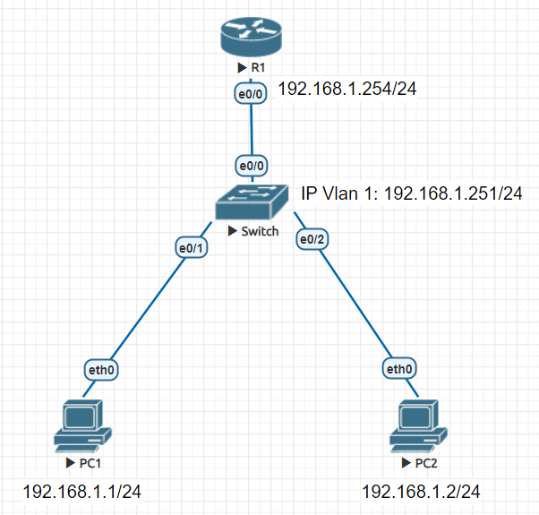
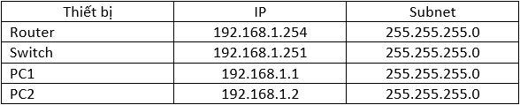
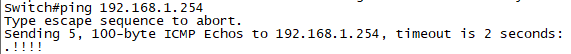

# Mô hình



# IP Planning



## I. Giới thiệu
Chiến lược bảo mật hệ thống AAA (Điều khiển truy xuất-`Access Control`, Xác thực-`Authentication`, Kiểm tra-`Auditing`) được xem là bước tiếp cận cơ bản và là chiến lược nền tảng để thực thi các chính sách bảo mật trên một hệ thống được mô tả theo mô hình CIA ((Tính bí mật-`Confidentiality`, Tính toàn vẹn- `Intergrity`, Tính khả dụng- `Availability`).

`AAA` gồm 3 lĩnh vực tách rời nhưng hoạt động song song với nhau nhằm tạo ra các cơ chế bảo vệ sự an toàn của hệ thống: 

- Thiết lập các cơ chế điều khiển truy xuất cho từng đối tượng (Access Control).
- Xác thực các đồi tượng trước khi cho phép thao tác trên hệ thống (Authentication).
- Theo dõi các thao tác của đối tượng trên hệ thống (Auditing).

### 1. Điều khiển truy xuất
Là một quy trình được thực hiện bởi một thiết bị phần cứng hay một module phần mềm, có tác dụng chấp thuận hay từ chối một sự truy xuất cụ thể đến một tài nguyên cụ thể.

Trong thực tế, điều khiển truy xuất thực hiện theo ba mô hình sau đây:

- Mô hình điều khiển truy xuất bắt buộc (`Mandatory Access Control – MAC`): là mô hình điều khiển truy xuất được áp dụng bắt buộc đối với toàn hệ thống.

Những đặc điểm phân biệt của mô hình điều khiển truy xuất bắt buộc:
1. Được thiết lập cố định ở mức hệ thống, người sử dụng (bao gồm cả người tạo ra tài nguyên) không thay đổi được.

1. Người dùng và tài nguyên trong hệ thống được chia thành nhiều mức bảo mật khác nhau, phản ánh mức độ quan trọng của tài nguyên và người dùng.

1. Khi mô hình điều khiển bắt buộc đã được thiết lập, nó có tác dụng đối với tất cả người dùng và tài nguyên trên hệ thống.


- Mô hình điều khiển truy xuất tự do (`Dicscretionary Access Control – DAC`):  là mô hình điều khiển truy xuất trong đó việc xác lập quyền truy xuất đối với từng tài nguyên cụ thể  do người chủ sở hữu của tài nguyên đó quyết định. Đây là mô hình được sử dụng phổ biến nhất, xuất hiện trong hầu hết các hệ điều hành máy tính.

Đặc điểm phân biệt của mô hình điều khiển truy xuất tự do:

1. Không được áp dụng mặc định trên hệ thống.

1. Người chủ sở hữu của tài nguyên (owner) thường là người tạo ra tài nguyên đó hoặc người được gán quyền sở hữu, có toàn quyền điều khiển việc truy xuất đến tài nguyên.

1. Quyền điều khiển truy xuất trên một tài nguyên có thể được chuyển từ đối tượng (user) này sang đối tượng (user) khác.

- Mô hình điều khiển truy xuất theo chức năng (`Role Based Access Control – RBAC`): đây là mô hình điều khiển truy xuất dựa trên vai trò của từng người dùng trong hệ thống (user’roles).

Đặc điểm phân biệt của mô hình điều khiển truy xuất theo chức năng:

1. Quyền truy xuất được cấp dựa trên công việc của người dùng trong hệ thống (user’s role).

2. Linh động hơn mô hình điều khiển truy xuất bắt buộc, người quản trị hệ thống có thể cấu hình lại quyền truy xuất cho từng nhóm chức năng hoặc thay đổi thành viên trong các nhóm.

3. Thực hiện đơn giản hơn mô hình điều khiển truy xuất tự do, không cần phải gán quyền truy xuất trực tiếp cho từng người dùng.


### 2. Xác thực

`Xác thực` là một thủ tục có chức năng xác minh nhận dạng (identity) của một đối tượng trước khi trao quyền truy xuất cho đối tượng này đến một tài nguyên nào đó. Xác thực được thực hiện dựa trên 3 cơ sở:

- What you know (điều mà đối tượng biết), ví dụ: mật khẩu.

- What you have (cái mà đối tượng có ), ví dụ thẻ thông minh smartcard.

- What you are (đặc trưng của đối tượng): các đặc điểm nhận dạng sinh trắc học như dấu vân tay, võng mạc,…..

Nhiều kỹ thuật khác nhau được áp dụng để thực thi cơ chế xác thực. Cơ chế xác thực dùng tên đăng nhập và mật khẩu là cơ chế truyền thống và vẫn còn được sử dụng rộng rãi hiện nay.

### 3. Kiểm tra

`Kiểm tra` là cơ chế theo dõi hoạt động của hệ thống ghi nhận các hành vi diễn ra trên hệ thống và liên kết các hành vi này với các tác nhân gây ra hành vi.

Các mục tiêu của kiểm tra:

- Cung cấp các thông tin cần thiết cho việc phục hồi hệ thống khi có sự cố.

- Đánh giá mức độ an toàn của hệ thống để có kế hoặch nâng cấp kịp thời.

- Cung cấp các thông tin làm chứng cứ cho việc phát hiện các hành vi truy xuất trái phép trên hệ thống.

Các thành phần của hệ thống kiểm tra:

- Logger: Ghi lại thông tin giám sát trên hệ thống.

- Analyzer: Phân tích kết quả kiểm tra.

- Notifier: Cảnh báo về tính an toàn của hệ thống dựa trên kết quả phân tích.

Các chức năng có thể thực hiện bởi các chương trình kiểm tra hệ thống trên máy tính thường gặp:

- Kiểm tra việc tuân thủ chính sách an toàn về mật khẩu (password policy), ví dụ: người dùng có đổi mật khẩu thường xuyên không, độ dài mật khẩu, độ phức tạp của mật khẩu……

- Đánh giá khả năng xâm nhập hệ thống từ bên ngoài.

- Kiểm tra phản ứng của hệ thống đối với các dấu hiệu có thể dẫn đến tấn công từ chối dịch vụ hoặc sự cố trên hệ thống (system crash).


## II. Thực hành cấu hình trên Cisco
- Trên Router:

Bật cơ chế xác thực, phân quyền và kiểm toán.
```
Router(config)#aaa new-model 
Router(config)#aaa authentication login Lai_Duy local
```

Tạo `username admin` với đặc quyền là cao nhất.
```
Router(config)#username admin privilege 15 password duylk123
Router(config)#
```

Tạo thêm 1 user nữa với đặc quyền thấp nhất.
```
Router(config)#username subadmin privilege 1 password duylk208
Router(config)#
```

Liên kết phương thức xác thực `Lai_Duy` vào cổng giao tiếp `line vty`.
```
Router(config)#line vty 0 4
Router(config-line)#login authentication Lai_Duy
```

- Trên Switch:

Tiến hành Telnet tới Router. Trước tiên cần kiểm tra kết nối bằng lệnh `ping`. 



Quá trình ping đã thành công, lúc này ta thử telnet tới Router.

```
Switch#telnet 192.168.1.254
Trying 192.168.1.254 ... Open


User Access Verification

Username: admin
Password: 

Router>
```

User là `admin` và Password là `duylk123`

Kiểm tra mức độ đặc quyền của Router:
```
Router#show privilege 
Current privilege level is 15
Router#
```

Nếu telnet tới Router bằng user `subadmin` thì ta chỉ vào được chế độ user. Nếu không biết mật khẩu `enable` thì sẽ không thể vào chế độ đặc quyền cao hơn được.
```
Switch#telnet 192.168.1.254
Trying 192.168.1.254 ... Open

User Access Verification

Username: subadmin
Password: 

Router>
```

- Khảo sát chế độ phân quyền

Ở level 8 thì chỉ có thể thực hiện câu lệnh `show running-config`. Và tạo cho đặc quyền 8 mật khẩu là `ccna123`.
```
Router(config)#privilege exec level 8 show running-config
Router(config)#enable secret level 8 ccna123
Router(config)#
```

Để đăng nhập vào đặc quyền 8, ta dùng lệnh `enable 8`.
```
Router>enable 8
Password: 
Router#show privilege 
Current privilege level is 8
Router#
```

```
Router#
Router#show running-config
Router#show star
               ^
% Invalid input detected at '^' marker.

Router#
```

Như ta thấy, chế độ đặc quyền 8 chỉ dùng được lệnh `show running-config`. Kể cả gõ lệnh vào chế độ `configure terminal` cũng bị báo lỗi.

Để có thể vào chế độ `configure terminal` tại đặc quyền 8, ta cần cấu hình bên Router bằng lệnh `privilege exec level 8 configure terminal`.

```
Router(config)#privilege exec level 8 configure terminal
```

Sau đó ta quay lại bên Switch và kiểm tra.
```
Router#conf t
Enter configuration commands, one per line.  End with CNTL/Z.
Router(config)#
```

Vậy là ta đã có thể truy cập vào chế độ `configure terminal`. Ngoài ra còn một số quyền khác như truy cập vào `interface` và cấu hình địa chỉ ip. Để chế độ đặc quyền 8 có thể truy thực hiện được, ta cấu hình bên Router như với chế độ `configure terminal`.

- Cuối cùng là chức năng `kiểm toán`.

Lên Router và bật cơ chế kiểm toán:
```
Router(config)#archive 
Router(config-archive)#log config 
Router(config-archive-log-cfg)#logging enable
```

Khi `user` thực hiện bất kỳ câu lệnh nào trên Router thì chức năng này sẽ ghi lại các câu lệnh đó.

```
Router#show archive log config all
 idx   sess           user@line      Logged command
    1     1        console@console  |  logging enable 
    2     1        console@console  |  exit 
Router#
```

Ta tiến hành lên Switch đăng nhập vào user `subadmin` với đặc quyền 8 và thực hiện 1 số câu lệnh bất kỳ. Phía Router sẽ lưu lại các lệnh mà ta vừa sử dụng.

```
Router#show archive log config all
 idx   sess           user@line      Logged command
    1     1        console@console  |  logging enable 
    2     1        console@console  |  exit 
    3     0       subadmin@vty0     |!exec: enable
    4     2       subadmin@vty0     |interface Ethernet0/0 
    5     2       subadmin@vty0     | no shutdown 
```

Vậy là ta đã hoàn thành cấu hình cơ chế xác thực AAA trên thiết bị Cisco.

