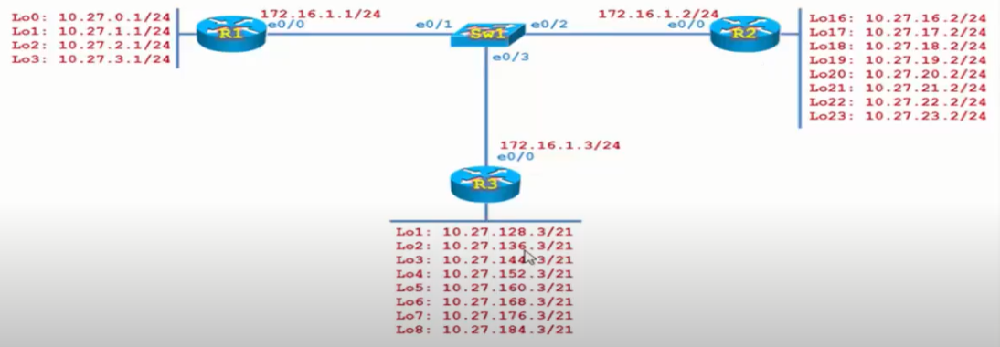
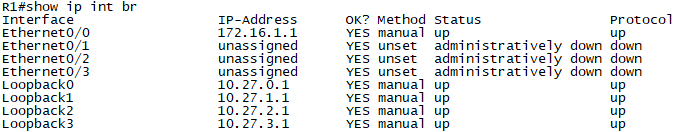

# Mô hình




## I. Giới thiệu kỹ thuật Sumary
Kỹ thuật Sumary kết hợp với phương thức Static Route để giúp cho hệ thống mạng định tuyến mượt hơn và bảng định tuyến gọn hơn.

Để đảm bảo mạng LAN của các Router R1, R2, R3 có thể giao tiếp với nhau, nếu không sử dụng kỹ thuật Sumary thì Router R1 phải `route` tới từng mạng cụ thể của Router R2 và cũng tương tự với Router R3. Tương tự, Router R2 cũng phải `route` tới từng mạng của Router R1 và R3.

Vậy số `static route` phải gõ trên router sẽ rất nhiều. Trong tình huống này, ta sẽ áp dụng kỹ thuật Sumary để quá trình định tuyến ngắn gọn hơn mà vẫn đảm bảo các router vẫn có thể giao tiếp được với nhau.

Trên Router R1 ta sẽ tạo 4 hệ thống mạng LAN giả định bằng cách tạo ra các `Interface loopback`.

## II. Tiến hành cấu hình trên Router.
- Trên Router R1
  - Tạo 4 `Interface Loopback` trên R1.

```
Router#conf t
Enter configuration commands, one per line.  End with CNTL/Z.
Router(config)#int loopback 0
*Sep 26 07:14:07.380: %LINEPROTO-5-UPDOWN: Line protocol on Interface Loopback0, changed state to up
Router(config-if)#ip address 10.27.0.1 255.255.255.0
Router(config-if)#no shut
```

- Làm tương tự với 3 Interface Loopback còn lại.

Kiểm tra trạng thái của các Loopback.



Ta thấy trạng thái của 4 loopback đã `up`.

Ta vào Router R2 và R3 tiến hành tương tự như với R1.

Ngoài ra, ta tiến hành đặt IP cho các cổng `e0/0` của R1, R2 và R3.

```
R1(config)#int e0/0
R1(config-if)#ip add
R1(config-if)#ip address 172.16.1.1 255.255.255.0
R1(config-if)#no shut
R1(config-if)#
```

```
R2(config)#int e0/0
R2(config-if)#ip add
R2(config-if)#ip address 172.16.1.2 255.255.255.0
R2(config-if)#no shut
R2(config-if)#
```

```
R3(config)#int e0/0
R3(config-if)#ip add
R3(config-if)#ip address 172.16.1.3 255.255.255.0
R3(config-if)#no shut
R3(config-if)#
```

- Tiếp theo, ta sẽ Sumary tất cả các mạng của Router R2 thành `10.27.16.0/21` và từ R1 route tới R2. Kỹ thuật Sumary có thể xem [ở đây](https://vnpro.vn/thu-vien/chuong-1-dia-chi-ipv4-chia-subnet-vlsm-summary-4108.html).

```
Router#conf t
Enter configuration commands, one per line.  End with CNTL/Z.
Router(config)#ip route 10.27.16.0 255.255.248.0 172.16.1.2 
Router(config)#end
```

Sau khi route xong, R1 có thể hoàn toàn ping tới tất cả địa chỉ của Router R2.

```
R1#ping 10.27.16.2
Type escape sequence to abort.
Sending 5, 100-byte ICMP Echos to 10.27.16.2, timeout is 2 seconds:
!!!!!
Success rate is 100 percent (5/5), round-trip min/avg/max = 1/1/2 ms
R1#ping 10.27.18.2
Type escape sequence to abort.
Sending 5, 100-byte ICMP Echos to 10.27.18.2, timeout is 2 seconds:
!!!!!
Success rate is 100 percent (5/5), round-trip min/avg/max = 1/1/2 ms
```

Tiếp tục, đứng tại Router R1, ta `route` tới Router R3.

```
Router#conf t
Enter configuration commands, one per line.  End with CNTL/Z.
Router(config)#ip route 10.27.128.0 255.255.192.0 172.16.1.3
Router(config)#end
```

Tiến hành ping từ R1 tới R3.

```
R1#ping 10.27.128.3
Type escape sequence to abort.
Sending 5, 100-byte ICMP Echos to 10.27.128.3, timeout is 2 seconds:
!!!!!
Success rate is 100 percent (5/5), round-trip min/avg/max = 2/2/3 ms
R1#
```

- Cấu hình Sumary trên Router R2 tớI R1.

```
Router(config)#ip route 10.27.0.0 255.255.252.0 172.16.1.1
Router(config)#end
```

Tiến hành ping từ R2 tới R1.

```
Router#ping 10.27.0.1
Type escape sequence to abort.
Sending 5, 100-byte ICMP Echos to 10.27.0.1, timeout is 2 seconds:
!!!!!
Success rate is 100 percent (5/5), round-trip min/avg/max = 1/1/2 ms
Router#ping 10.27.1.1
Type escape sequence to abort.
Sending 5, 100-byte ICMP Echos to 10.27.1.1, timeout is 2 seconds:
!!!!!
Success rate is 100 percent (5/5), round-trip min/avg/max = 2/3/10 ms
Router#
```

Vậy là ta đã cấu hình Sumary kết hợp với Static route thành công trên thiết bị Router.


