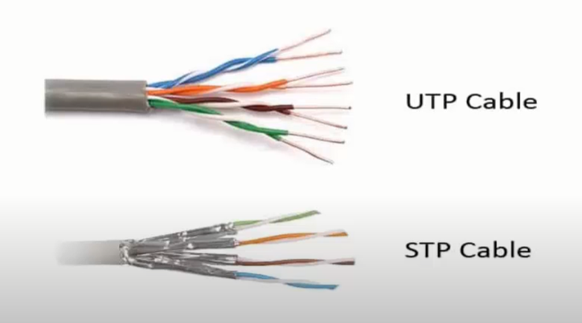
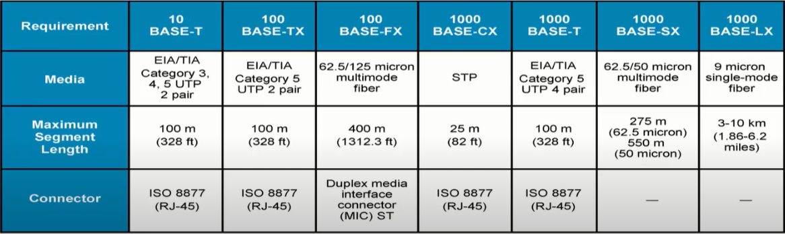
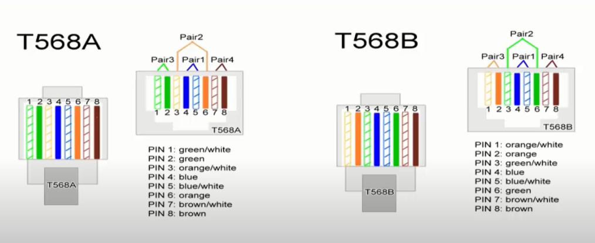

## I. Giới thiệu
Để truyền dữ liệu từ 1 host sang 1 host, có 2 cách truyền. 
- Dùng môi trường truyền không dây.
- Dùng môi trường truyền có dây.

Để truyền dữ liệu qua đường truyền có dây, ta cần có các thiết bị như: card mạng, dây cáp mạng.
- Card mạng thường được tích hợp trên 1 thiết bị pc, laptop hay server nào đó.
- Dây cáp mạng thường dùng loại `RJ45` để bấm cáp. Một đầu sẽ cắm vào card mạng và đầu còn lại cắm vào card mạng khác hoặc cắm vào cổng `RJ-45 Jack` để truyền dữ liệu.

Trong môi trường truyền mạng LAN truyền bằng dây cáp, có 2 loại cáp hay gặp là `STP Cable` (Shielded Twisted Pair) và `UTP Cable` (Unshielded Twisted Pair).

Cả 2 loại trên đều là cáp xoắn đôi. Cáp xoắn đôi bên trong sẽ có tổng cộng 8 sợi dây được chia thành 4 cặp và mỗi cặp như vậy sẽ được xoắn đôi với nhau. Mục đích của việc xoắn đôi đó là để đảm bảo độ bền của sợi cáp, chống nhiễu trong việc truyền dữ liệu.

- `UTP` là loại cáp xoắn đôi không có lớp vỏ bảo vệ. Nghĩa là ngoài lõi nhựa bọc 8 sợi dây thì bên trong sợi cáp UTP sẽ không có thêm lớp bọc bảo vệ nào.
- `STP` ngoài lớp vỏ nhựa bảo vệ ra thì còn có thêm lớp giấy bạc bọc bảo vệ lõi dây. Mục đích của lớp giấy bạc là để bảo vệ sợi cáp cũng như chống tác nhân gây nhiễu từ bên ngoài như nhiệt độ, từ trường, ...

Thông số một số các loại cáp hay gặp:

## II. Các chuẩn cáp
Có 2 loại chuẩn cáp để bấm cáp: `T568A` và `T568B`.

Bấm dây theo chuẩn mục đích là chống nhiễu tốt cho dây khiến dây mạng đạt độ dài tối đa mà không mất tín hiệu.

Trong môi trường mạng LAN sẽ có 2 sợi day cáp truyền dũ liệu hay gặp nhất là: `cáp thẳng` và `cáp chéo`.
- Cáp thẳng là 2 đầu đều bấm theo 1 chuẩn duy nhất (cùng là chuẩn A hoặc cùng là chuẩn B).
- Cáp chéo là 1 đầu theo chuẩn A thì đầu còn lại theo chuẩn B hoặc ngược lại.

**Cáp thẳng** để nối 2 thiết bị khác nhau ví dụ như nối PC với Switch.

**Cáp chéo** để nối 2 thiết bị giống nhau như Router với Router, PC với PC.

