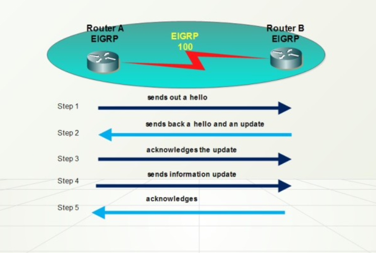

## I. Giới thiệu
`EIGRP – Enhance Interio Gateway Routing Protocol` là giao thức định tuyến mở rộng của IGRP, IGRP là giao thức dạng Classfull, còn EIGRP là giao thức dạng Classless, nghĩa là có mang theo subnetmask trong các lần cập nhật EIGRP là giao thức định tuyến lai (Hybrid Routing), là sự kết hợp của Distance Vector và Link States. 

`EIGRP` là một giao thức định tuyến theo vector khoảng cách nâng cao nhưng khi cập nhật và bảo trì thông tin láng giềng và thông tin định tuyến thì nó làm việc giống như một giao thức định tuyến theo trạng thái đường liên kết.

Một số ưu điểm của EIGRP so với các giao thức định tuyến véc tơ khoảng cách:

- Khả năng hội tụ nhanh: vì chúng sử dụng DUAL. DUAL bảo đảm hoạt động không bị lặp vòng khi tính toán đường đi, cho phép mọi Router trong hệ thống mạng thực hiện đồng bộ cùng lúc khi có sự thay đổi xảy ra.
- Bảo tồn băng thông và sử dụng băng thông một cách hiệu quả
- Hỗ trợ VLSM (Veriable Length Subnet Mask) và CIDA (Classles Inter Domain Routing). Không giống như IGRP,EIGRP có thể trao đổi thông tin ở các IP khác lớp mạng
- Hỗ trợ IP, IPX, Apple talk: vì Talk nhờ có cấu trúc từng phần theo giao thức (PDMs – Protocok dependent modules). EIGRP có thể phân phối thông tin của IPX,RIP để cải tiến hoạt động toàn diện. Trên thực tế, EIGRP có thể điều khiển giao thức này. Router EIGRP nhận thông tin định tuyến và dịch vụ, chỉ cập nhật cho các Router khác khi thông tin trong bảng định tuyến thay đổi.
- Chạy trực tiếp trên IP và protocol number là 88.
- Load balancing trên tất cả các cost không bằng nhau.
- Hỗ trợ tất cả các giao thức và cấu trúc dữ liệu ở layer 2.
- Không dùng broadcast và dùng Multicast hoặc Unicast trong từng trường hợp cụ thể.
- Hỗ trợ việc chứng thực.
- Manual Summary trên bất kỳ interface nào.

**Nhược điểm**: EIGRP là một giao thức với rất nhiều ưu điểm và có thể được sử dụng trong những mô hình mạng vừa và lớn tuy nhiên vì đây là giao thức độc quyền của Cisco nên nó chỉ chạy trên thiết bị của cisco, trong khi đó không phải một tổ chức nào cũng có thể dùng toàn đồ Cisco mà còn các dòng sản phẩm khác nữa. Chính vì vậy, đây là một bất lợi của giao thức định tuyến EIGRP.

## II. Nguyên lý hoạt động

- EIGRP Router lưu giữ các thông tin về đường đi và cấu trúc mạng trên RAM, nhờ đó chúng đáp ứng nhanh chóng theo sự thay đổi. Giống như OSPF, EIGRP cũng lưu những thông tin này thành từng bảng và từng cơ sở dữ liệu khác nhau. 
- EIGRP lưu các con đường mà nó học được theo một cách đặc biệt. Mỗi con đường có trạng thái riêng và có đánh dấu để cung cấp thêm nhiều thông tin hữu dụng khác.

`Topology exchange`: Những Router neighbor sẽ trao đổi thông tin lẫn nhau, cập nhật đầy đủ cấu trúc liên kết, topology mạng. Khi topoly mạng thay đổi nó sẽ cập nhật phần thay đổi.

`Choosing routes`: Mỗi Router sẽ tiến hành phân tích bảng EIGRP topology table, chọn ra con đường định tuyến có metric tốt để đến các subnet. Sau khi thực hiện 3 bước ở trên, hệ điều hành IOS sẽ lưu 3 bảng EIGRP Tables quan trọng:

- Bảng láng giềng (Neighbor table): Bảng láng giềng là bảng quan trọng nhất của EIGRP, trong đó có danh sách các router thân mật với nó. Đối với mỗi giao thức mà EIGRP hỗ trợ thì nó sẽ có 1 bảng láng giềng tương ứng. Khi phát hiện một láng giềng mới, router sẽ ghi lại thông tin về địa chỉ, cổng kết nối.

- Bảng cấu trúc mạng (Topology table): Là bảng cung cấp dữ liệu để xây dựng nên bảng định tuyến của EIGRP. Thuật toán DUAL sẽ lấy thông tin từ bảng láng giềng và bảng cấu trúc để chọn đường có chi phí thấp nhất cho từng mạch đích. 
- Mỗi EIGRP Router lưu một bảng cấu trúc mạng riêng tương ứng với từng loại giao thức mạng khác nhau. Bảng cấu trúc mạng chứa thông tin về tất cả các con đường mà Router học được. Nhờ những thông tin này mà Router có thể xác định đường đi khác để thay thế nhanh chóng khi cần thiết.

Những thông tin chứa trong bảng cấu trúc

- `Feasible Distance` (FD): Là thông tin định tuyến nhỏ nhất mà EIGRP tính được cho từng mạch đích.
- `Router Sourch`: Là nguồn phát khởi thông tin về một nguồn nào đó, phần thông tin này chỉ có đối với những kết nối ngoài mạng EIGRP.
- `Reported Distance` (RD): Là thông số định tuyến đến 1 Router láng giềng được thông báo qua.
- Thông tin về cổng giao tiếp mà Router sử dụng để đi đến mạch đích.
- Trạng thái đường đi: Trạng thái không tác động (P-Passive) là trạng thái ổn định, sẵn sàng sử dụng được, trạng thái tác động(A-active) là trạng thái đang trong tiến trình tính toán lại của DUAL.
- Bảng định tuyến (Routing table): Bảng định tuyến EIGRP lưu giữ danh sách các đường tốt nhất đến các mạng đích. Những thông tin trong bảng định tuyến được rút ra từ bảng cấu trúc mạng.