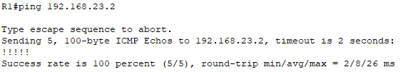

# Mô hình


# IP Planning


## Cấu hình EIGRP trên các Router.
### Trên Router R1
```
Router(config)#router eigrp 100
Router(config-router)#network 192.168.1.0
Router(config-router)#network 192.168.12.0 0.0.0.3
Router(config-router)#ex
Router(config)#int s2/0
Router(config-if)#ip address 192.168.12.1 255.255.255.252
Router(config-if)#no shut
```


### Trên Router R2

```
R2(config)#int s2/0
R2(config-if)#ip address 192.168.12.2 255.255.255.252
R2(config-if)#ex
R2(config)#int s3/0
R2(config-if)#ip address 192.168.23.1 255.255.255.252
R2(config-if)#no shut
```

### Trên Router R3

```
Router(config)#router eigrp 100
Router(config-router)#network 192.168.3.0
Router(config-router)#network 192.168.23.0 0.0.0.3
Router(config-router)#ex
Router(config)#int s2/0
Router(config-if)#ip address 192.168.23.2 255.255.255.252
Router(config-if)#no shut
```

Để cho một cổng nào đó của Router tham gia định tuyến, thực hiện `network` dải IP có chứa subnet mask nằm trên cổng đấy. Trong cách cấu hình EIGRP, người quản trị có thể sử dụng 2 kiểu cho cổng Router tham gia định tuyến:
- `network` một major network có chứa subnet của cổng muốn cho tham gia giống như cấu hình RIP.
- `network` chính xác subnet trên cổng bằng cách sử dụng thêm Wirecard mask giống như với cấu hình OSPF.

Giờ thì ta đã có EIGRP chạy trên cả 3 router. 

Có thể kiểm tra bảng láng giềng trên các Router bằng lệnh `show ip eigrp neighbor`.


Sử dụng lệnh Ping để xem các Router đã thông với nhau chưa:

- Ping từ R1 tới R3.



