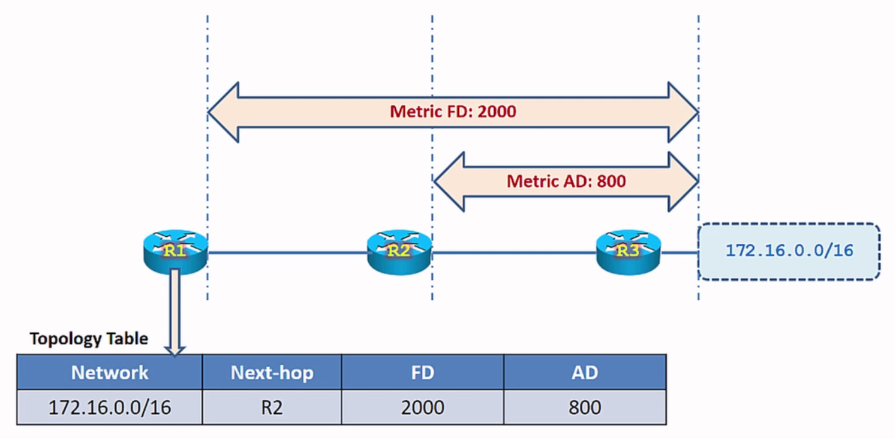
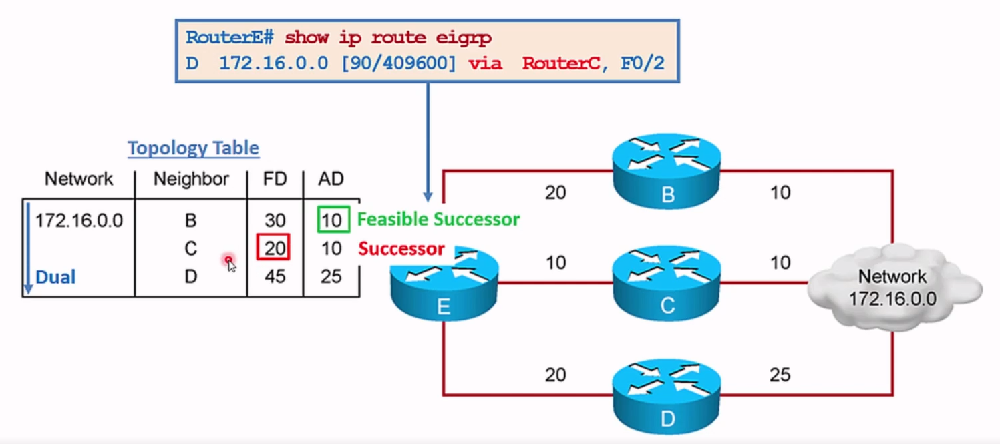

Tại một thiết bị định tuyến, có thể có nhiều đường đi để đến mạng đích. 

Trong  cisco sẽ sử dụng một giải thuật là giải thuật `Dual` (Diffusing Update Algorithm) để tính toán xem đường đi nào là đường tốt nhất.
- Đường tốt nhất sẽ được gọi là `Successor`.
- Đường dự phòng sẽ được gọi là `Feasible Successor`.

Trên một đường đi có 2 giá trị Metric đi kèm:

- FD: Feasible Distance => tính từ đầu tới cuối chặng đường.
- AD: Advertised Distance => tính từ router hàng xóm tới cuối. Chú ý từ AD này khác với từ khoảng cách quản trị là Administrative Distance (độ tin cậy của các giao thức).

Để chọn ra đường đi tốt nhất sẽ dựa vào tham số FD, số metric càng nhỏ thì đường đó càng tốt.

Vì FD của Router C có giá trị nhỏ nhất nên sẽ được chọn làm đường chính để các thông tin từ Router E đi tới mạng đích.

Ngoài việc chọn đường đi tốt nhất thì giao thức EIGRP còn lựa chọn 1 đường backup cho đường `Successor` đó gọi là `Feasible Successor`. Để lựa chọn đường backup thì tiêu chí là giá trị `AD` phải nhỏ hơn `FDmin`.

Đối với một mạng đích bất kì thì có thể có 1 hoặc 2 đường hoặc đôi khi không có đường Feasible Successor nào.

Khi con Router C gặp sự cố thì ngay lập tức nó sẽ lấy đường Feasible Successor và đưa đường này vào bảng định tuyến. Lúc này tất cả dữ liệu gửi từ Router E đến mạng đích sẽ được gửi qua Router B.