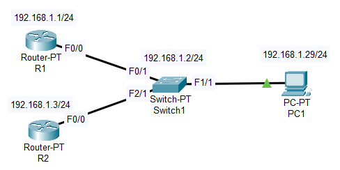
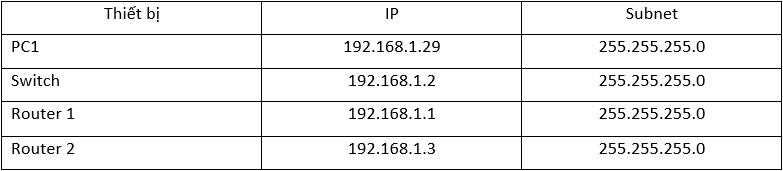
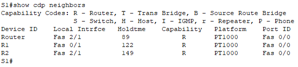
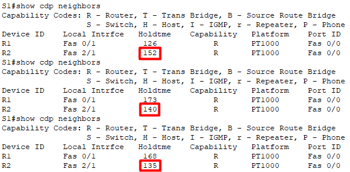
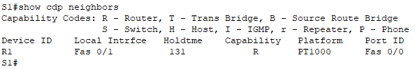

# Mô hình



## IP Planning



### I. Tổng quan giao thức CDP (Cisco Discovery Protocol)
`CDP (Cisco Discovery Protocol)` là một giao thức độc quyền của Cisco dùng để thực hiện thu thập thông tin về các thiết bị kết nối lân cận (neighbor), qua việc trao đổi thông điệp CDP thì các thiết bị sẽ nắm rõ được hết các thiết bị láng giềng của mình. Các thông điệp này được gửi định kỳ 60s một lần và chỉ trên các đường link có trạng thái up/up. Còn những Switch thì chạy theo chuẩn chung là `LLDP`.

CDP chỉ cung cấp thông tin của các thiết bị kết nối trực tiếp, các thông tin bao gồm:
- Device ID: Tên của thiết bị láng giềng.
- Local Interface: kết nối với thiết bị láng giềng qua port nào
- Holdtme: thời gian mà thiết bị chưa nhận được thông tin láng giềng
- Capability: loại thiết bị đang được kết nối trực tiếp
- Platform: dòng sản phẩm
- Port ID: port của thiết bị đầu ra



Để hiển thị thông tin chi tiết hơn của thiết bị láng giềng, ta sử dụng lệnh `show cdp neighbors detail` trong chế độ `Privileged`.
```
S1#show cdp neighbors detail

Device ID: Router
Entry address(es): 
  IP address : 192.168.1.3
Platform: cisco PT1000, Capabilities: Router
Interface: FastEthernet2/1, Port ID (outgoing port): FastEthernet0/0
Holdtime: 95

Version :
Cisco Internetwork Operating System Software
IOS (tm) PT1000 Software (PT1000-I-M), Version 12.2(28), RELEASE SOFTWARE (fc5)
Technical Support: http://www.cisco.com/techsupport
Copyright (c) 1986-2005 by cisco Systems, Inc.
Compiled Wed 27-Apr-04 19:01 by miwang

advertisement version: 2
Duplex: full
---------------------------

Device ID: R1
Entry address(es): 
  IP address : 192.168.1.1
Platform: cisco PT1000, Capabilities: Router
Interface: FastEthernet0/1, Port ID (outgoing port): FastEthernet0/0
Holdtime: 128
```

### II. Tấn công giao thức CDP
#### 1. Tấn công giao thức CDP
Những thông tin này mặc định được gửi ra trên các port và rất dễ bị tấn công nhằm mục đích nghe lén để xác định xem là IP của Server, Switch, Router là bao nhiêu, đang chạy trên hệ điều hành gì...

Do mỗi hệ điều hành, mỗi phiên bản đều có các lỗ hổng riêng, nếu hacker biết được thông tin này thì sẽ tìm ra các lỗi và từ các lỗi đó sẽ tấn công vào hệ thống.

#### 2. Ngăn chặn tấn công CDP
Do CDP mặc định được bật trên tất cả các cổng nên dễ bị rò rỉ thông tin IP cũng như hệ điều hành mà thiết bị đang sử dụng. Ta chỉ bật giao thức CDP trên các cổng kết nối giữa các thiết bị mạng quan trọng để dễ dàng quản lý và tắt trên các cổng kết nối các thiết bị người dùng để tránh khỏi sự can thiệp không cần thiết.

Trong sơ đồ của bài này, do cổng `F1/1` và `F3/1` kết nối đến `PC1` và `PC3` nên khi tắt CDP sẽ không ảnh hưởng gì và tránh không bị rò rỉ thông tin địa chỉ IP hoặc hệ điều hành của `Switch1`.

Muốn tắt CDP trên port cụ thể nào thì vào interface đó gõ lệnh `no cdp enable`.
```
S1(config)#interface f1/1
S1(config-if)#no cdp enable
```

Nếu muốn tắt tất cả các port thì gõ `no cdp run` trên Global Config.

```
S1(config)#no cdp run
```

Khi tắt CDP trên port của Switch, Switch vẫn giữ thông tin của các thiết bị láng giềng như ví dụ dưới. Khi `Holdtme` về dưới 0 thì Switch sẽ xoá thông tin của R1 khỏi bảng thông tin. Ví dụ dưới tắt port `F2/1` kết nối tới `Router 2`.



Đợi 1 lúc sau đó ta sủ dụng lệnh `show cdp neighbors` để kiểm tra thì thấy thông tin của R2 đã bị xoá khỏi bảng thông tin.




# Tài liệu tham khảo
[VnPro](https://vnpro.vn/thu-vien/giao-thuc-cdp-cisco-discovery-protocol-3129.html)


