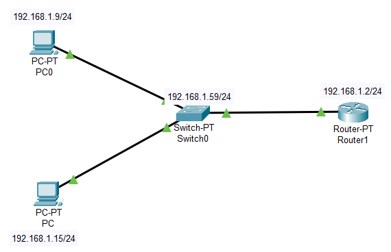
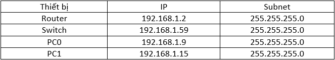
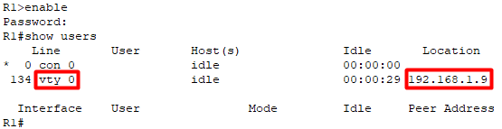
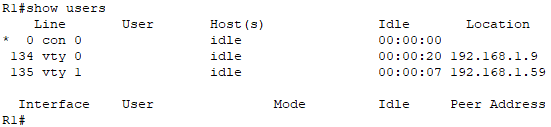

# Mô hình


# IP Planning



## Menu
[I. Cấu hình dịch vụ telnet](#cau_hinh_dich_vu_telnet)

[II. Cấu hình dịch vụ SSH](#cau_hinh_dich_vu_ssh)

<a name="cau_hinh_dich_vu_telnet"></a>

## I. Cấu hình dịch vụ telnet
Telnet là một giao thức dòng lệnh được sử dụng để quản lý các thiết bị khác nhau như máy chủ, PC, Router, Switch, ... Nó có nhiệm vụ kết nối từ xa, gửi các lệnh hoặc dữ liệu từ các hệ thống mạng để điều chỉnh, thay đổi, ... các thiết bị theo ý muốn.

Để bật dịch vụ trlnet trên router ta làm như sau: 
- B1: vào chế độ global config.
```
R1#conf t
Enter configuration commands, one per line.  End with CNTL/Z.
R1(config)#
```

- B2: cấu hình telnet 
```
R1(config)#line vty 0 4
R1(config-line)#password duylk123
R1(config-line)#login
R1(config-line)#exit
R1(config)#enable pas
R1(config)#enable password duylk123
R1(config)#
```

Ta đã hoàn thành dịch vụ thiết lập telnet server trên router. Để kiểm tra, ta tiến hành vào Switch hoặc PC để kiểm tra. Ở đây ta sử dụngt PC để kiểm tra dịch vụ telnet.

Vào PC và chọn chế độ `Command Line` và làm như ví dụ dưới để kiểm tra dịch vụ telnet.
```
Cisco Packet Tracer PC Command Line 1.0
C:\>telnet 192.168.1.2
Trying 192.168.1.2 ...Open


User Access Verification

Password: 
R1>enable 
Password: 
R1#
```

Nếu hiển thị như trên thì tức là đã kết nối telnet thành công. Muốn thoát khỏi phiên telnet này ta chỉ cần gõ thêm lệnh `exit`.
```
R1#exit

[Connection to 192.168.1.2 closed by foreign host]
C:\>
```
Tại thiết bị Router, ta có thể kiểm tra xem thiết bị nào đang telnet tới nó bằng lệnh `show users`.



Vì là người đầu tiên telnet nên được định danh là `vty 0` và địa chỉ IP của thiết bị đang telnet tới Router là `192.168.1.9`.

Ta cũng có thể telnet đến Router từ Switch.
```
Switch>
Switch>enable
Switch#telnet 192.168.1.2
Trying 192.168.1.2 ...Open


User Access Verification

Password: 
R1>enable
Password: 
R1#
```

Ta quay lại Router và kiểm tra.



Tại đây ta thấy đã xuất hiện thêm 1 địa chỉ IP là `192.168.1.59`. Đây là địa chỉ IP của Switch và được định danh và `vty 1`.

Để tắt dịch vụ telnet trên Router, ta làm như sau:
```
R1#conf t
Enter configuration commands, one per line.  End with CNTL/Z.
R1(config)#line vty 0 4
R1(config-line)#no password 
R1(config-line)#
```

Để kiểm tra xem đã tắt thành công chưa, ta tiến hành telnet lại vào Router.
```
Cisco Packet Tracer PC Command Line 1.0
C:\>telnet 192.168.1.2
Trying 192.168.1.2 ...Open

[Connection to 192.168.1.2 closed by foreign host]
C:\>
```

Vậy là ta đã tắt thành công dịch vụ telnet.

<a name="cau_hinh_dich_vu_ssh"></a>

## II. Cấu hình dịch vụ SSH 
Giao thức SSH được Cisco sử dụng để thay thế giao thức Telnet. Việc sử dụng Telnet để truy cập vào Router là không an toàn và dễ bị đánh cắp thông tin dữ liệu truyền trên giao thức telnet là plaintext.

Đối với cấu hình SSH, ta cần phải có 1 cặp `key` là `Public Key` và `Private Key`.
```
R1>enable
Password: 
R1#conf t
Enter configuration commands, one per line.  End with CNTL/Z.
R1(config)#ip domain-name laiduy
R1(config)#crypto key generate rsa 
The name for the keys will be: R1.laiduy
Choose the size of the key modulus in the range of 360 to 2048 for your
  General Purpose Keys. Choosing a key modulus greater than 512 may take
  a few minutes.

How many bits in the modulus [512]: 1024
% Generating 1024 bit RSA keys, keys will be non-exportable...[OK]
```

Tiếp theo ta tiến hành tạo user và password để đăng nhập SSH.
```
R1(config)#username user1 password duylk123
R1(config)#username user2 password duylk208
```

Kích hoạt dịch vụ SSH bằng lệnh `line vty 0 1`. Tức là cho phép 2 người có thể đồng thời SSH tới thiết bị.
```
R1(config)#line vty 0 1
R1(config-line)#login local
R1(config-line)#transport input ssh
```

Và ta cần phải khai báo password `enable`. Nếu đã có thì có thể bỏ qua bước này.

Để kiểm tra xem user nào đang SSH tới Router, tại Router ta sử dụng lệnh `show SSH`.


Như ta thấy trong hình, `user2` đang kết nối SSH tới Router.


