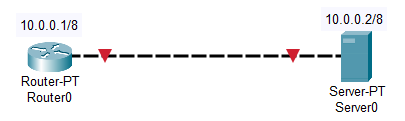
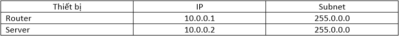
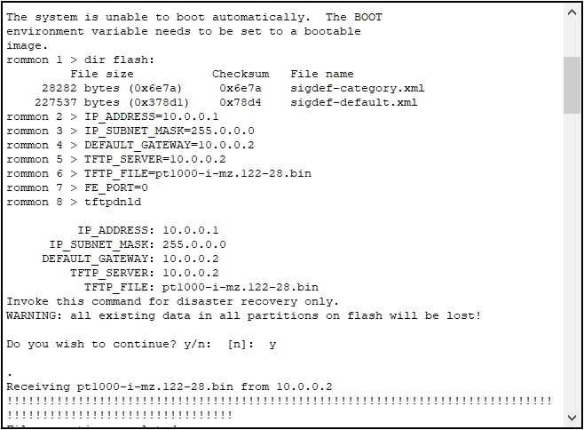
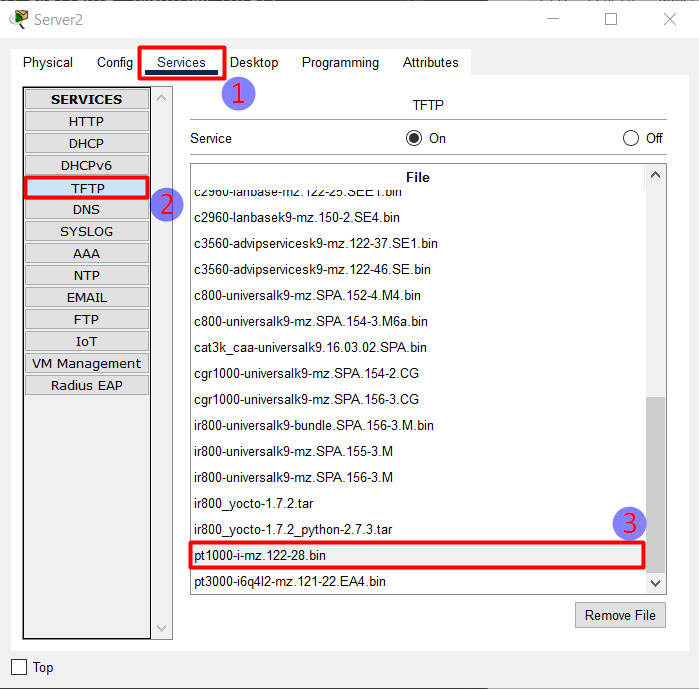
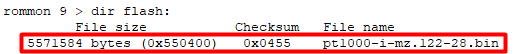
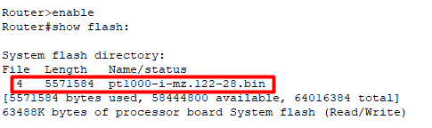

# Mô hình


# IP Planning


## Khôi phục hệ điều hành IOS trên Cisco Router.
Router và Cisco có 4 bộ nhớ:
- Flass: chứa hệ điều hành chính của thiết bị.
- ROM: chứa hệ điều hành phụ (mini OS) sử dụng khi hệ điều hành chính bị lỗi hoặc bị mất.
- RAM
- NVRAM

Để kiểm tra hệ điều hành của Router, ta sử dụng lệnh `show flash:`.
```
Router>enable
Router#show flash:

System flash directory:
File  Length   Name/status
  3   5571584  pt1000-i-mz.122-28.bin
  2   28282    sigdef-category.xml
  1   227537   sigdef-default.xml
[5827403 bytes used, 58188981 available, 64016384 total]
63488K bytes of processor board System flash (Read/Write)


Router#
```

Hiện tại flash có 3 file, file đuôi `.bin` là file hệ điều hành.

Ta có thể xoá các file trong bộ flash với lệnh `delete flash:ten_file`. 

Ở ví dụ này, ta giả sử file hệ điều hành bị mất, dùng lệnh `delete flash` để xoá file.
```
Router>enable
Router#show flash:

System flash directory:
File  Length   Name/status
  3   5571584  pt1000-i-mz.122-28.bin
  2   28282    sigdef-category.xml
  1   227537   sigdef-default.xml
[5827403 bytes used, 58188981 available, 64016384 total]
63488K bytes of processor board System flash (Read/Write)

Router#delete flash:pt1000-i-mz.122-28.bin 
Delete filename [pt1000-i-mz.122-28.bin]?
Delete flash:/pt1000-i-mz.122-28.bin? [confirm]

Router#show flash:

System flash directory:
File  Length   Name/status
  2   28282    sigdef-category.xml
  1   227537   sigdef-default.xml
[255819 bytes used, 63760565 available, 64016384 total]
63488K bytes of processor board System flash (Read/Write)


Router#
```

Xoá thành công file hệ điều hành. Sau đó ta tiến hành reload lại thiết bị bằng lệnh `reload` và vào chế độ `rommon`.
Tại chế độ `rommon` ta tiến hành đặt IP cho Router và download file hệ điều hành từ Server về Router.



Để lấy file hệ điều hành, ta truy cập vào Server, chọn mục Service --> TFTP --> chọn file phù hợp với thiết bị Router. Router ở đây là Router PT nên ta chọn file có tên là `pt`.



- `DEFAULT_GATEWAY` ta đặt địa chỉ của Server.
- `FE_PORT` là cổng được nối dây với Server.

Kiểm tra xem đã tải file từ Server về Router thành công hay chưa, ta sử dụng lệnh `dir flash`.



Như ảnh dưới là ta đã tải file về thành công. Sau đó ta dùng lệnh `reset` để khởi động lại thiết bị.

Ta có thể kiểm tra lại tại chế độ `Privileged`.



Vậy là ta đã khôi phục hệ điều hành trên Router thành công.


