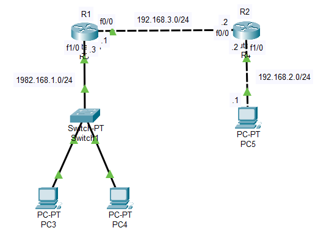
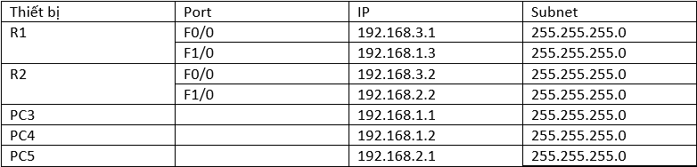
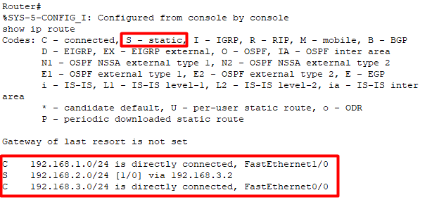
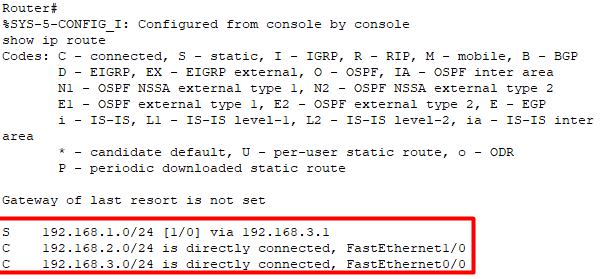

# Mô hình


# IP Planning


### I. Khái niệm
Định tuyến tĩnh là quá trình router thực hiện chuyển gói dữ liệu tới địa chỉ mạng đích dựa vào địa chỉ IP đích của gói dữ liệu. Để chuyển được gói dữ liệu đến đúng đích thì router phải học thông tin về đường đi tới các mạng khác. Thông tin về đường đi tới các mạng khác sẽ được người quản trị cấu hình cho router.


### II. Cấu hình định tuyến tĩnh
Đầu tiên, ta phải cấu hình IP cho các cổng của router, cũng như IP và Default-gateway cho các PC. Default Gateway hiểu đơn giản là IP của cổng Router gần nhất mà PC đó kết nối trực tiếp đến.

Cấu hình định tuyến tĩnh trên router Cisco được thực hiện bằng cách sử dụng lệnh có cú pháp sau: `ip route destination_subnet subnetmask{IP_next_hop|output_interface} [AD]`

Trong đó:
- destination_subnet: mạng đích đến.
- subnetmask: subnetmask của mạng đích.
- IP_next_hop: địa chỉ IP của trạm kế tiếp trên đường đi.
- output_interface: cổng ra trên router.
- AD: chỉ số AD của router khai báo, sử dụng trong trường hợp có cấu hình dự phòng.

Trong sơ đồ trên, từ R1 mà muốn đến mạng `192.168.2.0/24` thì phải đi qua cổng `f0/0`. Để thực hiện điều đó, ta vào bảng định tuyến tại router R1 và thực hiện những việc sau:
```
R1>enable
R1#conf t
R1(config)#ip route 192.168.2.0 255.255.255.0 192.168.3.2
R1(config)#
``` 

Bên router R2 cũng thực hiện tương tự như R1:
```
R2>enable
R2#conf t
R2(config)#ip route 192.168.1.0 255.255.255.0 192.168.3.1
R2(config)#
```

Sau khi đã cấu hình xong các router cho các mạng `192.168.1.0/24` và `192.168.2.0/24`, ta kiểm tra bảng định tuyến trên mỗi router.
- Bảng định tuyến R1:



Ký tự `S` ở đầu dòng thể hiện rằng các thông tin định tuyến này được học vào bảng định tuyến thông qua định tuyến tĩnh và các dòng mô tả các mạng kết nối trực tiếp được ký hiệu bởi chữ `C` - connected - kết nối trực tiếp.




