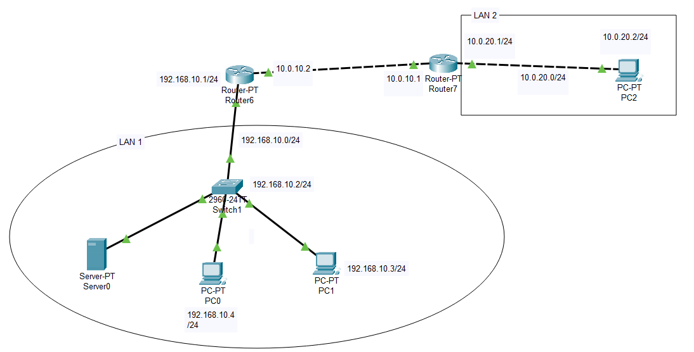
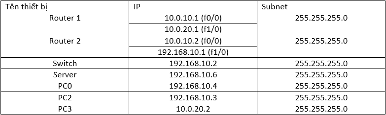
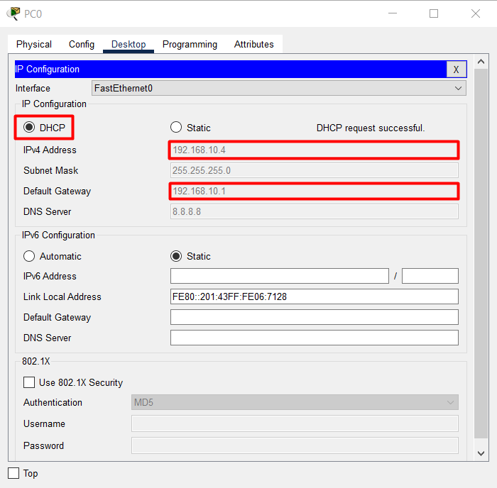
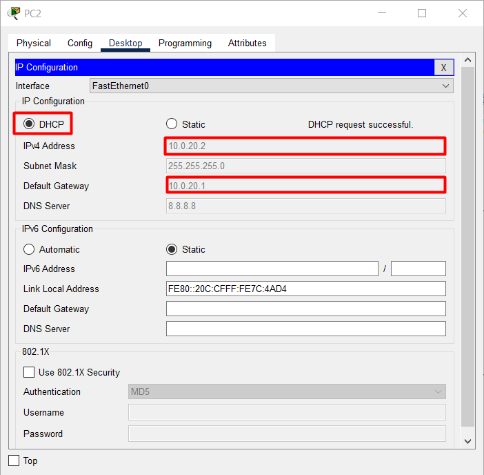

# Mô hình


# IP Planning


- Bật dịch vụ DHCP server lên bằng lệnh `service dhcp`. Khi cấu hình cấp phát địa chỉ IP động, không cấp phát các IP đã gán cố định có trên các máy chủ, thiết bị, ... Với mô hình này, yêu cầu không cấp phát bao gồm: 192.168.10.1 và 192.168.10.2
```
Router#conf t
Router(config)#service dhcp 
```

- Khai báo DHCP pool sau đó định nghĩa đường mạng các địa chỉ IP cấp phát cho các thiết bị trên LAN.
```
Router(config)#ip dhcp pool LAN1
Router(dhcp-config)#network 192.168.10.0 255.255.255.0
```

- Khai báo các biến bổ sung như: DNS Server, Default Gateway
```
Router(dhcp-config)#default-router 192.168.10.1
Router(dhcp-config)#dns-server 8.8.8.8
Router(dhcp-config)#
```

- Loại bỏ các địa chỉ mà `LAN1` pool sẽ không cấp phát cho thiết bị trong mạng LAN.
```
Router(config)#ip dhcp excluded-address 192.168.10.1 192.168.10.2
Router(config)#ip dhcp excluded-address 10.0.20.1
```

**Kiểm tra địa chỉ IP đã cấp phát trên Cisco Router**
```
Router#show ip dhcp binding
IP address       Client-ID/              Lease expiration        Type
                 Hardware address
192.168.10.4     0001.4306.7128           --                     Automatic
192.168.10.5     00E0.F975.622A           --                     Automatic
Router#
```

Kiểm tra trên PC.



Để `Router1` có thể cấp ip cho mạng `LAN2` ta làm tương tự như với `Router2`:
```
Router#conf t
Enter configuration commands, one per line.  End with CNTL/Z.
Router(config)#ip dhcp excluded-address 10.0.20.1
Router(config)#ip dhcp pool LAN2
Router(dhcp-config)#network 10.0.20.0 255.255.255.0
Router(dhcp-config)#default-router 10.0.20.1
Router(dhcp-config)#dns-server 8.8.8.8
Router(dhcp-config)#
```
Kiểm tra trên Router1;
```
Router#show ip dhcp bi
Router#show ip dhcp binding 
IP address       Client-ID/              Lease expiration        Type
                 Hardware address
10.0.20.2        000C.CF7C.4AD4           --                     Automatic
Router#
```

Kiểm tra ở trên PC2 thuộc LAN2:




