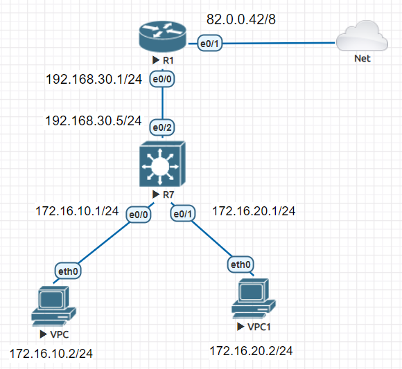
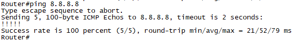
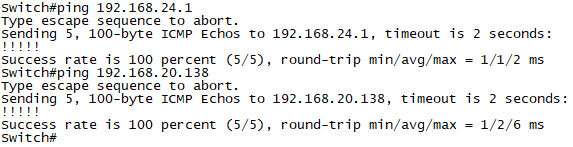
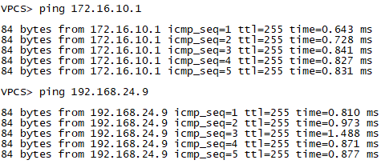
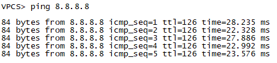
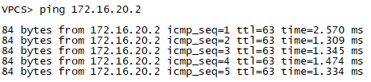

# Mô hình


# IP Planing

   
   
   
### I. Cấu hình trên 2 PC
Đặt ip cho PC1:
```
VPCS> ip 172.16.10.2/24 172.16.10.1
Checking for duplicate address...
PC1 : 172.16.10.2 255.255.255.0 gateway 172.16.10.1
```

Kiểm tra xem ip đã đặt thành công hay chưa bằNg lệnh `show ip`.
```
VPCS> show ip

NAME        : VPCS[1]
IP/MASK     : 172.16.10.2/24
GATEWAY     : 172.16.10.1
DNS         : 
MAC         : 00:50:79:66:68:05
LPORT       : 20000
RHOST:PORT  : 127.0.0.1:30000
MTU         : 1500
```

Tiến hành đặt IP cho PC2 tương tự như PC1.

### II. Cấu hình trên Switch Layer 3
Đặt `ip VLAN10` cho Sw layer 3:
```
Switch>en
Switch#conf t
Enter configuration commands, one per line.  End with CNTL/Z.
Switch(config)#int vlan 10
*Aug 15 01:52:55.986: %LINEPROTO-5-UPDOWN: Line protocol on Interface Vlan10, changed state to down
Switch(config-if)#ip address 172.16.10.1 255.255.255.0
Switch(config-if)#no shut
Switch(config-if)#
```

Đặt `ip VLAN 20` như với `VLAN 10`.

Ta cần thêm 1 port vào `vlan 10` và `vlan 20` để trạng thái chuyển thành `up`.

Thêm port `e0/0` vào vlan 10:
```
Switch(config)#int e0/0
Switch(config-if)#switchport mode access 
Switch(config-if)#switchport access vlan 10
Switch(config-if)#no shut
```

Làm tương tự với `vlan 20` và port `e0/1`.
Kiểm tra xem `vlan 10` đã ở trạng thái up chưa bằng lệnh `show ip int br`.
```
Switch#show ip int br
Interface              IP-Address      OK? Method Status                Protocol
Ethernet0/0            unassigned      YES unset  up                    up      
Ethernet0/1            unassigned      YES unset  up                    up      
Ethernet0/2            192.168.24.9    YES manual up                    up      
Ethernet0/3            unassigned      YES unset  up                    up      
Vlan10                 172.16.10.1     YES manual up                    up      
Vlan20                 172.16.20.1     YES manual up                    up      
Switch#
```

Tương tự, ta thêm port `e0/1` vào `vlan 20`.

Đặt ip cho port `e0/2` được nối với Router.
```
Switch(config)#int e0/2
Switch(config-if)#ip add
Switch(config-if)#ip address 192.168.24.9 255.255.255.0
Switch(config-if)#no shut
```

### III. Cấu hình trên Router.
Tiến hành đặt ip cho port `e0/0`.
```
Router(config)#int e0/0
Router(config-if)#ip address 192.168.24.1 255.255.255.0
Router(config-if)#no shut
```

Port `e0/1` được cấp IP động từ Net nên sẽ không cần cấu hình IP port này.

### Tiến hành Routing 
#### 1. Trên Router.
Thực hiện routing từ Router tới PC1 và PC2.
```
Router#conf t
Enter configuration commands, one per line.  End with CNTL/Z.
Router(config)#ip route 172.16.10.0 255.255.255.0 192.168.24.9
Router(config)#ip route 172.16.20.0 255.255.255.0 192.168.24.9
Router(config)#
```

### 2. Trên Switch Layer 3
Thực hiện routing từ Switch tới Net.
```
Switch#conf t
Enter configuration commands, one per line.  End with CNTL/Z.
Switch(config)#ip route 0.0.0.0 0.0.0.0 192.168.24.1
Switch(config)#
```


## Kiểm tra xem đã routing thành công hay chưa
- Ping từ Router tới `8.8.8.8`.



- Ping từ Switch tới Router.



- Ping từ các PC tới Switch.



- Ping từ các PC tới `8.8.8.8`.



- Ping giữa 2 PC với nhau.




