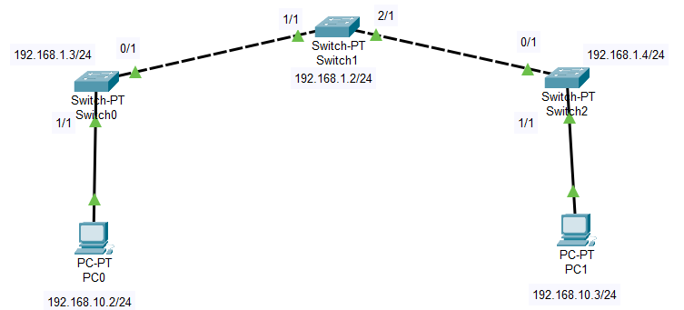
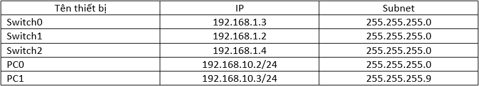
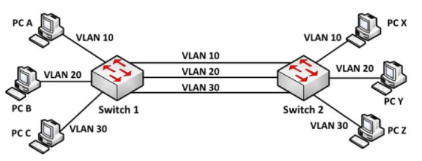
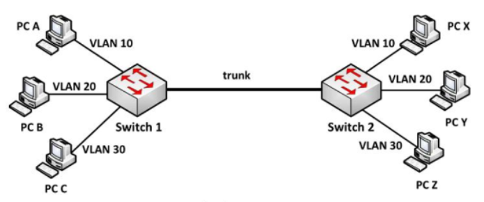
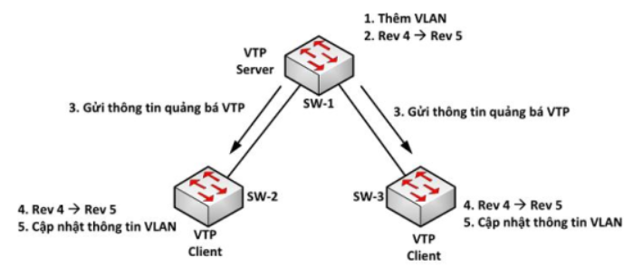
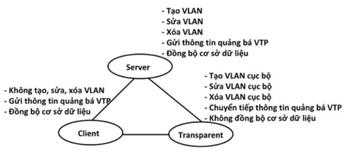
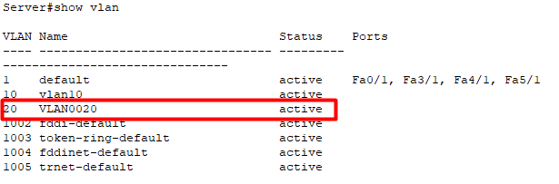
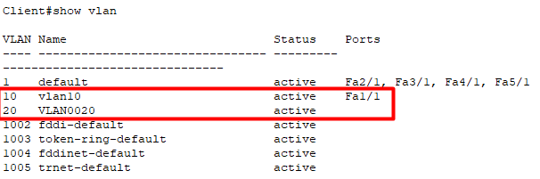

# Mô hình


# IP Planning



## I. VLAN
### 1. Khái niệm
VLAN là viết tắt của `Virtual Local Area Network` hay còn gọi là mạng LAN ảo. Mạng LAN ảo là một nhóm các máy tính được kết nối với cùng một mạng nhưng không ở gần nhau.

Một VLAN được định nghĩa là một nhóm logic các thiết bị mạng và được thiết lập dựa trên các yếu tố như chức năng, bộ phận, ứng dụng, ... của công ty.

VLAN là một miền quảng bá được tạo bởi `Switch`.

### 2. Các loại VLAN
- `Port-based VLAN`: là cách cấu hình VLAN đơn giản và phổ biến. Mỗi cổng của Switch được gán với một VLAN xác định (mặc định là VLAN 1), do vậy bất cứ thiết bị host nào gắn vào cổng đó đều thuộc một VLAN nào đó.
- `MAC address based VLAN`: cách cấu hình này ít được sử dụng do có nhiều bất tiện trong việc quản lý. Mỗi địa chỉ MAC được đánh dấu với một VLAN xác định.
- `Protocol based VLAN`: cách cấu hình này gần giống như MAC address based, nhưng sử dụng một địa chỉ logic hay địa chỉ IP thay thế cho địa chỉ MAC. Cách cấu hình không còn thông dụng nhờ sử dụng giao thức DHCP.

### 3. Lợi ích của VLAN
- Tiết kiệm băng thông của hệ thống mạng.
- Tăng khả năng bảo mật.
- Dễ dàng thêm hay bớt máy tính vào VLAN.
- Giúp mạng có tính linh động cao.

## II. Đường Trunk
VLAN tổ chức trên nhiều Switch, để các thiết bị nằm ở những Switch khác nhau có thể liên lạc với nhau, ta có 2 cách:
- Dùng mỗi kết nối cho từng VLAN.



Có nghĩa là mỗi VLAN ở trên các Switch sẽ được kết nối lại bằng một đường kết nối riêng. Theo mô hình trên ta thấy, nếu PC A trong VLAN 10 ở Switch 1 muốn liên lạc với PC X trong VLAN 10 ở Switch 2, ta phải có một kết nối vật lý nối Switch 1 với Switch 2 và hai cổng kết nối này phải cùng VLAN 10.

Tương tự vớI VLAN 2 và VLAN 3. Vậy với N VLAN được tạo ra tổng cộng ta phải dùng đến N dây nối. Điều này gây ra lãng phí.

- Kết nối Trunk.
Một kỹ thuật khác để giải quyết vấn đề trên là dùng chỉ một kết nối cho phép dữ liệu của các VLAN có thể cùng lưu thông qua đường này. Người này gọi kết nối này là đường Trunk.



Theo mô hình trên chúng ta thấy chỉ dùng 1 dây nối Switch 1 với Switch 2, các thành viên trong cùng VLAN ở các Switch khác nhau vẫn có thể giao tiếp với nhau. Đường dây như thế gọi à Trunk lớp 2.

## III. VLAN Trunking Protocol (VTP)
VTP là là giao thức hoạt động ở tầng liên kết dữ liệu trong mô hình OSI. VTP giúp việc cấu hình VLAN luôn đồng nhất khi thêm, sửa, xoá, sửa thông tin về VLAN trong hệ thống mạng.

### Hoạt động của VTP
VTP gửi thông điệp quảng bá qua `VTP domain` mỗi 5 phút một lần, hoặc khi có sự thay đổi xảy ra trong quá trình cấu hình VLAN. Một thông điệp VTP bao gồm `rivision-number`, tên VLAN (VLAN name), số hiệu VLAN. Bằng sự cấu hình VTP Server và việc quảng bá thông tin VTP tất cả các switch đều đồng bộ về tên VLAN và số liệu VLAN của tất cả các VLAN.



### VTP hoạt động ở 1 trong 3 cơ chế sau:
- Server
- Client
- Transparent



## IV. Cấu hình VLAN trên Switch
- Tạo VLAN
```
Server(config)#conf t
Server(config)#vlan 10 
Server(config-vlan)#name vlan10
Server(config)#vlan 20
Server(config-vlan)#name vlan20
Server(config-vlan)#exit
```

- Kiểm tra VLAN vừa tạo
```
Server#show vlan

VLAN Name                             Status    Ports
---- -------------------------------- --------- -------------------------------
1    default                          active    Fa0/1, Fa3/1, Fa4/1, Fa5/1
10   vlan10                           active    
20   vlan20                           active    
1002 fddi-default                     active    
1003 token-ring-default               active    
1004 fddinet-default                  active    
1005 trnet-default                    active    
```

Xác định port mà thiết bị cần cấu hình VLAN.
```
Server(config)#int range f1/1,f2/1
Server(config)#switchport access vlan 10
```

## V. Cấu hình Trunking trên Cisco 
- Chọn port cần cấu hình đường trunk và cấu hình bằng lệnh như ví dụ dưới.
```
Server(config)#int range f1/1,f2/1
Server(config-if-range)#switchport mode trunk 
```

- Kiểm tra xem các interface này đã thiết lập đường trunk hay chưa, ta dùng lệnh `show interface trunk`.
```
Server#show interfaces trunk
Port        Mode         Encapsulation  Status        Native vlan
Fa1/1       on           802.1q         trunking      1
Fa2/1       on           802.1q         trunking      1

Port        Vlans allowed on trunk
Fa1/1       10-20
Fa2/1       10-20

Port        Vlans allowed and active in management domain
Fa1/1       10,20
Fa2/1       10,20

Port        Vlans in spanning tree forwarding state and not pruned
Fa1/1       10,20
Fa2/1       10,20
```

Kết quả ở trên cho thấy, Switch tên Server với port `Fa1/1` và `Fa2/1` đã được thiết lập đường trunk.

Làm tương tự với các Switch còn lại.

## VI. Giao thức VTP
Giao thức cho phép lan truyền thông tin VLAN giữa các Switch.

Tại Switch tên Client, ta thấy chỉ có duy nhất 1 `vlan 10`. Sau đó ta tiến hành thêm `vlan 20` tại Switch Server, lúc này Switch Client sẽ học `vlan 20` từ Switch Server.




Kiểm tra lại ta thấy Client đã có thêm `vlan 20`.




