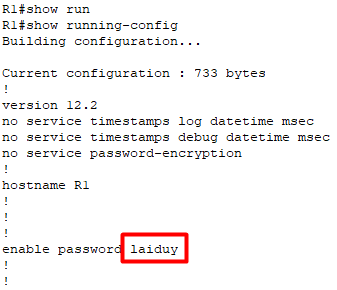

# Mô hình


## Tiến hành cấu hình cơ bản router
Kích đúp vào biểu tượng router, sau đó di chuyển vào phần CLI. Khi lần đầu tiên khởi động thiết bị với cấu hình trắng, sẽ xuất hiện giao diện như hình bên dưới, ta chọn `no` để tự mình cấu hình các tham số cho thiết bị.


Khi chọn `no` và ấn Enter, ta sẽ thấy ta đang ở chế độ `user EXEC mode`.

Để khảo sát chế độ này dùng được bao nhiêu lệnh thì ta gõ ký tự `?`.


Ta thấy có lệnh `enable`. Đây là lệnh để vào chế độ cao hơn.
```
Router>enable
Router#
```

Ta thấy dấu `>` đã chuyển thành `#` tức là đã thành công vào chế độ đặc quyền cao hơn. Tại đây ta cũng gõ ký tự `?` để xem các lệnh có thể thực hiện được.
```
Router#?
Exec commands:
  <1-99>      Session number to resume
  auto        Exec level Automation
  clear       Reset functions
  clock       Manage the system clock
  configure   Enter configuration mode
  connect     Open a terminal connection
  copy        Copy from one file to another
  debug       Debugging functions (see also 'undebug')
  delete      Delete a file
  dir         List files on a filesystem
  disable     Turn off privileged commands
  disconnect  Disconnect an existing network connection
  enable      Turn on privileged commands
  erase       Erase a filesystem
  exit        Exit from the EXEC
  logout      Exit from the EXEC
  mkdir       Create new directory
  more        Display the contents of a file
  no          Disable debugging informations
  ping        Send echo messages
  reload      Halt and perform a cold restart
  resume      Resume an active network connection
 --More-- 
```

Và khi ta ấn phím cách trên bàn phím (phím dài nhất) thì sẽ hiển thị thêm thêm 1 trang màn hình cho đến khi hết câu lệnh thì thôi.
```
Router#?
Exec commands:
  <1-99>      Session number to resume
  auto        Exec level Automation
  clear       Reset functions
  clock       Manage the system clock
  configure   Enter configuration mode
  connect     Open a terminal connection
...
  more        Display the contents of a file
  no          Disable debugging informations
  ping        Send echo messages
  reload      Halt and perform a cold restart
  resume      Resume an active network connection
  rmdir       Remove existing directory
  send        Send a message to other tty lines
  setup       Run the SETUP command facility
  show        Show running system information
  ssh         Open a secure shell client connection
  telnet      Open a telnet connection
  terminal    Set terminal line parameters
  traceroute  Trace route to destination
  undebug     Disable debugging functions (see also 'debug')
  write       Write running configuration to memory, network, or terminal
Router#
```

Vậy là ta vừa khảo sát xong 2 chế độ là `User EXEC Mode` và `Privileged EXEC Mode`.

Để có thể cấu hình thì ta cần vào chế độ `global configuration mode`.

Ta muốn liệt kê tất cả các câu lệnh bằng chữ cái nào thì ta chỉ cần gõ chữ cái đó và dấu `?` kèm theo sau. Ví dụ ở dưới liệt kê các câu lệnh bắt đầu bằng chữ `c`.
```
Router#c?
clear  clock  configure  connect  copy  
Router#c
```
Ta thấy ở đây có câu lệnh `configure` để truy cập vào chết độ `configure terminal`. Nếu bạn không nhớ hết câu lệnh thì chỉ cần ghi vài chữ đầu sau đó ấn `Tab` câu lệnh sẽ tự hoàn thiện.
Để xem các option có thể dùng với `configure` thì ta chỉ cần thêm ký tự `?` ở cuối. Ở đây ta thấy chỉ có option `terminal` có thể được dùng nên ta sẽ gõ đầy đủ cả câu lệnh là `configure terminal` và Enter.
```
Router#confi
Router#configure ?
  terminal  Configure from the terminal
  <cr>
Router#configure terminal
Enter configuration commands, one per line.  End with CNTL/Z.
Router(config)#
```

Ngoài ra ta có thể gõ tắt câu lệnh `configure terminal` thành `conf t`.
```
Router#conf t
Enter configuration commands, one per line.  End with CNTL/Z.
Router(config)#
```

Tại đây ta cũng dùng ký tự `?` để xem các lệnh có thể thực hiện được. 


Câu lệnh `hostname` cho phép ta đặt tên cho thiết bị. Để thoát khỏi bảng hiện các option ta ấn phím bất kỳ (q, w, e, ...)
```
Router(config)#hostname ?
  WORD  This system's network name
Router(config)#hostname R1
R1(config)#
```

Ta thấy từ `Router` đã chuyển thành `R1`.

## Cấu hình 2 loại mật khẩu trên router
### 1. Mật khẩu console
Ta sử dụng lệnh `line consolo 0` để vào chế độ line và đặt mật khẩu.
```
R1(config)#line console 0
R1(config-line)#pas
R1(config-line)#password duylk123
R1(config-line)#login
R1(config-line)#
```
Để password có hiệu lực, ta gõ thêm từ `login`. Ở đây ta đặt mật khẩu `console` là `duylk123`. 
Để test thử mật khẩu, ta cần thoát hẳn khỏi Router bằng lệnh `exit`. Mỗi lần dùng lệnh ta sẽ thoát được 1 cấp. Dùng lệnh `exit` đến khi hiện ra như ví dụ dưới.
```
R1(config-line)#exit
R1(config)#exit
R1#
%SYS-5-CONFIG_I: Configured from console by console

R1#exit


R1 con0 is now available


Press RETURN to get started.


```
Để quay lại ta ấn phím Enter thì ngay lập tức thiết bị sẽ yêu cầu đăng nhập mật khẩu console.


Khi nhập mật khẩu thì trên màn sẽ không hiện ký tự.


### 2. Mật khẩu enable
Từ chế độ `User` mà muốn vào chế độ `Privileged` thì ta cần có mật khẩu thì mới vào được.
```
R1>enable
R1#conf t
Enter configuration commands, one per line.  End with CNTL/Z.
R1(config)#enable passw
R1(config)#enable password duylk208
R1(config)#end
R1#
%SYS-5-CONFIG_I: Configured from console by console

R1#disable
R1>enable
Password: 
R1#
```
Nếu muốn gỡ bỏ mật khẩu enable thì ta sẽ thực hiện câu lệnh `No enable password`.
```
R1#configure terminal 
Enter configuration commands, one per line.  End with CNTL/Z.
R1(config)#no enable password
R1(config)#end
R1#
%SYS-5-CONFIG_I: Configured from console by console

R1#disable
R1>enable
R1#
```

## Mã hoá mật khẩu
Sử dụng lệnh `show running-config` tại chế độ `Privileged`.



Ta thấy mật khẩu chưa được mã hoá và vẫn hiện như lúc mới tạo. Ta sử dụng lệnh `service password-encryption` trong chế độ `config` để mã hoá các mật khẩu.


Ta thấy mật khẩu ban đầu là `laiduy` đã được mã hoá thành `082D4D470D0C1C`.

## Cấu hình router
Để hiển thị router có bao nhiêu cổng thì ta thực hiện câu lệnh là `show ip interface brief`.
```
R1#show ip interface brief 
Interface              IP-Address      OK? Method Status                Protocol 
FastEthernet0/0        unassigned      YES unset  administratively down down 
FastEthernet1/0        unassigned      YES unset  administratively down down 
Serial2/0              unassigned      YES unset  administratively down down 
Serial3/0              unassigned      YES unset  administratively down down 
FastEthernet4/0        unassigned      YES unset  administratively down down 
FastEthernet5/0        unassigned      YES unset  administratively down down
R1#
```

Ta muốn vào cổng `FastEthernet0/0` để cấu hình IP cho cổng này ta cần vào `mode global config` trước. Ta gõ tiếp `interface f0/0`. Sau đó ta sử dụng lệnh `ip address 192.168.1.2 255.255.255.0`. Cuối cùng thực hiện câu lệnh `no shutdown` để kích hoạt cổng này lên.


Cổng giao tiếp đã chuyển từ màu đỏ sang màu xanh lá và cho phép truyền dữ liệu.

Để kiểm tra xem dữ liệu truyền từ router đến PC đã thông hay chưa, ta vào PC và đặt IP. Ta ấn đúp vào máy tính, vào mục `desktop`, chọn `IP configuration`.


Ta làm tương tự với máy tính còn lại. Kiểm tra xem các máy đã thông với router chưa, ta sử dụng lệnh `ping`. 

Đứng từ PC1, ta ping tới địa chỉ ip của router là `192.168.1.2`.


Kết quả như hình tức là router và PC đã thông với nhau. Ta cũng có thể ping 2 PC với nhau.


## Cấu hình IP cho Switch

```
Switch>enable
Switch#conf t
Enter configuration commands, one per line.  End with CNTL/Z.
Switch(config)#interface vlan 1
Switch(config-if)#ip address 192.168.1.19 255.255.255.0
Switch(config-if)#no shutdown

Switch(config-if)#
%LINK-5-CHANGED: Interface Vlan1, changed state to up

%LINEPROTO-5-UPDOWN: Line protocol on Interface Vlan1, changed state to up

Switch(config-if)#
```


