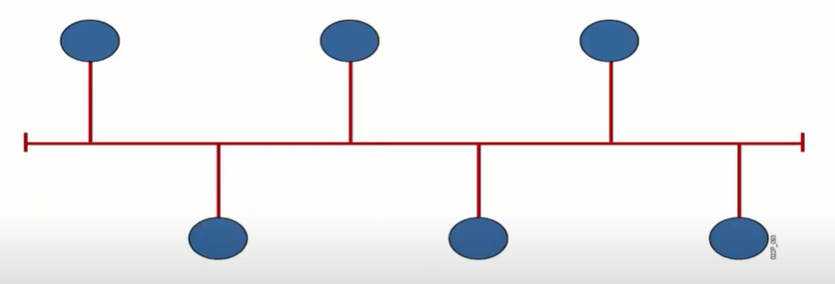
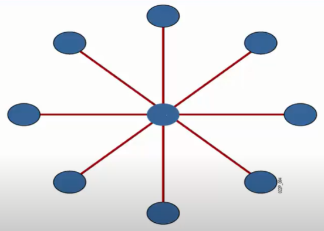
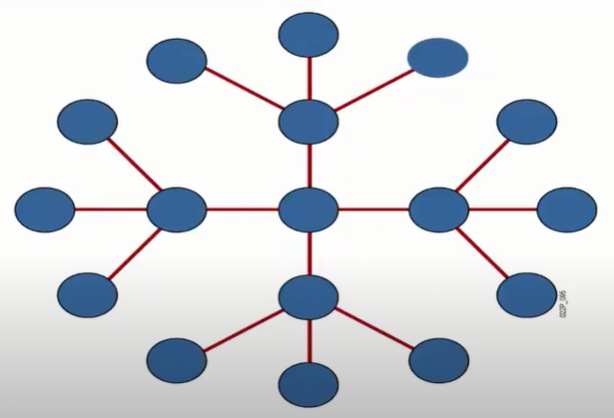
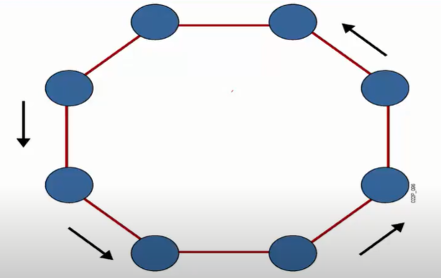
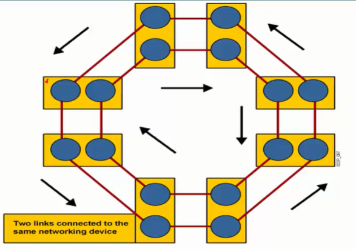
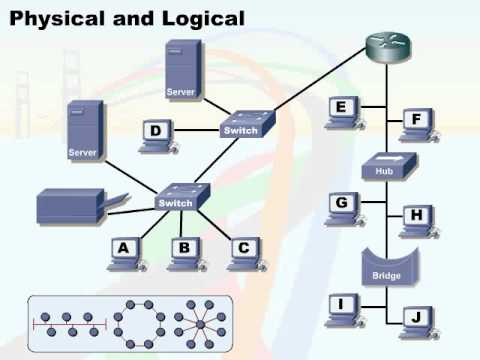
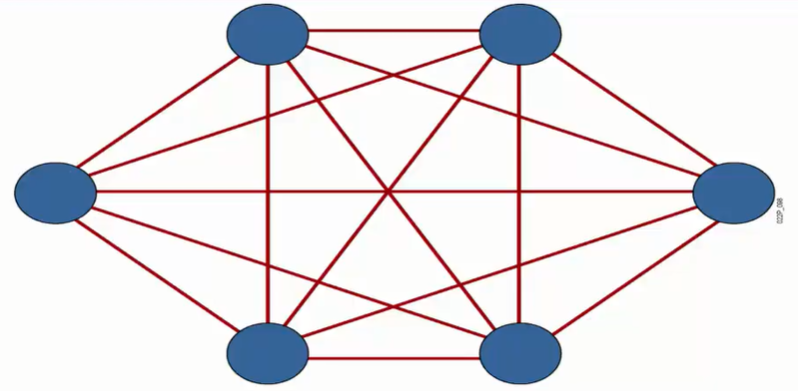
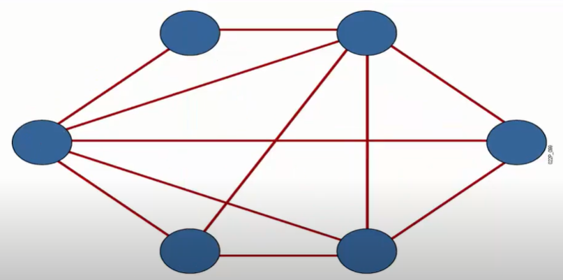

# Network basic
### Menu
[I. Khái niệm mạng máy tính](#khai_niem_mang_may_tinh)
- [1. Chia sẻ về dữ liệu và ứng dụng](#chia_se_ve_du_lieu_va_ung_dung)
- [2. Chia sẻ tài nguyên phần cứng](#chia_se_tai_nguyen_phan_cung)
- [3. Lưu trữ dữ liệu, dự phòng dữ liệu](#luu_tru_du_lieu_du_phong_du_lieu)

[II. Các ứng dụng](#cac_ung_dung)

[III. Tác động của người dùng ứng dụng trên mạng](#tac_dong_cua_nguoi_dung_ung_dung_tren_mang)
- [1. Ứng dụng dạng Batch](#ung_dung_dang_batch)
- [2. Ứng dụng tương tác](#ung_dung_tuong_tac)
- [3. Ứng dụng thời gian thực](#ung_dung_thoi_gian_thuc)

[IV. Đặc điểm của một mạng](#dac_diem_cua_mot_mang)
- [1. Tốc độ](#toc_do)
- [2. Chi phí triển khai hệ thống](#chi_phi_trien_khai_he_thong_mang)
- [3. Bảo mật](#bao_mat)
- [4. Tính sẵn sàng](#tinh_san_sang)
- [5. Độ mở rộng](#do_mo_rong)
- [6. Độ tin cậy](#do_tin_cay)
- [7. Sơ đồ mạng](#so_do_mang)

[V. Các loại sơ đồ mạng](#cac_loai_so_do_mang)
- [1. Physical](#physical)
- [2. Logical](#logical)
- [3. Sơ đồ Full Mesh](#full_mesh)

[VI. Các loại hình kết nối internet ở Việt Nam](#cac_loai_hinh_ket_noi_internet_o_Viet_Nam)
- [1. ADSL](#ADSL)
- [2. FTTH/FTTB (Fiber to the Home/Fiber to the Building)](#FTTH_FTTB)
- [3. Cable TV](#cableTV)
- [4. Leased line internet](#leased_line_internet)

## I. Khái niệm mạng máy tính
Mạng máy tính là một tập hợp các thực thể mạng có thể kết nối được với nhau, 
có thể trò chuuyện được với nhau cũng như có thể trao đổi dữ liệu được với nhau thì đó gọi là một mạng máy tính.

Thực thể mạng là những thiết bị mạng mà mình tiếp xúc mỗi ngày như PC, máy tính, laptop, điện thoại, router, ... miễn sao kết nối vào được mạng thì đó là thực thể mạng. 

Để kết nối vào hệ thống mạng thì ta cần những thực thể mạng như PC, trên PC này sẽ có card mạng (Network interface card - NIC), trên card mạng này ta sẽ sử dụng một sợi dây cáp, một đầu cắm vào card mạng đầu còn lại sẽ cắm vào switch, từ switch ta lại dùng một sợi dây cáp mạng để nối từ switch tới 1 con router, rồi từ router ta sẽ có những đường để đi ra ngoài mạng và những máy PC có thể truy cập internet bình thường.

Các ký hiệu trong sơ đồ mạng
- Đường kết nối liền với nhau màu đỏ hoặc đen: đây là đường kết nối mạng LAN hay còn gọi là mạng nội bộ.
- Đường zích zắc: đường kết nối mạng WAN (mạng diện rộng).
- Đường nét đứt hoặc đường bọc trong ống: kết nối từ xa hay đường kết nối mạng riêng ảo.
- Đám mây màu xám: bên trong có rất nhiều thiết bị mạng, nhiều đường đi mà không mô phỏng được hết.

Trong mạng máy tính có 4 tính năng về chia sẻ, sao lưu dữ liệu.

### 1. Chia sẻ về dữ liệu và ứng dụng.
Để gửi dữ liệu từ máy A đến máy B, ta sử dụng một dây cáp mạng đấu nối từ máy A sang B thì sẽ gửi dữ liệu bình thường.

### 2. Chia sẻ tài nguyên phần cứng.
Ví dụ trong công ty, ta thường muốn in tài liệu từ máy in thì máy in này phải được kết nối vào hệ thống mạng và nếu thành viên của công ty muốn in tài liệu thì chỉ cần truy cập vào hệ thống mạng của công ty là có thể truy cập dễ dàng vào máy in và sử dụng bình thường.

### 3. Lưu trữ dự liệu, dự phòng dữ liệu.
Trong một mạng máy tính, sẽ có những server để lưu trữ dữ liệu quan trọng (dữ liệu của khách hàng). Khi mà công ty không có server để lưu trữ dữ liệu thì ta có thể sử dụng các ứng dụng lưu trữ trực tuyến như gg drive.

## II. Các ứng dụng.
- Thư điện tử: Outlook, gmail.
- Trình duyệt web: gg chrome, coccoc.
- Hội họp: gg meet, jitsi, ...
- Nhắn tin trực tuyến: Facebook, Zalo, ...
- Lưu trữ dữ liệu: file servers.

## III. Tác động của ứng dụng người dùng trên mạng.

### 1. Ứng dụng dạng Batch.
Là ứng dụng chỉ có máy tính giao tiếp với máy tính và không có sự can thiệp của con người.

Những ứng dụng này là ứng dụng dùng để truyền tải dữ liệu hay download dữ liệu. Những ứng dụng này thì băng thông sẽ là yếu tố quan trọng nhất.

### 2. Ứng dụng tương tác.
Là những ứng dụng mà con người sẽ tương tác với máy tính. Những ứng dụng này thường là ứng dụng trích xuất dữ liệu của khách hàng hay người dùng. Yếu tố quan trong nhất của ứng dụng này 7là thời gian phản hồi từ server về cho ta.

### 3. Ứng dụng thời gian thực.
Là những ứng dụng mà con người tương tác với con người (gọi video call). Những ứng dụng này yêu cầu độ trễ thấp nhất.

## IV. Đặc điểm của 1 mạng.

### 1. Tốc độ.
Tốc độ mạng nhanh hay chậm do gói cước đăng ký trên nhà mạng.

### 2. Chi phí triển khai hệ thống mạng.
Để triển khai hết hệ thống mạng cần bao nhiêu tiền từ PC, laptop, server, router, đi dây như nào.
 

### 3. Bảo mật.
Chống các hacker bên ngoài, các thành phần đảo chính trong công ty.

### 4. Tính sẵn sàng.
Khi thiết kế một hệ thống mạng, đảm bảo mạng của mình được kết nối 24/24 không bị gián đoạn.

### 5. Độ mở rộng.
Khi thiết kế 1 hệ thống mạng, không nên thiết kế chỉ phù hợp cho hiện
tại mà cần phải phù hợp trong vài năm tới.

### 6. Độ tin cậy.
Khi thiết kế hệ thống mạng, phải đảm bảo những user có thể truy cập được
hệ thống mạng, họ phải gửI tài liệu đi được và đầu bên kia phải nhận được dữ liệu 1 cách hoàn chỉnh mà không mất gì cả.

### 7. Sơ đồ mạng.
Phải có một sơ đồ mạng khi xây dựng một hệ thống mạng để lưu trữ tất cả 
các thiết bị bên trong mạng của mình để nếu xảy ra sự cố thì có thể dễ dàng khoanh vùng xem nơi phát sinh lỗi là ở đâu.

## V. Các loại sơ đồ mạng

### 1. Physical
Có 3 loại sơ đồ chính: Bus, Ring và Star.

- Sơ đồ dạng bus

Những điểm mạng sẽ được kết nối với nhau trên một đường truyền. Khi một máy trong đường truyền truyền đi một dữ liệu vào đường truyền thì các máy trong mạng bus này đều nhận được dữ liệu.

- Sơ đồ dạng hình sao (Star)
Tất cả các thiết bị được kết nối qua một thiết bị tập trung ở giữa.

Khi một máy A muốn gửi gì đó cho máy B, thì máy A sẽ đẩy dữ liệu qua thiết bị tập trung và thiết bị tập trung sẽ gửi dữ liệu đến cho máy B một cách riêng lẻ và bảo mật.

Trong sơ đồ dạng sao tồn tại một điểm chết chính là điểm ở giữa. Nếu điểm ở giữa chết thì tất cả các máy sung quanh sẽ không di chuyển được vì điểm ở giữa mang tính chất là điểm chung chuyển. Còn nếu máy khác bị chết thì chỉ có máy đấy bị cô lập và không ảnh hưởng gì đến các máy khác.

Để giải quyết vấn đề này, họ đưa ra một mô hình sao mở rộng. Có nhiều thiết bị tập trung hơn.

- Sơ đồ dạng vòng (ring)
Các thiết bị được đóng gói với nhau theo hình vòng tròn và luồng dữ liệu sẽ di chuyển theo cùng chiều hoặc ngược chiều kim đồng hồ.

Để tránh cho việc sơ đồ bị tê liệt do đứt dây giữa 2 máy, người ta đưa ra một sơ đồ mở rộng hơn là Dual Ring.

Các phần màu vàng đại diện cho 1 thiết bị tập trung. Trong sơ đồ lúc này có 2 vòng di chuyển, 1 vòng ngược chiều và 1 vòng cùng chiều kim đồng hồ.

Nếu vòng ngược chiều kim đồng hồ bị đứt, dữ liệu sẽ đi vào vòng cũng chiều kim đồng hồ. Mô hình này có tính dự phòng cao, đứt đường này thì vẫn còn đường khác.

### 2. Logical
Thể hiện luồng dữ liệu di chuyển trong sơ đồ vật lý như thế nào.

Sơ đồ logical đôi khi rất giống với sơ đồ physical.

### 3. Sơ đồ Full Mesh
Là tất cả các thiết bị đều có những đường kết nối tới tất cả các thiết bị còn lại. Mô hình này đảm bảo tính dự phòng cao cho sơ đồ mạng.

Mô hình này tính dự phòng cao nhưng không hợp lý do chi phí triển khai những đường dự phòng này rất cao và dễ phát sinh ra lỗi. Vì vậy nên họ đã đưa ra thêm 1 sơ đồ nữa là sơ đồ `Partial Mesh`.

Sơ đồ này không có tất cả những đường kết nối tới những điểm còn lại mà những nơi nào quan trọng như trụ sở thì sẽ có những đường từ chi nhánh khác về nó.

## VI. Các loại hình kết nối internet ở Việt Nam

### 1. ADSL
Để kết nối vào internet, ta tiến hành lên nhà đài cung cấp dịch vụ mạng đăng ký thuê bao điện thoại và vài ngày sau sẽ có người kỹ thuật đem modum xuống và ta cắm dây vào cục modum tiến hành vào internet một cách bình thường.

### 2. FTTH/FTTB (Fiber to the Home/Fiber to the Building)
Là loại hình kết nối cáp quang nên tốc độ kết nối vào internet nhanh.

### 3. Cable TV
Là loại hình kết nối internet thông qua dịch vụ truyền hình cáp.

### 4. Leased line internet
Loại hình này không dùng cho những người dùng tại nhà mà chỉ áp dụng với hệ thống mạng doanh nghiệp lớn. 

Khi những doanh nghiệp lớn muốn có những đường truyền riêng biệt, đảm bảo tốc độ nhanh không bị ảnh hưởng từ chi nhánh này qua chi nhánh khác thì họ sẽ thuê 1 đường truyền Leased line internet riêng biệt chỉ có họ mới được sử dụng đường truyền này.

