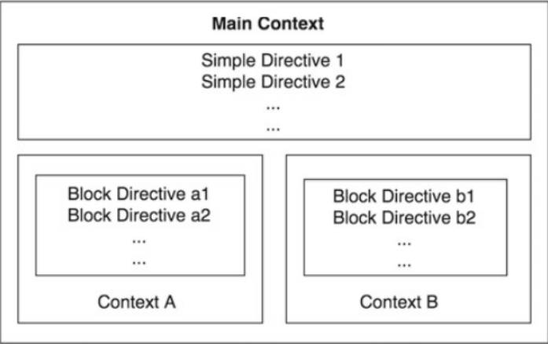

## I. Cấu trúc và cách sử dụng tập tin cấu hình
### 1. Cấu trúc
- Tất cả file cấu hình của `nginx` nằm trong thư mục `/etc/nginx`.
- File cấu hình chính của nginx là `/etc/nginx/nginx.conf`.
- Document root directory: `/usr/share/nginx/html`.
- Nginx bao gồm các module được điều khiển bởi các directive trong file cấu hình. "Directive" được định nghĩa như `instruction` (chỉ dẫn) hay `direct`. Directives được chia thành các directive đơn giản và các block directive.

    - Cấu trúc của 1 directive đơn giản gồm tên và tham số được phân tách bởi dấu cách và kết thúc bằng dấu chấm phẩy(;). Ví dụ về một directive đơn giản: `worker_proccesses 1;`
    - Một block directive có cấu trúc tương tự như một directive đơn giản nhưng thay vì sử dụng dấu `;` nó sẽ sử dụng cặp dấu `{}` để bắt đầu và kết thúc 1 block directive. Một config file điển hình của nginx có thể được minh hoạ như hình dưới.



Một main contect sẽ bao gồm nhiều directive đơn giản, nhiều context chứa các block directive.

### 2. Các thao tác cần thực hiện trước và sau khi chỉnh sửa file config file.
- Trước khi thay đổi cấu hình, sao lưu lại file cấu hình: `cp /etc/nginx/conf/nginx.conf /etc/nginx/conf/nginx.conf.backup`.
- Sau khi thực hiện thay đổi cấu hình trong file cấu hình, restart lại service: `systemctl restart nginx`.

*Chú ý*
- Tất cả những dòng có dấu `#` phía trước là những dòng chú thích được sử dụng để giải thích những khối lệnh dùng làm gì hoặc để lại ý kiến làm thế nào chỉnh sửa giá trị.
- Bạn có thể cho đoạn mã đó được kích hoạt bằng cách loại bỏ các `#`.
- Sử dụng tab hay space để phân cấp đoạn mã sẽ giúp dễ dàng chỉnh sửa hay tìm ra lỗi.

## II. Tìm hiểu chi tiết về file config
- Core Contexts

Đây là nhóm đầu tiên của contexts, được nginx sử dụng để tạo ra 1 cây phân cấp và tách biệt các cấu hình giữa các block. Trong đây cũng gồm các cấu hình chính của nginx.

- Main Context

Cũng có thể gọi là `global` context. Đây là context chung nhất bao gồm tất cả các directive đơn giản, block directive và các  context khác.

Ví dụ về nội dung file config của nginx:
```
#user  nobody;
worker_processes  1;

#error_log  logs/error.log;
#error_log  logs/error.log  notice;
#error_log  logs/error.log  info;

#pid        logs/nginx.pid;


events {
    worker_connections  1024;
}


http {
    include       mime.types;
    default_type  application/octet-stream;

    #log_format  main  '$remote_addr - $remote_user [$time_local] "$request" '
    #                  '$status $body_bytes_sent "$http_referer" '
    #                  '"$http_user_agent" "$http_x_forwarded_for"';

    #access_log  logs/access.log  main;

    sendfile        on;
    #tcp_nopush     on;

    #keepalive_timeout  0;
    keepalive_timeout  65;

    #gzip  on;

    server {
        listen       80;
        server_name  localhost;

        #charset koi8-r;

        #access_log  logs/host.access.log  main;

        location / {
            root   html;
            index  index.html index.htm;
        }

        #error_page  404              /404.html;

        # redirect server error pages to the static page /50x.html
        #
        error_page   500 502 503 504  /50x.html;
        location = /50x.html {
            root   html;
        }

        # proxy the PHP scripts to Apache listening on 127.0.0.1:80
        #
        #location ~ \.php$ {
        #    proxy_pass   http://127.0.0.1;
        #}
```
- File bắt đầu cùng với 4 directives: `user`, `worker_processes`, `error_log` và `pid`. Chúng nằm ngoài bất kỳ block hay context cụ thể nào do đó chúng nằm trong main context (bối cảnh chính).

Các `event` và `http` block là khu vực cho các directives bổ sung do đó chúng nằm trong main context.
- Giải thích cụ thể
  - `user`: định nghĩa cho biết người dùng hệ thống linux nào sẽ có quyền chạy các máy chủ Nginx. Có những trường hợp sử dụng nhất định mà được hưởng lợi từ việc thay đổi người dùng.
  - `worker_processes`: có giá trị mặc định là 1. Nó định nghĩa số lượng worker processes Nginx sử dụng. Số lượng worker processes nên được set bằng giá trị với số core của CPU.
  - `access_log` & `error_log`: những file mà nginx sẽ sử dụng để log lại toàn bộ error và access request. Phần log này thường được sử dụng để debug.
  - `pid`: xác định nơi nginx sẽ ghi lại master process ID hoặc PID. PID được sử dụng bởi hệ điều hành để theo dõi và gửi tín hiệu đến quá trình Nginx. Bạn có thể xác định thông tin về PID (master process và worker process) của nginx bằng câu lệnh `ps -ax | grep nginx`.
  - `worker_connections`: cho biết số lượng connection mà mỗi worker_process có thể xử lý. Mặc định, số lượng connection này được thiết lập là `1024`. Để xem về mức giới hạn sử dụng của hệ thống bạn có thể dụng lệnh: `ulimit ulimit –n`.
Con số thiết lập của worker_connections nên nhỏ hơn hoặc bằng giới hạn này.
- Events Context
```
events {
  worker_connections  1024;
  }
```
NGINX sử dụng mô hình xử lý kết nối dựa trên sự kiện(event) nên các directive được định nghĩa trong context này sẽ ảnh hưởng đến connection processing được chỉ định. Ví dụ ở trên là cấu hình số worker connection mà mỗi worker process có thể xử lý được.

- HTTP Context
    - Khi cấu hình nginx như một web server hoặc reverse proxy, http context sẽ giữ phần lớn cấu hình. Context này chứa tấT cả các directive và những context (block directive) cần thiết khác để xác định các chương trình sẽ xử lý các kết nối HTTP và HTTPS.
    - Giải thích một số directive:
      - `include`: chỉ thị include (include /etc/nginx/mime.types) của nginx có vai trò trong việc thêm nội dung từ một file khác vào trong cấu hình nginx. 
      - `gzip`: chỉ thị `gzip` sẽ giúp giải nén các dữ liệu trước khi chuyển chúng tới client, hạn chế số lượng băng thông sử dụng và tăng tốc độ dịch chuyển dữ liệu.   


