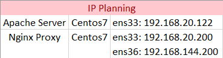
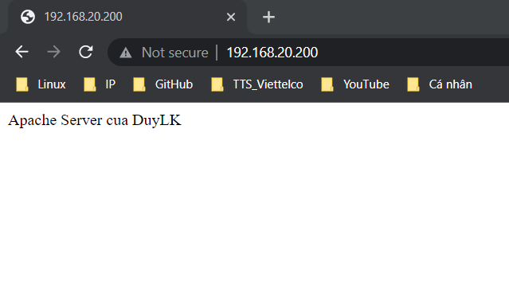

## Mô hình IP


### I. Cài đặt Apache Server
Cài đặt httpd: `yum install -y httpd`.

Cấu hình tường lửa:
```
firewall-cmd --zone=public --permanent --add-port=80/tcp
firewall-cmd --zone=public --permanent --add-port=443/tcp
firewall-cmd --reload
```
Khởi động Apache.
```
systemctl start httpd
systemctl enable httpd
```

Tạo 1 file test.
```
echo 'Nginx Proxy cua DuyLK' >> /var/www/html/index.html
```


### II. Cài đặt Nginx Server
Cài đặt các điều kiện cần thiết: `yum install yum-utils -y`.

Thêm repo:
```
echo '[nginx-stable]
name=nginx stable repo
baseurl=http://nginx.org/packages/centos/$releasever/$basearch/
gpgcheck=1
enabled=1
gpgkey=https://nginx.org/keys/nginx_signing.key
module_hotfixes=true

[nginx-mainline]
name=nginx mainline repo
baseurl=http://nginx.org/packages/mainline/centos/$releasever/$basearch/
gpgcheck=1
enabled=0
gpgkey=https://nginx.org/keys/nginx_signing.key
module_hotfixes=true' >> /etc/yum.repos.d/nginx.repo
```

Sử dụng gói nginx mainline: `yum-config-manager --enable nginx-mainline`

Cài đặt Nginx: `yum install nginx -y`

Cấu hình tường lửa:
```
firewall-cmd --zone=public --permanent --add-port=80/tcp
firewall-cmd --zone=public --permanent --add-port=443/tcp
firewall-cmd --reload
```

Khởi động dịch vụ
```
systemctl start nginx
systemctl enable nginx
```

Backup file cấu hình `/etc/nginx/nginx.conf`: `cp /etc/nginx/nginx.conf /etc/nginx/nginx.conf.bak`

Cấu hình proxy, tạo tệp `test.conf` trong `/etc/nginx/conf.d/`.
```
echo 'server {
        listen      80 default_server;
        #listen      [::]:80 default_server;

        proxy_redirect           off;
        proxy_set_header         X-Real-IP $remote_addr;
        proxy_set_header         X-Forwarded-For $proxy_add_x_forwarded_for;
        proxy_set_header         Host $http_host;

        location / {
            proxy_pass http://192.168.20.122/;
        }
    }' >> /etc/nginx/conf.d/test.conf
```

Trong đó, chuyển yêu cầu tới máy được uỷ quyền
```
location /some/path/ {
    proxy_pass http://www.example.com/link/;
}
```

Người dùng truy cập: `http://192.168.20.200/` (location ở đây là /) sẽ được chuyển đến đỉa chỉ `http://192.168.20.122/`.

Kiểm tra cú pháp (syntax) cấu hình:
```
[root@centos ~]# nginx -t
nginx: the configuration file /etc/nginx/nginx.conf syntax is ok
nginx: configuration file /etc/nginx/nginx.conf test is successful
[root@centos ~]#
```

Khởi động lại dịch vụ: `systemctl restart nginx`.

### III. Kiểm tra
Truy cập ip: `192.168.20.200`.




