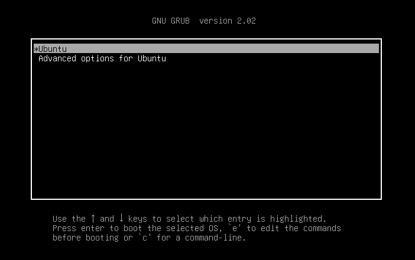
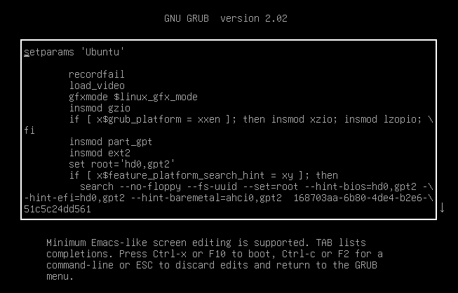
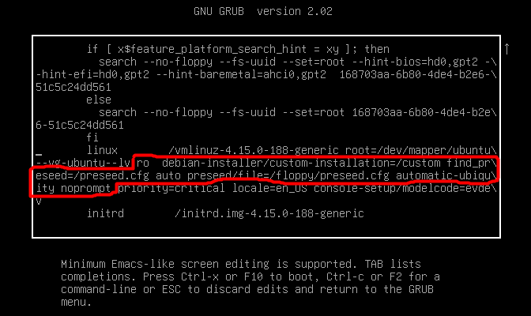
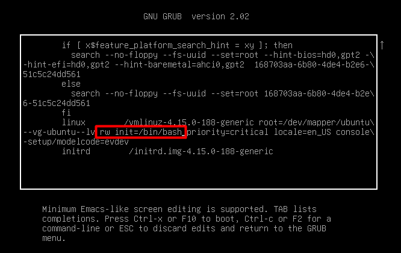
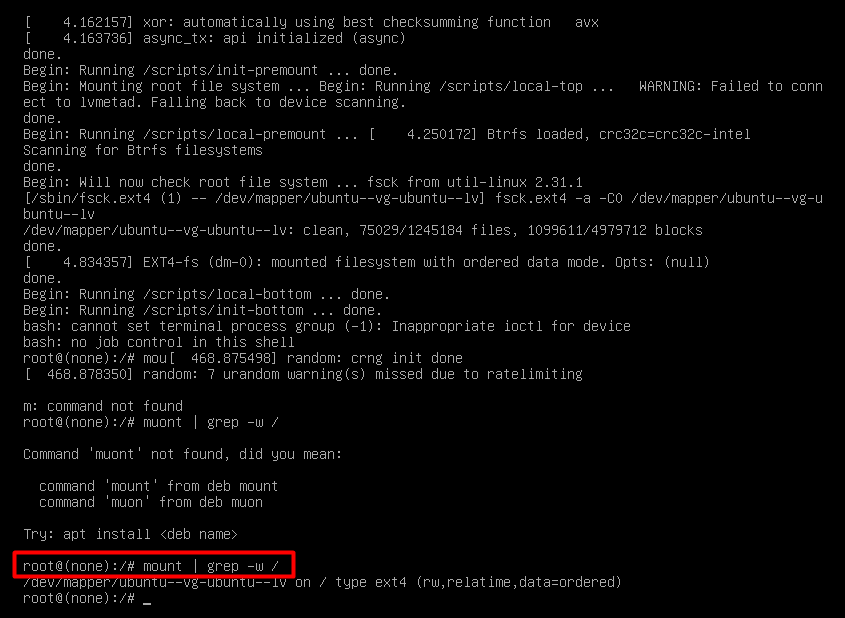
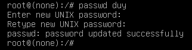

# Reset Password Windows - Ubuntu20 - Centos7
## Menu
[I. Reset Password Windows.](#reset-password-windows)
- [1. Đổi mật khẩU do nghi ngờ có người vào](#Win_doimatkhau)
- [2. Đổi do quên](#Win_doquen)

[II. Reset Password Ubuntu 20](#reset-password-ubuntu-20)
- [1. Đổi do nghi ngờ có người vào](#Ubuntu_doimatkhau)
- [2. Đổi do quên](#Ubuntu_doquen)
  
[III. Reset password Ubuntu 18](#reset_passwd_Ubuntu18)  
[IV. Reset Password Centos7](#reset-password-centos7)
- [1. Đổi do nghi ngờ có người vào](#Centos_doimatkhau)
- [2. Đổi do quên](#Centos_doquen)

[Tài liệu tham khảo](#Tai_lieu_tham_khao)


<a name="reset-password-windows"></a>
## I. Reset Password Windows.

<a name="Win_doimatkhau"></a>
#### 1. Đổi mật khẩu do nghi ngờ có người vào.
B1: Nhấn tổ hợp phím `Windows + R`.
B2: Nhập `control userpasswords2` và Enter.


B3: Sau khi hiện ra bảng ta ấn theo gợi ý.


B4: Chọn `change a password`.


B5: Điền lại mật khẩu cũ và đặt mật khẩu mới cho User.


<a name="Win_doquen"></a>
#### 2. Đổi do quên.

<a name="reset-password-ubuntu-20"></a>
### II. Reset Password Ubuntu 20.

<a name="Ubuntu_doimatkhau"></a>
#### 1. Đổi do nghi ngờ có người vào.
Ta sử dụng lệnh `passwd "tên user"`


Ta tiến hành nhập lại mật khẩu cũ và nhập mật khẩu mới.

<a name="Ubuntu_doquen"></a>
#### 2. Đổi do quên
Khởi động lại Ubuntu và giữ `Shift` cho đến khi xuất hiện bảng như hình dưới.


Ấn `e` và sẽ xuất hiện nội dung như bên dưới.


Tìm đến dòng và thay thế như trong hình.


Sau khi sửa xong, ấn tổ hợp phím `Ctrl + x` hoặc `f10` để tiến hành boot.

Kiểm tra trạng thái của phân vùng gốc bằng lệNh `mount | grep -w /`


Đặt lại mật khẩu cho root: `passwd laiduy`


Lưu và khởi động lại: `exec /sbin/itit`

<a name="reset_passwd_Ubuntu18"></a>

### III. Reset password Ubuntu 18
- Đổi do quên mật khẩu.
B1. Khởi động lại Ubuntu và giữ `Shift` cho đến khi xuất hiện bảng như bên dưới.


B2. Ấn `e` để tiến hành chỉnh sửa. Sau khi ấn `e` sẽ xuất hiện nội dung như bên dưới.


B3. Kéo xuống và sửa đổi nội dung như ảnh bên dưới.




Sau khi chỉnh sửa xong, ta ấn `Ctrl x` hoặc `F10` để khởi động lại hệ thống của bạn. Hệ thống của bạn sẽ khởi động vào màn hình root shell như hình dưới. Bạn có thể xác nhận rằng hệ thống tệp gốc có quyền truy cập đọc và ghi bằng cách chạy lệnh `mount | grep -w /`.
 

Bây giờ ta đã có thể đổi mật khẩu của user.


Sau khi đổi xong, ta tiến hành khởi động lại `exec /sbin/init`.
Chờ khởi động lại xong và đăng nhập vào bằng mật khẩu mới.


<a name="reset-password-centos7"></a>
### IV. Reset Password Centos7

<a name="Centos_doimatkhau"></a>
#### 1. Đổi do nghi ngờ có người vào.

**Thực hiện như với Ubuntu 20**


<a name="Centos_doquen"></a>
#### 2. Đổi do quên.

Ta tiến hành khởi động lại Centos7 và khi hiện ra màn hình bên dưới ta nhấn phím `e`.


Sau đó sẽ xuất hiện ra nội dung như bên dưới. Ta nhấn phím mũi tên để kéo xuống dưới và tìm từ `ro` tại dòng `linux 16`.


Ta thay `ro` thành `rw init=/sysroot/bin/sh` và ấn `Ctrl + x` để lưu.


Ta tiến hành đặt lại mật khẩu tài khoản root. Gõ lệnh `chroot /sysroot` và `passwd root` để mount và đặt lại mật khẩU cho root. Sau khi thay mật khẩu cho root xong, ta gõ lần lượt các lệnh sau:
```
touch /.autorelabel
exit
reboot
```


<a name="Tai_lieu_tham_khao"></a>
## Tài liệu tham khảo
- [Centos7](https://www.7host.vn/huong-dan-khoi-phuc-mat-khau-quan-tri-reset-root-password-tren-may-chu-su-dung-he-dieu-hanh-centos/#CentOS_7)

- [Ubuntu20](https://itsystems.vn/reset-password-on-ubuntu-20-04)
- [Ubuntu18](https://viettelco.vn/huong-dan-dat-lai-mat-khau-root-da-quen-trong-ubuntu/)
- [Windows](https://trainghiemso.vn/cach-lay-lai-mat-khau-windows-10-de-dang-nhat/?fbclid=IwAR1wYwpAfNVqeZVS72O2yKHM3wreepC7RtzjL1TrmwKRplW9ghQkkL0b39I)

**Tài liệu tham khảo chung:** Github [anh Huy](https://github.com/huydv398/Linux-tutorial/blob/15ca6a0dedad74a533259b28948cb136d8b26e2f/tool/Reset-passwd.md)