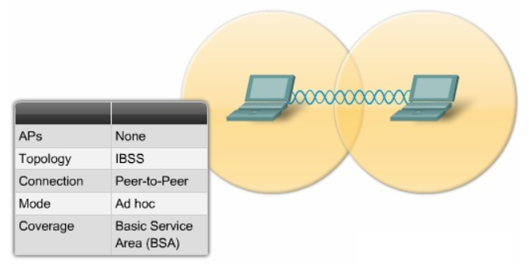
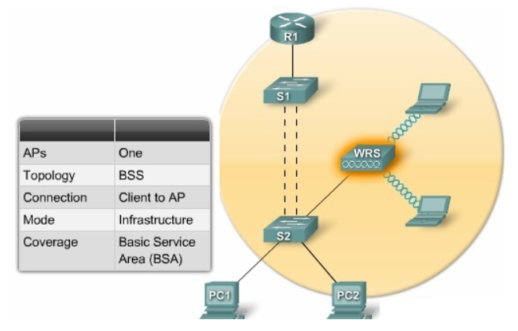
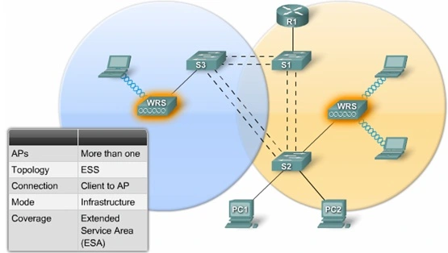

# Menu
[I. Wlan là gì? Mã hoá Wlan là gì?](#wlan_la_gi)
- [1. Khái niệm Wlan](#khai_niem)
- [2. Mã hoá Wlan](#ma_hoa)

[II. Ưu điểm và nhược điểm của Wlan](#uu_diem_va_nhuoc_diem)
- [1. Ưu điểm](#uu_diem)
- [2. Nhược điểm](#nhuoc_diem)

[III. Các mô hình mạng Wlan](#cac_mo_hinh)
- [1. Mô hình mạng Wlan độc lập IBSSs](#ibss)
- [2. Mô hình mạng Wlan cơ sở BSSs](#bss)
- [3. Mô hình mạng Wlan mở rộng ESSs](#ess)

## I. Wlan là gì? Mã hoá Wlan là gì?

### 1. Khái niệm Wlan
Mạng không dây (wireless lan)  là mạng sử dụng công nghệ cho phép hai hay nhiều thiết bị kết nối với nhau bằng cách sử dụng một giao thức chuẩn mà không cần những kết nối bằng dây mạng (cable).

Vì đây là mạng dựa trên chuẩn IEEE 802.11 nên đôi khi nó còn được gọi là mạng `802.11 network Ethernet` để nhất mạnh rằng mạng này dựa trên mạng Ethernet truyền thống. Bên cạnh đó còn tồn tại một tên gọi khác rất quen thuộc khi nói về mạng không dây mà chúng ta thường dùng là: Wi-fi (Wireless Fidelity).

### 2. Mã hoá Wlan
Mã hoá là biến đổi dữ liệu để chỉ có các thành phần được xác nhận mới giải mã được nó.

Trong mã hoá, có hai loại mật mã với cách sinh ra một chuỗi khoá (key stream) từ một giá trị khoá bí mật.

Mật mã dòng (stream ciphers): mật mã dòng mã hoá theo từng bit. Điều này làm phát sinh chuỗi khoá liên tục dựa trên giá trị của khoá. Mật mã khối (block ciphers): ngược lại với mật mã dòng. Mật mã khối sinh ra một chuỗi khoá duy nhất có kích thước cố định. Mỗi chuỗi sẽ được trộn với chuỗi khoá một cách độc lập.

## II. Ưu điểm và nhược điểm của Wlan

### 1. Ưu điểm
Các thiết bị có thể kết nối không dây, loại bỏ sự cần thiết của cáp. Điều này cho phép các gia đình và doanh nghiệp tạo ra các mạng cục bộ mà không cần kết nối hệ thống với Ethernet.

Wlan không bị giới hạn bởi số cổng vật lý trên router và do đó có thể hỗ trợ hàng chục hoặc thậm chí hàng trăm thiết bị. Phạm vi của một mạng Wlan có thể dễ dàng được mở rộng bằng cách thêm một hoặc nhiều bộ lặp.

Wlan có thể dễ dàng được nâng cấp bằng cách thay thế các bộ định tuyến bằng các phiên bản mới - một giải pháp dễ dàng và rẻ hơn nhiều so với việc nâng cấp cáp Ethernet cũ.

### 2. Nhược điểm
Mạng không dây tự nhiên kém an toàn hơn so với mạng có dây. Bất kỳ thiết bị không dây nào cũng có thể cố gắng kết nối với mạng Wlan, vì vậy điều quan trọng là hạn chế truy cập vào mạng nếu bảo mật là một mối quan ngại. Điều này thường được thực hiện bằng cách sử dụng xác thực không dây như WEP hoặc WPA, mã hoá thông tin liên lạc.

Ngoài ra, các mạng không dây dễ bị ảnh hưởng bởi các tín hiệu khác hoặc các rào cản vật lý, chẳng hạn như các bức tưởng bê tông. Vì mạng LAN cung cấp hiệu suất và bảo mật cao nhất, chúng vẫn được sử dụng cho nhiều mạng công ty và chính phủ.

## III. Các mô hình mạng Wlan

### 1. Mô hình mạng Wlan độc lập IBSSs
Cấu trúc của mô hình mạng độc lập gồm các nút di động (máy tính kết nối mạng) tập trung lại trong một không gian nhỏ để hình thành nên kết nối ngang cấp. Các nút di động có thể trao đổi thông tin trực tiếp với nhau, không cần phải quản trị mạng.

### 2. Mô hình mạng Wlan cơ sở BSSs
Bao gồm các điểm truy nhập AP (Access Point) gắn với mạng đường trục hữu tuyến, BSSs là mô hình giao tiếp với các thiết bị di động trong vùng phủ sóng của một cell. AP đóng vai trò điều khiển cell và điều khiển lưu lượng tớI mạng. Các thiết bị di động không giao tiếp trực tiếp với nhau mà giao tiếp với các AP.

### 3. Mô hình mạng Wlan mở rộng ESSs
ESSs là một tổ hợp các BSSs nơi mà các Access Point giao tiếp với nhau để chuyển lưu lượng từ một BSS này đến một BSS khác nhằm đảm bảo sự trơn tru trong quá trình di chuyển của các trạm giữa các BSS. AP có thể kết nối với các thiết bị di động hoặc giao tiếp trực tiếp với nhau.

