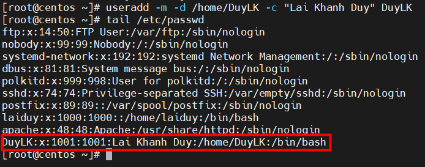

# Menu
[I. Quản lý người dùng](#quan_ly_nguoi_dung)

[II. /etc/passwd](#etc_passwd)

[III. root](#root)

[IV. useradd](#useradd)

[V. /etc/default/useradd](#etc_default_useradd)

[VI. userdel](#userdel)

[VII. usermod](#usermod)

[VIII. Tạo thư mục chính](#tao_thu_muc_chinh)

[IX. /etc/skel/](#etc_skel)

[X. Xoá thư mục chính](#xoa_thu_muc_chinh)

[XI. Đăng nhập shell](#dang_nhap_shell)

[XII. chsh](#chsh)


Chương này sẽ hướng dẫn cho bạn cách sử dụng `useradd`, `usermod` và `userdel` để tạo, sửa đổi  và xoá tài khoản người dùng. Bạn sẽ cần quyền truy cập root trên máy tính linux để hoàn thành chương này.

<a name="quan_ly_nguoi_dung"></a>

## I. Quản lý người dùng
Quản lý người dùng trên Linux có thể được thực hiện theo ba cách bổ sung. Bạn có thể dùng các công cụ đồ hoạ do bản phân phối của bạn cung cấp. Các công cụ này có giao diện phụ thuộc vào trên bản phân phối. Nếu bạn là người dùng Linux mới làm quen trên hệ thống gia đình của mình thì hãy sử dụng công cụ đồ hoạ đã được cung cấp bởi bản phân phối của bạn. Điều này sẽ đảm bảo rằng bạn không chạy vào các vấn đề. Một tuỳ chọn khác là sử dụng các công cụ dòng lệnh như `useradd`, `usermod`, `gpasswd`, `passwd` và khác.

Quản trị viên máy chủ có khả năng sử dụng các công cụ này, vì chúng quen thuộc và rất tương tự trên nhiều bản phân phối khác nhau. Chương này sẽ tập trung vào các dòng lệnh công cụ này.

Một cách thứ ba khá cực đoan là chỉnh sửa trực tiếp các tệp cấu hình cục bộ bằng cách sử dụng `vi` (hoặc `vipw`, `vigr`). 

<a name="etc_passwd"></a>

## II. /etc/passwd
Cơ sở dữ liệu người dùng cục bộ trên Linux (và hầU hết là trên Unix) là `/etc/passwd`.
```
[root@centos ~]# tail /etc/passwd
games:x:12:100:games:/usr/games:/sbin/nologin
ftp:x:14:50:FTP User:/var/ftp:/sbin/nologin
nobody:x:99:99:Nobody:/:/sbin/nologin
systemd-network:x:192:192:systemd Network Management:/:/sbin/nologin
dbus:x:81:81:System message bus:/:/sbin/nologin
polkitd:x:999:998:User for polkitd:/:/sbin/nologin
sshd:x:74:74:Privilege-separated SSH:/var/empty/sshd:/sbin/nologin
postfix:x:89:89::/var/spool/postfix:/sbin/nologin
laiduy:x:1000:1000::/home/laiduy:/bin/bash
apache:x:48:48:Apache:/usr/share/httpd:/sbin/nologin
[root@centos ~]#
```

Như bạn có thể thấy, tệp này chứa các dòng, các dòng gồm 7 phần được phân chia bởi dấu `:`. Các cột chứa tên người dùng, một x, id người dùng, id nhóm chính, mô tả, tên nhà thư mục và trình bao đăng nhập.

<a name="root"></a>

## III. root
Người dùng root còn được gọi là superuser, là tài khoản mạnh nhất trên hệ thống Linux của bạn. Người dùng này có thể làm hầu như mọi thứ, bao gồm cả việc tạo ra những người dùng khác. Người dùng root luôn có userid 0 (bất kể tên của tài khoản)
```
[root@centos ~]# head -1 /etc/passwd
root:x:0:0:root:/root:/bin/bash
[root@centos ~]#
```

<a name="useradd"></a>

## IV. useradd
Bạn có thể thêm người dùng bằng useradd. Ví dụ dưới đây cho thấy cách thêm một người dùng có tên `DuyLK` và đồng thời buộc tạo nhà thư mục (-m), đặt tên của thư mục chính (-d) và đặt mô tả (-c).
```
useradd -m -d /home/DuyLK -c "Lai Khanh Duy" DuyLK
```

Người dùng có tên `DuyLK` đã nhận được userid là 1001 và id nhóm chính 1001.

<a name="etc_default_useradd"></a>

## V. /etc/default/useradd
Cả Red Hat Enterprise Linux và Debian/Ubuntu đều có 1 tệp tên là `/etc/default/useradd` chứa một số tuỳ chọn người dùng mặc định. Bên cạnh việc sử dụng `cat` để hiển thị tệp này, bạn cũng có thể sử dụng `useradd -D`.
```
[root@centos ~]# useradd -D
GROUP=100
HOME=/home
INACTIVE=-1
EXPIRE=
SHELL=/bin/bash
SKEL=/etc/skel
CREATE_MAIL_SPOOL=yes
[root@centos ~]#
```

<a name="userdel"></a>

## VI. userdel
Bạn có thể xoá người dùng `DuyLK` bằng lệNh `userdel`. Tuỳ chọn `-r` của `userdel` cũng sẽ xoá thư mục chính.
```
[root@centos ~]# userdel -r DuyLK
```

<a name="usermod"></a>

## VII. usermod
Bạn có thể sửa đổi các thuộc tính của người dùng bằng `usermod`. Ví dụ này đang sử dụng `usermod` để thay đổi mô tả của người dùng `laiduy`.
```
[root@centos ~]# tail -1 /etc/passwd
laiduy:x:1000:1000::/home/laiduy:/bin/bash
```
Sau khi dùng lệnh `usermod -c 'tts' laiduy` sẽ thành: `laiduy:x:1000:1000:tts:/home/laiduy:/bin/bash`.
Đã có thêm mô tả là `tts`.

<a name="tao_thu_muc_chinh"></a>

## VIII. Tạo thư mục chính
Cách dễ nhất để tạo thư mục chính là cung cấp tuỳ chọn `-m` với `useradd`. Một cách ít dễ dàng hơn là tạo thư mục chính theo cách thủ công với `mkdir`, cách này cũng yêu cầu thiết lập chủ sở hữu và các quyền trên thư mục với `chmod` và `chown`.
```
[root@centos ~]# mkdir /home/DuyLK
[root@centos ~]# chown DuyLK:DuyLK /home/DuyLK
[root@centos ~]# chmod 700 /home/DuyLK
[root@centos ~]#  ls -ld /home/DuyLK/
drwx------. 2 DuyLK DuyLK 6 Jun 25 10:43 /home/DuyLK/
[root@centos ~]#
```

<a name="etc_skel"></a>

## IX. /etc/skel/
Khi sử dụng `useradd` tuỳ chọn `-m`, thư mục `etc/skel/` được sao chép vào thư mục mới được tạo thư mục chính. Thư mục `/etc/skel/` chứa một số tệp (thường là ẩn) có chứa cài đặt cấu hình và giá trị mặc định cho các ứng dụng. Theo cách này `/etc/skel/` phục vụ như một mặc định thư mục chính và như một hồ sơ người dùng mặc định.
```
[root@centos ~]#  ls -la /etc/skel/
total 24
drwxr-xr-x.  2 root root   62 Jun 23 16:05 .
drwxr-xr-x. 75 root root 8192 Jun 25 10:44 ..
-rw-r--r--.  1 root root   18 Nov 24  2021 .bash_logout
-rw-r--r--.  1 root root  193 Nov 24  2021 .bash_profile
-rw-r--r--.  1 root root  231 Nov 24  2021 .bashrc
[root@centos ~]#
```

<a name="xoa_thu_muc_chinh"></a>

## X. Xoá thư mục chính
Tùy chọn `-r` của `userdel` sẽ đảm bảo rằng thư mục chính bị xóa cùng với tài khoản người dùng.
```
[root@centos ~]# ls -ld /home/DuyLK/
drwx------. 2 DuyLK DuyLK 6 Jun 25 10:43 /home/DuyLK/
[root@centos ~]# userdel -r DuyLK
[root@centos ~]# ls -ld /home/DuyLK/
ls: cannot access /home/DuyLK/: No such file or directory
[root@centos ~]#
```

<a name="dang_nhap_shell"></a>

## XI. Đăng nhập shell
Tệp `/etc/passwd` chỉ định trình bao đăng nhập cho người dùng. Trong ví dụ bên dưới, bạn có thể thấy rằng người dùng `laiduy` sẽ đăng nhập `shell/bin/bash` và người dùng laura bằng shell `/bin/ksh`.
```
[root@centos ~]# tail -2 /etc/passwd
laiduy:x:1000:1000:tts:/home/laiduy:/bin/bash
apache:x:48:48:Apache:/usr/share/httpd:/sbin/nologin
[root@centos ~]#
```
Bạn có thể sử dụng lệnh `usermod` để thay đổi trình bao cho người dùng.
```
[root@centos ~]# usermod -s /bin/bash apache
[root@centos ~]# tail -1 /etc/passwd
apache:x:48:48:Apache:/usr/share/httpd:/bin/bash
[root@centos ~]#
```

<a name="chsh"></a>

## XII. chsh
Người dùng có thể thay đổi trình bao đăng nhập của họ bằng lệnh `chsh`. Đầu tiên, người dùng `laiduy` có được một danh sách shell có sẵn (anh ấy cũng có thể đã làm xong một `cat/etc/shell`) và sau đó thay đổi trình bao đăng nhập của mình vào trình bao korn (`/bin/ksh`). Ở lần đăng nhập tiếp theo, `laiduy` sẽ mặc định thành `ksh` thay vì `bash`.
```
[root@centos ~]# chsh -l
/bin/sh
/bin/bash
/usr/bin/sh
/usr/bin/bash
[root@centos ~]#
```
Lưu ý rằng tuỳ chọn `-l` không tồn tại trên dabian và ví dụ ở trên giả định rằng trình bao `ksh` và `csh` đã được cài đặt.
Ví dụ bên dưới cho thấy cách `laiduy` có thể thay đổi trình bao mặc định của mình (hoạt động đăng nhập của lần tiếp theo).


