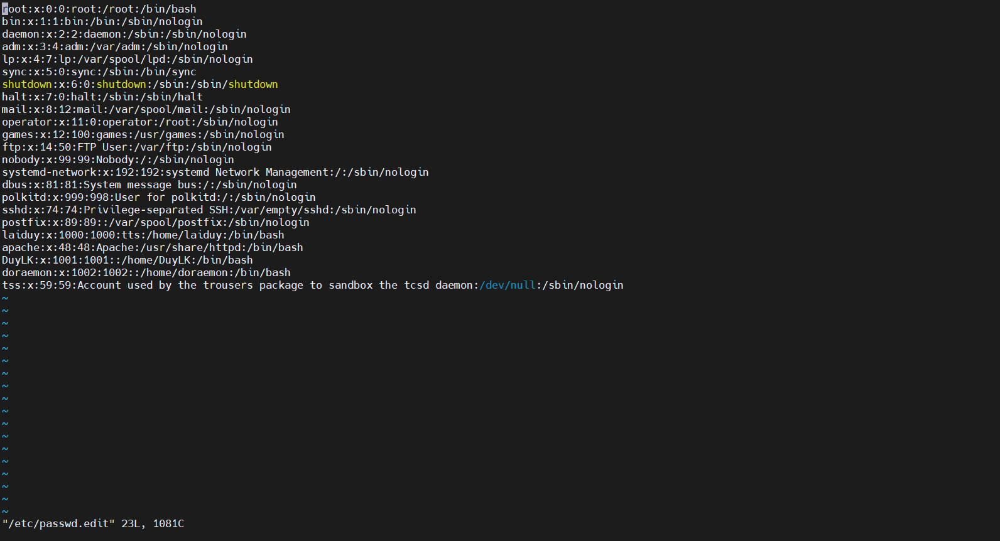

# Menu
[I. passwd](#passwd)

[II. Tệp bóng](#tep_bong)

[III. Mã hoá bằng mật khẩu](#ma_hoa_bang_mat_khau)

[IV. Mã hoá với openssl](#ma_hoa_voi_openssl)

[V. Mã hoá bằng crypt](#ma_hoa_bang_crypt)

[VI. /etc/login.defs](#etc_login.defs)

[VII. chage](#chage)

[VIII. Vô hiệu hoá mật khẩu](#vo_hieu_hoa_mat_khau)

[IX. Chỉnh sửa các tệp cục bộ](#chinh_sua_cac_tep_cuc_bo)


Chương này sẽ cho bạn biết thêm về mật khẩu dành cho người dùng cục bộ. Ba phương pháp để đặt mật khẩu được giải thích; sử dụng lệnh `passwd`, sử dụng `opensel passwd` và sử dụng hàm `crypt` trong chương trình C. 

Chương này cũng sẽ thảo luận về cài đặt mật khẩu và tắt, tạm ngừng hoặc khoá các tài khoản.

<a name="passwd"></a>

## I. passwd
Mật khẩu của người dùng có thể được đặt bằng lệnh `passwd`. Khi sử dụng lệnh này, người dùng phải nhập 2 lần mật khẩU.
```
[laiduy@centos ~]$ passwd
Changing password for user laiduy.
Changing password for laiduy.
(current) UNIX password:
New password:
BAD PASSWORD: The password fails the dictionary check - it is too simplistic/systematic
New password:
Retype new password:
passwd: all authentication tokens updated successfully.
[laiduy@centos ~]$
```
Như bạn có thể thấy, công cụ `passwd` sẽ thực hiện một số xác minh cơ bản để ngăn người dùng sử dụng mật khẩu quá đơn giản. Người dùng root không phải tuân theo các quy tắc này (sẽ có một cảnh báo). Người dùng root cũng không phải cung cấp mật khẩu cũ trước khi nhập lại mật khẩu mới 2 lần.
```
[root@centos ~]# passwd laiduy
Changing password for user laiduy.
New password:
BAD PASSWORD: The password fails the dictionary check - it is too simplistic/systematic
Retype new password:
passwd: all authentication tokens updated successfully.
[root@centos ~]#
```
Cảnh báo mật khẩu yêu nhưng bạn vẫn có thể dùng nó.

<a name="tep_bong"></a>

## II. Tệp bóng
Mật khẩu người dùng được mã hoá và lưu trong `/etc/shadow`. Tệp `/etc/shadow` chỉ được đọc và chỉ có thể được đọc bởi root. Chúng ta sẽ xem trong phần quyền đối với tệp như thế nào để người dùng thay đổi mật khẩu của họ. Hiện tại, bạn sẽ phải biết rằng người dùng có thể thay đổi mật khẩu của họ bằng lệnh `/usr/bin/passwd`.
```
[root@centos ~]# tail -4 /etc/shadow
sshd:!!:19111::::::
postfix:!!:19111::::::
laiduy:$6$Rb7b1/CN$plVYLDSrUaPvDsH35kKfSvLhc1g2MMhdevna9wfrvfSqvwzjxKSJSXX6ceVLRdAbzGUmmAEHq2dsv0DuoOd8b/:19170:0:99999:7:::
apache:!!:19146::::::
[root@centos ~]#
```

<a name="ma_hoa_bang_mat_khau"></a>

## III. Mã hoá bằng mật khẩu
Mật khẩu được lưu trữ ở định dạng được mã hoá. Việc mã hoá này được thực hiện bởi `hàm crypt`. Cách dễ nhất (và được khuyến nghị) để thêm người dùng có mật khẩu vào hệ thống là thêm người dùng bằng lệnh `useradd -m` rồi đặt mật khẩu của người dùng bằng `passwd`.
```
[root@centos ~]# useradd -m DuyLK
[root@centos ~]# passwd DuyLK
Changing password for user DuyLK.
New password:
BAD PASSWORD: The password contains the user name in some form
Retype new password:
passwd: all authentication tokens updated successfully.
[root@centos ~]#
```

<a name="ma_hoa_voi_openssl"></a>

## IV. Mã hoá với openssl
Một cách khác để tạo người dùng có mật khẩu là sử dụng tuỳ chọn `-p` của `useradd`, nhưng tuỳ chọn yêu cầu mật khẩu được mã hoá. Bạn có thể tạo mật khẩu được mã hoá này bằng lệnh `openssl passwd`. Lệnh `openssl passwd` sẽ tạo ra một số hàm băm riêng biệt cho cùng một mật khẩu, đối với điều này, nó sử dụng một loại muối.
```
[root@centos ~]# openssl passwd laiduy
Dj.9sWnvsKx8Q
[root@centos ~]# openssl passwd laiduy
emtasZEH8KkvQ
[root@centos ~]# openssl passwd laiduy
0ZGscsKWRh922
[root@centos ~]#
```
Muối này có thể được chọn và hiển thị dưới dạng hai ký tự đầu tiên của hàm băm.
```
[root@centos ~]# useradd -m -p $(openssl passwd khanhduy) doraemon
[root@centos ~]#
```
Lưu ý rằng lệnh này đặt mật khẩu trong lịch sử lệnh của bạn.

<a name="ma_hoa_bang_crypt"></a>

## V. Mã hóa bằng crypt
Tùy chọn thứ ba là tạo chương trình C của riêng bạn bằng cách sử dụng hàm crypt và biên dịch thành một lệnh.
```
[root@centos ~]# cat fileC
#include <stdio.h>
#define __USE_XOPEN
#include <unistd.h>
int main(int argc, char** argv)
{
 if(argc==3)
 {
 printf("%s\n", crypt(argv[1],argv[2]));
 }
 else
 {
 printf("Usage: MyCrypt $password $salt\n" );
 }
 return 0;
}
[root@centos ~]#
```

<a name="etc_login.defs"></a>

## VI. /etc/login.defs
Tệp `/etc/login.defs` chứa một số cài đặt mặc định cho mật khẩu người dùng như mật khẩu cài đặt tuổi và độ dài. (Bạn cũng sẽ tìm thấy giới hạn số lượng id người dùng và id nhóm và có nên tạo thư mục chính theo mặc định hay không).
```
[root@centos ~]# grep ^PASS /etc/login.defs
PASS_MAX_DAYS   99999
PASS_MIN_DAYS   0
PASS_MIN_LEN    5
PASS_WARN_AGE   7
[root@centos ~]#
```
Debian cũng có tệp này: `grep PASS /etc/login.defs`

<a name="chage"></a>

## VII. chage
Lệnh `chage` có thể được sử dụng để đặt ngày hết hạn cho tài khoản người dùng (`-E`), đặt tuổi mật khẩu tối thiểu (`-m`) và tối đa (`-M`), ngày hết hạn mật khẩu và đặt số ngày cảnh báo trước ngày hết hạn mật khẩu. Phần lớn chức năng này là cũng có sẵn từ lệnh `passwd`. Tùy chọn `-l` của chage sẽ liệt kê các cài đặt này cho một người dùng.
```
[root@centos ~]# chage -l laiduy
Last password change                                    : Jun 27, 2022
Password expires                                        : never
Password inactive                                       : never
Account expires                                         : never
Minimum number of days between password change          : 0
Maximum number of days between password change          : 99999
Number of days of warning before password expires       : 7
[root@centos ~]#
```

<a name="vo_hieu_hoa_mat_khau"></a>

## VIII. Vô hiệu hoá mật khẩu
Mật khẩu trong `/etc/shadow` không được bắt đầu bằng dấu chấm than. Khi trường thứ hai trong `/etc/passwd` bắt đầu bằng dấu chấm than, sau đó không thể sử dụng mật khẩu.

Việc sử dụng tính năng này thường được gọi là khóa, vô hiệu hóa hoặc tạm ngưng tài khoản người dùng. ngoài ra `vi` (hoặc `vipw`) bạn cũng có thể thực hiện điều này với `usermod`. Lệnh đầu tiên trong ví dụ tiếp theo sẽ hiển thị mật khẩu đã băm của `laiduy` trong `/etc/` bóng. Lệnh tiếp theo vô hiệu hóa mật khẩu của `laiduy`, khiến `laiduy` không thể để xác thực bằng mật khẩu này.
```
[root@centos ~]# grep laiduy /etc/shadow | cut -c1-70
laiduy:$6$Rb7b1/CN$plVYLDSrUaPvDsH35kKfSvLhc1g2MMhdevna9wfrvfSqvwzjxKS
[root@centos ~]# usermod -L laiduy
```

Như bạn có thể thấy bên dưới, mã băm mật khẩu đơn giản được đặt trước bằng dấu chấm than.
```
[root@centos ~]# grep laiduy /etc/shadow | cut -c1-70
laiduy:!$6$Rb7b1/CN$plVYLDSrUaPvDsH35kKfSvLhc1g2MMhdevna9wfrvfSqvwzjxK
[root@centos ~]#
```

Người dùng root (và người dùng có quyền sudo trên su) vẫn có thể truy cập tài khoản `laiduy` (vì ở đây không có mật khẩu). Cũng lưu ý rằng `laiduy` sẽ vẫn có thể đăng nhập nếu cô ấy đã thiết lập ssh không mật khẩu.
```
[root@centos ~]# su - laiduy
Last login: Mon Jun 27 10:01:07 +07 2022 on pts/0
[laiduy@centos ~]$
```

Bạn có thể mở khoá lại tài khoản với `usermod -U`.
```
[root@centos ~]# usermod -U laiduy
[root@centos ~]# grep laiduy /etc/shadow | cut -c1-70
laiduy:$6$Rb7b1/CN$plVYLDSrUaPvDsH35kKfSvLhc1g2MMhdevna9wfrvfSqvwzjxKS
[root@centos ~]#
```

<a name="chinh_sua_cac_tep_cuc_bo"></a>

## IX. Chỉnh sửa các tệp cục bộ
Nếu bạn vẫn muốn chỉnh sửa thủ công `/etc/passwd` hoặc `/etc/shadow`, sau khi biết các lệnh để quản lý mật khẩu, sau đó sử dụng trực tiếp `vipw` thay vì `vi` (vim). `vipw` sẽ thực hiện khoá tệp thích hợp.




