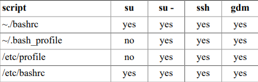

# Menu
[I. Hồ sơ hệ thống](#ho_so_he_thong)

[II. ~/.bash_profile](#bash_profile)

[III. ~/.bash_login](#bash_login)

[IV. ~/.profile](#profile)

[V. ~/.bashrc](#bashrc)

[VI. ~/.bash_logout](#bash_logout)

[VII. Tổng quan về Debian](#tong_quan_ve_debian)

[VIII. Tổng quan về RHEL5](#tong_quan_ve_rhel5)


Người dùng đã đăng nhập có một số bí danh, biến và hàm đặt trước (và tuỳ chỉnh), nhưng chúng đến từ đâu? Trình bao sử dụng một số tệp khởi động được thực thi (hoặc đúng hơn là có nguồn gốc) bất cứ khi nào shell được gọi. Sau đây là tổng quan về khởi động các tập lệnh.


<a name="ho_so_he_thong"></a>

## I. Hồ sơ hệ thống
Cả bash và ksh shell sẽ xác minh sự tồn tại của `/etc/profile` và nguồn nếu nó tồn tại. Khi đọc tập lệnh này, bạn sẽ nhận thấy (cả trên Debian và trên Red Hat Enterprise Linux) rằng nó xây dựng biến môi trường PATH (trong số những biến khác). Tập lệnh cũng có thể thay đổi biến PS1, đặt HOSTNAME và thực thi nhiều tập lệnh hơn như `/etc/inputrc`. 

Sử dụng lệnh `grep PATH /etc/profile` để hiển thị thao tác PATH trong Debian và RHEL7/Centos7.
```
[root@centos ~]# grep PATH /etc/profile
    case ":${PATH}:" in
                PATH=$PATH:$1
                PATH=$1:$PATH
export PATH USER LOGNAME MAIL HOSTNAME HISTSIZE HISTCONTROL
[root@centos ~]#
```

Người dùng root có thể sử dụng tập lệnh này để đặt bí danh, hàm và biến cho mọi người dùng trên hệ thống.

<a name="bash_profile"></a>

## II. ~/.bash_profile
Khi tệp này tồn tại trong thư mục chính, thì bash sẽ tạo nguồn cho nó. Trên Debian Linux 5/6/7 tệp này không tồn tại theo mặc định. RHEL7/CentOS7 sử dụng một `~/.bash_profile` nhỏ, nơi nó kiểm tra sự tồn tại của `~/.bashrc` và sau đó dẫn nguồn. Nó cũng thêm `$HOME/bin` vào biến `$PATH`.
```
[root@centos ~]# cat /home/laiduy/.bash_profile
# .bash_profile

# Get the aliases and functions
if [ -f ~/.bashrc ]; then
        . ~/.bashrc
fi

# User specific environment and startup programs

PATH=$PATH:$HOME/.local/bin:$HOME/bin

export PATH
[root@centos ~]#

```

<a name="bash_login"></a>

## III. ~/.bash_login
Khi `.bash_profile` không tồn tại, bash sẽ kiểm tra `~/.bash_login và mã nguồn nó. Theo mặc định, cả Debian và Red Hat đều không có tệp này.

<a name="profile"></a>

## IV. ~/.profile
Khi cả `~/.bash_profile` và `~/.bash_login` đều không tồn tại, thì bash sẽ xác minh sự tồn tại của `~/.profile` và thực thi nó. Tệp này không tồn tại theo mặc định trên Red Hat. 

Trên Debian tập lệnh này có thể thực thi `~/.ashrc` và sẽ thêm `$HOME/bin` vào `$PATH` Biến đổi.

`RHEL/CentOS` không có tệp này theo mặc định.

<a name="bashrc"></a>

## V. ~/.bashrc
Tập lệnh `~/.bashrc` thường được lấy nguồn từ các tập lệnh khác. Hãy để chúng tôi xem xét những gì nó làm theo mặc định.

Red Hat sử dụng `~/.bashrc` rất đơn giản, kiểm tra `/etc/bashrc` và tìm nguồn cung cấp nó. Nó cũng rời đi chỗ cho các bí danh và chức năng tùy chỉnh.
```
[root@centos ~]# cat /home/laiduy/.bash_profile
# .bash_profile

# Get the aliases and functions
if [ -f ~/.bashrc ]; then
        . ~/.bashrc
fi

# User specific environment and startup programs

PATH=$PATH:$HOME/.local/bin:$HOME/bin

export PATH
[root@centos laiduy]# cat .bashrc
# .bashrc

# Source global definitions
if [ -f /etc/bashrc ]; then
        . /etc/bashrc
fi

# Uncomment the following line if you don't like systemctl's auto-paging feature:
# export SYSTEMD_PAGER=

# User specific aliases and functions
[root@centos ~]#
```
Trên Debian tập lệnh này dài hơn một chút và cấu hình $PS1, một số biến lịch sử và một số af hoạt động và bí danh không hoạt động.
```
[root@centos ~]# wc -l /home/laiduy/.bashrc
11 /home/laiduy/.bashrc
[root@centos ~]#
```

<a name="bash_logout"></a>

## VI. ~/.bash_logout
Khi thoát bash, nó có thể thực thi `~/.bash_logout`. Debian sử dụng cơ hội này để xoá màn hình điều khiển.

Red Hat Enterprise Linux 6 và 7 tạo tệp này, nhưng để trống (ngoại trừ một chú thích).
```
[root@centos ~]# cat .bash_logout
# ~/.bash_logout

[root@centos ~]#
```

<a name="tong_quan_ve_debian"></a>

## VII. Tổng quan về Debian
Dưới đây là bảng tổng quan về thời điểm Debian đang chạy bất kỳ tập lệnh khởi động bash nào trong số này.

Ảnh Môi trường người dùng Debian.


<a name="tong_quan_ve_rhel5"></a>

## VIII. Tổng quan về RHEL5
Dưới đây là bảng tổng quan về thời điểm Red Hat Enterprise Linux 5 đang chạy bất kỳ bash nào trong số này các tập lệnh khởi động.

Môi trường người dùng Red Hat.



