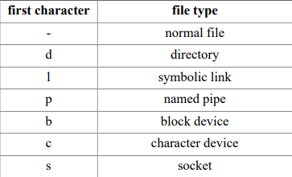
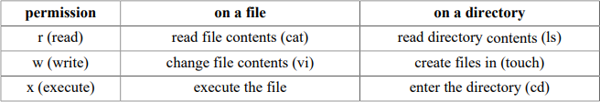
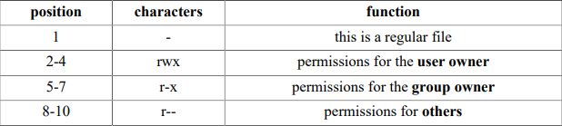
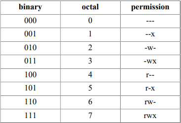

# Menu
[I. Quyền sở hữu tập tin](#quyen_so_huu_tap_tin)
- [1. Chủ sở hữu người dùng và chủ sở hữu nhóm](#chu_so_huu_nguoi_dung_va_chu_so_huu_nhom)
- [2. Liệt kê tài khoản người dùng](#liet_ke_tai_khoan_nguoi_dung)
- [3. chgrp](#chgrp)
- [4. chown](#chown)

[II. Danh sách các tệp đặc biệt](#danh_sach_cac_tep_dac_biet)

[III. Sự cho phép](#su_cho_phep)
- [1. rwx](#rwx)
- [2. Bộ ba rwx](#bo_ba_rwx)
- [3. Ví dụ về quyền](#vi_du_ve_quyen)
- [4. Thiết lập quyền (chmod)](#thiet_lap_quyen)
- [5. Thiết lập quyền bát phân](#thiet_lap_quyen_bat_phan)
- [6. umask](#umask)
- [7. mkdir -m](#mkdir-m)
- [8. cp -p](#cp-p)


Chương này chứa thông tin chi tiết về bảo mật tệp cơ bản thông qua quyền sở hữu tệp và quyền tệp.

<a name="quyen_so_huu_tap_tin"></a>

## I. Quyền sở hữu tập tin

<a name="chu_so_huu_nguoi_dung_va_chu_so_huu_nhom"></a>

### 1. Chủ sở hữu người dùng và chủ sở hữu nhóm
Người dùng và nhóm của một hệ thống có thể được quản lý cục bộ trong `/etc/passwd` và `/etc/group` hoặc chúng có thể nằm trong miền NIS, LDAP hoặc Samba. Những người dùng và nhóm này có thể sở hữu tệp. Trên thực tế, mọi tệp đều có chủ sở hữu người dùng và chủ sở hữu nhóm, như có thể thấy trong phần sau của ví dụ.

<a name="liet_ke_tai_khoan_nguoi_dung"></a>

### 2. Liệt kê tài khoản người dùng
Bạn có thể sử dụng lệnh sau để liệt kê tất cả các tài khoản người dùng cục bộ.
```
[laiduy@centos ~]$ cut -d: -f1 /etc/passwd | column
root            sync            games           polkitd         DuyLK
bin             shutdown        ftp             sshd            doraemon
daemon          halt            nobody          postfix         tss
adm             mail            systemd-network laiduy          florentino
lp              operator        dbus            apache
[laiduy@centos ~]$
```

<a name="chgrp"></a>

### 3. chgrp
Bạn có thể thay đổi chủ sở hữu nhóm của tệp bằng lệnh `chgrp`.
```
[root@centos ~]#  ls -l file2
-rw-r--r--. 1 root root 0 Jun 24 08:56 file2
[root@centos ~]#  chgrp dacau file2
[root@centos ~]# ls -l file2
-rw-r--r--. 1 root `dacau` 0 Jun 24 08:56 file2
[root@centos ~]#
```

<a name="chown"></a>

### 4. chown
Chủ sở hữu người dùng của tệp có thể được thay đổi bằng lệnh `chown`.
```
[root@centos ~]#  ls -l file1
-rw-r--r--. 1 root root 0 Jun 24 08:56 file1
[root@centos ~]# chown laiduy file1
[root@centos ~]#  ls -l file1
-rw-r--r--. 1 laiduy root 0 Jun 24 08:56 file1
[root@centos ~]#
```
Bạn cũng có thể sử dụng `chown` để thay đổi cả chủ sở hữu người dùng và chủ sở hữu nhóm.
```
[root@centos ~]# ls -l file1
-rw-r--r--. 1 laiduy root 0 Jun 24 08:56 file1
[root@centos ~]# chown laiduy:dacau file1
[root@centos ~]# ls -l file1
-rw-r--r--. 1 laiduy dacau 0 Jun 24 08:56 file1
[root@centos ~]#
```

<a name="danh_sach_cac_tep_dac_biet"></a>

## II. Danh sách các tệp đặc biệt
Khi bạn sử dụng `ls -l`, đối với mỗi tệp, bạn có thể thấy mười ký tự trước người dùng và chủ sở hữu nhóm. Ký tự đầu tiên cho chúng ta biết loại tệp. Các tệp thông thường nhận một `-`, các thư mục nhận một `d`, tượng trưng liên kết được hiển thị bằng chữ `l`, đường ống nhận chữ `p`, thiết bị ký tự `a c`, thiết bị khối `a b` và ổ cắm một `s`.

Các tệp Unix đặc biệt:

Dưới đây là ví dụ của thiết bị ký tự (bảng điều khiển) và thiết bị khối (đĩa cứng).
```
[root@centos ~]# ls -ld /dev/console /dev/sda
crw-------. 1 root root 5, 1 Jun 29 08:14 /dev/console
brw-rw----. 1 root disk 8, 0 Jun 29 08:14 /dev/sda
[root@centos ~]#
```

Và ở đây bạn có thể thấy một thư mục, một tệp thông thường và một liên kết tượng trưng.
```
[root@centos ~]# ls -ld /etc /etc/hosts /etc/motd
drwxr-xr-x. 77 root root 8192 Jun 29 09:28 /etc
-rw-r--r--.  1 root root  158 Jun  7  2013 /etc/hosts
-rw-r--r--.  1 root root    0 Jun  7  2013 /etc/motd
[root@centos ~]#
```

<a name="su_cho_phep"></a>

## III. Sự cho phép

<a name="rwx"></a>

### 1. rwx
Chín ký tự theo sau loại tệp biểu thị các quyền trong ba bộ ba. Một quyền có thể là `r` cho quyền truy cập đọc, `w` cho quyền truy cập ghi và `x` cho quyền thực thi. Bạn cần `r` quyền liệt kê (ls) nội dung của một thư mục. Bạn cần quyền `x` để nhập (cd) một danh mục. Bạn cần quyền `w` để tạo tệp trong hoặc xoá tệp khỏi thư mục.

Quyền đối với tệp Unix tiêu chuẩn


<a name="bo_ba_rwx"></a>

### 2. Bộ ba rwx
Chúng ta đã biết rằng đầu ra của `ls -l` bắt đầu bằng mười ký tự cho mỗi tệp. Đây là ví dụ hiển thị một tệp thông thường (vì ký tự đầu tiên là `-`).
```
[root@centos ~]# ls -l file3
-rw-r--r--. 1 root root 0 Jun 24 08:56 file3
[root@centos ~]#
```

Dưới đây là bảng mô tả chức năng của tất cả mười ký tự.
Vị trí quyền đối với tệp Unix:


Khi bạn là chủ sở hữu người dùng của một tệp, thì quyền của chủ sở hữu người dùng sẽ áp dụng cho bạn. Các quyền còn lại không ảnh hưởng đến quyền truy cập của bạn vào tệp. Khi bạn thuộc về nhóm là chủ sở hữu nhóm của tệp, thì chủ sở hữu nhóm quyền áp dụng cho bạn. Các quyền còn lại không ảnh hưởng đến quyền truy cập của bạn vào tập tin.

Khi bạn không phải là chủ sở hữu người dùng của một tệp và bạn không thuộc chủ sở hữu nhóm, thì những quyền khác áp dụng cho bạn. Các quyền còn lại không ảnh hưởng đến truy cập vào tệp.

<a name="vi_du_ve_quyen"></a>

### 3. Ví dụ về quyền
Một số kết hợp ví dụ trên tệp và thư mục được nhìn thấy trong ví dụ này. Tên của tệp giải thích các quyền.
```
[root@centos ~]#  ls -lh
total 8.0K
-rw-------. 1 root   root  1.3K Apr 29 16:39 anaconda-ks.cfg
drwxr-xr-x. 2 root   root    42 Jun 29 09:32 duygroup
drwxr-xr-x. 2 root   root     6 Jun 27 09:11 file
-rw-r--r--. 1 laiduy dacau    0 Jun 24 08:56 file1
-rw-r--r--. 1 root   dacau    0 Jun 24 08:56 file2
-rw-r--r--. 1 root   root     0 Jun 24 08:56 file3
-rw-r--r--. 1 root   root     0 Jun 24 08:56 file4
-rwxr-xr-x. 1 root   root   225 Jun 27 10:58 fileC.c
drwxr-xr-x. 2 root   root     6 Jun 24 08:56 hist
[root@centos ~]#
```

<a name="thiet_lap_quyen"></a>

### 4. Thiết lập quyền (chmod)
Quyền có thể được thay đổi với `chmod`. Ví dụ đầu tiên cung cấp cho chủ sở hữu người dùng thực thi quyền.
```
[root@centos ~]# touch permissions.txt
[root@centos ~]# ls -l permissions.txt
-rw-r--r--. 1 root root 0 Jun 29 11:05 permissions.txt
[root@centos ~]# chmod u+x permissions.txt
[root@centos ~]# ls -l permissions.txt
-rwxr--r--. 1 root root 0 Jun 29 11:05 permissions.txt
[root@centos ~]#
```

Ví dụ này loại bỏ quyền đọc của chủ sở hữu nhóm.
```
[root@centos ~]# chmod g-r permissions.txt
[root@centos ~]# ls -l permissions.txt
-rwx---r--. 1 root root 0 Jun 29 11:05 permissions.txt
[root@centos ~]#
```

Ví dụ này loại bỏ quyền đọc của những người khác.
```
[root@centos ~]# chmod o-r permissions.txt
[root@centos ~]# ls -l permissions.txt
-rwx------. 1 root root 0 Jun 29 11:05 permissions.txt
[root@centos ~]#
```

Ví dụ này cung cấp cho tất cả chúng quyền ghi.
```
[root@centos ~]# chmod a+w permissions.txt
[root@centos ~]# ls -l permissions.txt
-rwx-w--w-. 1 root root 0 Jun 29 11:05 permissions.txt
[root@centos ~]#
```

Bạn thậm chí không cần phải nhập `a`.
```
[root@centos ~]# chmod +x permissions.txt
[root@centos ~]# ls -l permissions.txt
-rwx-wx-wx. 1 root root 0 Jun 29 11:05 permissions.txt
[root@centos ~]#
```

Bạn cũng có thể đặt các quyền rõ ràng.
```
[root@centos ~]# chmod u=rw permissions.txt
[root@centos ~]# ls -l permissions.txt
-rw--wx-wx. 1 root root 0 Jun 29 11:05 permissions.txt
[root@centos ~]#
```

Hãy thoải mái thực hiện bất kỳ loại kết hợp nào.
```
[root@centos ~]# chmod u=rw,g=rw,o=r permissions.txt
[root@centos ~]# ls -l permissions.txt
-rw-rw-r--. 1 root root 0 Jun 29 11:05 permissions.txt
[root@centos ~]#
```

Ngay cả sự kết hợp tanh cũng được chmod chấp nhận.
```
[root@centos ~]# chmod u=rwx,ug+rw,o=r permissions.txt
[root@centos ~]# ls -l permissions.txt
-rwxrw-r--. 1 root root 0 Jun 29 11:05 permissions.txt
[root@centos ~]#
```

<a name="thiet_lap_quyen_bat_phan"></a>

### 5. Thiết lập quyền bát phân
Hầu hết các quản trị viên Unix sẽ sử dụng hệ thống bát phân trường học cũ để nói về và thiết lập quyền. Nhìn theo bitwise bộ ba, tương đương với `r` là `4`, `w` là `2` và `x` là `1`.

Quyền của hệ bát phân


Điều này làm cho `777` bằng với `rwxrwxrwx` và theo cùng một logic, `654` có nghĩa là `rw-r-xr--`. Chmod lệnh sẽ chấp nhận những con số này.
```
[root@centos ~]# chmod 777 permissions.txt
[root@centos ~]# ls -l permissions.txt
-rwxrwxrwx. 1 root root 0 Jun 29 11:05 permissions.txt
[root@centos ~]# chmod 664 permissions.txt
[root@centos ~]# ls -l permissions.txt
-rw-rw-r--. 1 root root 0 Jun 29 11:05 permissions.txt
[root@centos ~]# chmod 750 permissions.txt
[root@centos ~]# ls -l permissions.txt
-rwxr-x---. 1 root root 0 Jun 29 11:05 permissions.txt
[root@centos ~]#
```

<a name="umask"></a>

### 6. umask
Khi tạo một tệp hoặc thư mục, một tập hợp các quyền mặc định sẽ được áp dụng. Những mặc định này quyền được xác định bởi `umask`. `Umask` chỉ định các quyền mà bạn thực hiện không muốn được đặt theo mặc định. Bạn có thể hiển thị `umask` bằng lệnh `umask`.
```
[root@centos ~]# umask
0022
[root@centos ~]# touch file9
[root@centos ~]# ls -l file9
-rw-r--r--. 1 root root 0 Jun 29 11:17 file9
[root@centos ~]#
```

Như bạn cũng có thể thấy, tệp này cũng không thể thực thi theo mặc định. Đây là một bảo mật chung tính năng giữa các Unix; các tệp mới tạo không bao giờ thực thi được theo mặc định. Bạn phải thực hiện một cách rõ ràng `chmod + x` để làm cho một tệp có thể thực thi được. Điều này cũng có nghĩa là 1 bit trong umask không có nghĩa - umask của 0022 giống với 0033.

<a name="mkdir-m"></a>

### 7. mkdir -m
Khi tạo thư mục với `mkdir`, bạn có thể sử dụng tùy chọn `-m` để đặt chế độ. Đây là ví dụ giải thích.
```
[root@centos ~]# mkdir -m 700 duy9
[root@centos ~]# mkdir -m 700 duy3k
[root@centos ~]# ls -dl duy9/ duy3k/
drwx------. 2 root root 6 Jun 29 11:19 duy3k/
drwx------. 2 root root 6 Jun 29 11:19 duy9/
[root@centos ~]#
```

<a name="cp-p"></a>

### 8.  cp -p
Để bảo toàn quyền và dấu thời gian khỏi tệp nguồn, hãy sử dụng `cp -p`.
```
[root@centos ~]# cp -p file* duy3k
cp: omitting directory ‘file’
[root@centos ~]# cd 3k
[root@centos duy3k]# ll *
-rw-r--r--. 1 laiduy dacau   0 Jun 24 08:56 file1
-rw-r--r--. 1 root   dacau   0 Jun 24 08:56 file2
-rw-r--r--. 1 root   root    0 Jun 24 08:56 file3
-rw-r--r--. 1 root   root    0 Jun 24 08:56 file4
-rw-r--r--. 1 root   root    0 Jun 29 11:17 file9
-rwxr-xr-x. 1 root   root  225 Jun 27 10:58 fileC.c
[root@centos duy3k]# 
```

Hết chap 32.